# Java基础篇

## 语法篇

### JDK、JRE和JVM的关系

JDK、JRE和JVM的关系：

- JDK(Java Development Kit)是Java开发工具包的缩写，包含了Java编译器、Java运行时环境(JRE)和其他开发工具。JDK是开发Java应用程序的必备工具，它提供了编写、编译、调试和运行Java程序所需的所有组件。
- JRE(Java Runtime Environment)是Java运行时环境的缩写，包含了Java虚拟机(JVM)和Java类库。JRE提供了Java程序运行的环境，包括了Java虚拟机和Java类库，可以让Java程序在任何支持Java虚拟机的操作系统上运行。
- JVM(Java Virtual Machine)是Java虚拟机的缩写，是Java程序执行的核心组件。JVM是一个虚拟计算机，它可以在任何支持Java虚拟机的操作系统上执行Java程序。JVM负责将Java源代码编译成字节码，并在运行时解释执行字节码。

因此，可以简单地将JDK看作是开发工具包，JRE看作是Java程序运行的环境，而JVM则是Java程序执行的核心组件。在实际使用中，通常需要安装JDK来开发Java应用程序，然后通过命令行或集成开发环境(IDE)来运行JRE来测试和调试Java程序，最终通过JVM来执行Java程序。


### 栈和堆分别存的什么数据

栈和堆是计算机内存中的两种数据结构，它们分别用于存储不同类型的数据。

  1. 栈(Stack)：栈是一种**后进先出**(LIFO)的数据结构，也就是说最后进入栈的数据会最先被弹出。栈通常用于存储函数调用时的参数、局部变量、返回地址等数据。在Java中，基本类型数据(如int、float、char等)和对象引用都属于栈上数据，而数组元素也是栈上数据。

  2. 堆(Heap)：堆是一种**先进先出**(FIFO)的数据结构，也就是说最先进入堆的数据会最先被弹出。堆通常用于存储动态分配的内存，比如Java中的new操作符创建的对象、数组等。在Java中，对象实例和数组元素都属于堆上数据。

     

> 补充：**堆是一种树形数据结构，它可以动态地分配和回收内存，支持高效的插入、删除和排序等操作。**
>
> 需要注意的是，Java中的垃圾回收机制会自动管理堆上的内存分配和释放，程序员不需要手动进行内存管理。

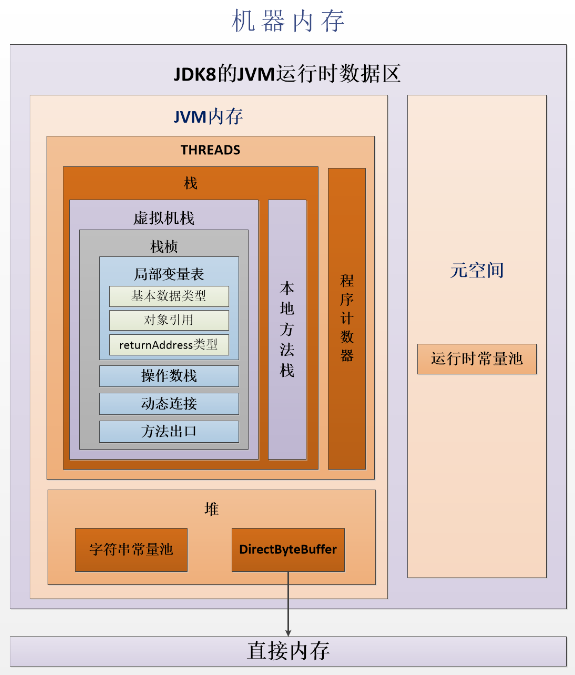

### 异步和同步

异步调用和同步调用都是指程序中不同组件之间的调用方式。

  在同步调用中，**程序的某个组件会在调用另一个组件时等待该组件完成后，才会继续执行下一步操作。**也就是说，在同步调用过程中，程序的运行会阻塞等待被调用组件的响应结果。

  而在异步调用中，**程序的调用不会等待被调用组件返回结果，而是继续执行下一步操作**。被调用组件会通过回调函数或事件通知的方式返回结果，程序在收到结果后再对其进行处理。也就是说，在异步调用过程中，程序的运行不会被阻塞，可以同时执行多个调用操作。

  异步调用通常用于网络请求、GUI编程和其他需要同时处理多个任务的场景中，而同步调用通常用于需要依次处理任务的场景中。


### 线程和进程区别

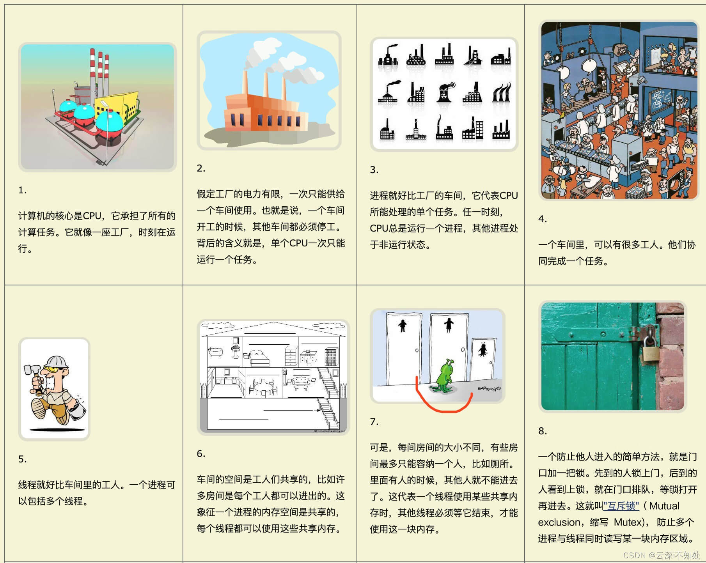

线程和进程是操作系统中用于实现多任务处理的两个基本概念，它们有以下区别：

1. 资源占用：一个进程可以独立占用系统资源，如内存、CPU等；而一个线程只能占用一定的系统资源，如栈空间、寄存器等。
2. 调度：进程是操作系统中的独立实体，它可以被操作系统分配资源和调度执行；而线程是在进程内部的执行单元，它的调度由进程管理。
3. 通信：由于进程之间是相互独立的，它们之间的通信需要通过进程间通信(IPC)机制来实现；而线程之间共享同一个进程的内存空间，因此可以直接进行通信。
4. 数据保护：由于每个进程都有自己独立的内存空间，因此不同进程之间的数据是相互隔离的；而线程共享同一个进程的内存空间，因此需要注意数据保护的问题。

总之，线程和进程都是实现多任务处理的基本概念，它们各自具有不同的特点和优缺点，在实际应用中需要根据具体的需求选择合适的方式。

补充：**一个进程可以包含多个线程，这些线程共享同一个进程的内存空间和系统资源。**在Java中，一个进程可以包含多个线程，这些线程可以通过继承Thread类或实现Runnable接口来创建。

### java的数据类型有哪些

| 类型                   | 占用字节 | 取值范围                                                     | 包装类    | 默认值 |
| ---------------------- | -------- | ------------------------------------------------------------ | --------- | ------ |
| byte(字节型)           | 1        | -128～127（-2的7次方到2的7次方-1）                           | Byte      | 0      |
| short（短整型）        | 2        | -32768～32767（-2的15次方到2的15次方-1）                     | Short     | 0      |
| int（整型）            | 4        | -2147483648～2147483647（-2的31次方到2的31次方-1）           | Integer   | 0      |
| long（长整型）         | 8        | -9223372036854774808～9223372036854774807（-2的63次方到2的63次方-1） | Long      | 0L     |
| float（浮点型）        | 4        | 3.402823e+38～1.401298e-45（e+38 表示乘以10的38次方，而e-45 表示乘以10的负45次方 | Float     | 0.0f   |
| double（双精度浮点型） | 8        | 1.797693e+308～4.9000000e-324（e+38 表示乘以10的38次方，而e-45 表示乘以10的负45次方 | Double    | 0.0d   |
| boolean（布尔型）      | 2        | true false                                                   | Boolean   | false  |
| char（字符型）         | 1        | 汉字字母都可以                                               | Character | \u0000 |


### equals和HashCode重写的问题?

  在Java中，Object类中提供了equals()和hashCode()方法用于**比较对象是否相等以及生成对象的哈希码**。默认情况下，equals()方法会比较对象的内存地址，而hashCode()方法则会根据对象的属性值计算出一个整数值作为哈希码。

  重写equals方法后，即使两个对象的属性值完全相同，它们也被认为是相等的。这是因为equals方法比较的是对象是否相等，而不是对象的哈希码是否相等。

  因此，如果我们不重写hashCode方法，那么即使两个对象相等，它们的哈希码也可能不同。这会导致在使用哈希表等数据结构时出现意外的结果。

  另外，如果多个对象具有相同的属性值，那么它们可能会被认为相等，从而出现在哈希表中出现多次的情况。这会影响哈希表的性能和正确性。

  因此，为了保证对象在哈希表中的正确性和性能，我们需要重写hashCode方法，确保每个对象都有唯一的哈希码。通常的做法是将每个属性的值取反后再进行求和，这样可以避免哈希冲突的问题。

>一般情况下，我们保证，当两个对象的Hashcode相同的时候对象不一定相同，但是当两个对象的equals方法相同时，这两个对象一定相同。
>
>**举例：**如果我们有1000万个对象，这个时候要找出外界输入的对象，判断和我们1000万个对象中哪个对象相等，这个时候我们会先调用hashcode方法，去大大的缩小范围，然后再使用equals方法，这样就可以大大提高我们寻找对象的速度。

### 深拷贝和浅拷贝的区别

**浅拷贝：**浅拷贝是指只复制对象本身的值，不复制它所引用的对象，因此新旧对象共享同一个引用对象。在 Java 中，可以通过实现 Cloneable 接口和覆盖 `clone()` 方法来实现浅拷贝。

**深拷贝：**深拷贝是指复制对象本身和所有它所引用的对象，因此新旧对象不共享任何引用对象。在 Java 中，可以通过实现 Serializable 接口和使用序列化/反序列化来实现深拷贝。例如：

###  ==和equals的区别

- == 既可以比较基本类型也可以比较引用类型，对于基本类型就是比较值，对于引用类型及时比较内存的地址

- equals的话，他是属于java.lang.Object类里面的方法，如果该方法没有被重写过，默认也是== ，我们可以看到String等类的equals方法是被重写过的，而且String类在日常开发中用的比较多，久而久之，形成了equasl是比较值的错误观点.
- 具体要看自定义类里面有没有重写Object的equals方法来判断
- 通常情况下，重写equals方法，会比较类中的属性是否相等

```java
/**
 * ==和equals的区别
 */
public class Test_01 {
    public static void main(String[] args) {

        /**
         * 比较基本数据类型
         */
        int a=1;
        double b=1.0;
        char c=1;
        System.out.println(a==b);  //true
        System.out.println(a==c);  //true


        /**
         * 引用数据类型
         */
        Customer c1 = new Customer("小明", 20);
        Customer c2 = new Customer("小明", 20);
        System.out.println(c1 == c2);       //false
        System.out.println(c1.equals(c2));  //false


//      String
        String str1 = new String("sth");
        String str2 = new String("sth");
        System.out.println(str1 == str2);      // false
        System.out.println(str1.equals(str2)); // true


//      java中String new和直接赋值的区别
//      对于字符串：其对象的引用都是存储在栈中的，如果是编译期已经创建好(直接用双引号定义的)的就存储在常量池中，
//      如果是运行期（new出来的）才能确定的就存储在堆中。对于equals相等的字符串，在常量池中永远只有一份，在堆中有多份。
        String s1="123"; //在常量池中
        String s2="123";
        System.out.println(s1==s2);  //true
        String s3 = new String("123");  //存储在堆内存中
        System.out.println(s1==s3);
        
        /**
         * Integer
         */
        Integer i1=1;
        Integer i2=1;
        System.out.println(i1==i2); //true

        Integer i3=128;
        Integer i4=128;
        System.out.println(i3==i4); //false
        System.out.println(i3.equals(i4));
    }
}
class Customer {
    private String namg;
    private int age;

    public Customer(){

    }

    public Customer(String namg, int age) {
        this.namg = namg;
        this.age = age;
    }

    public String getNamg() {
        return namg;
    }

    public void setNamg(String namg) {
        this.namg = namg;
    }

    public int getAge() {
        return age;
    }

    public void setAge(int age) {
        this.age = age;
    }
}
```

### 常见的运行时异常有哪些？

ArithmeticException(算术异常)

ClassCastException(类转换异常)

IllegalArgumentException(非法参数异常)

IndexOutOfBoundsException(下标越界异常)

NullPointerException(空指针异常)

SecurityException(安全异常)

## 集合

### 集合的形式

​		**集合可以有不同的形式，以下是一些常见的集合形式：**

    1. List：有序集合，元素可以重复。可以使用Collections.sort()方法对List进行排序。
    
    2. Set：无序集合，元素不能重复。可以使用HashSet或者TreeSet等实现类。
    
    3. Map：键值对集合，其中每个键对应唯一的值。可以使用HashMap或者TreeMap等实现类。
    
    4. Queue：队列，按照先进先出(FIFO)的顺序存储元素。可以使用LinkedList或者ArrayDeque等实现类。
    
    5. Stack：栈，按照后进先出(LIFO)的顺序存储元素。可以使用LinkedList或者ArrayDeque等实现类。

以上是一些常见的集合形式，每种形式都有其特定的应用场景和优缺点。在选择集合类型时，需要根据具体的需求来进行选择。

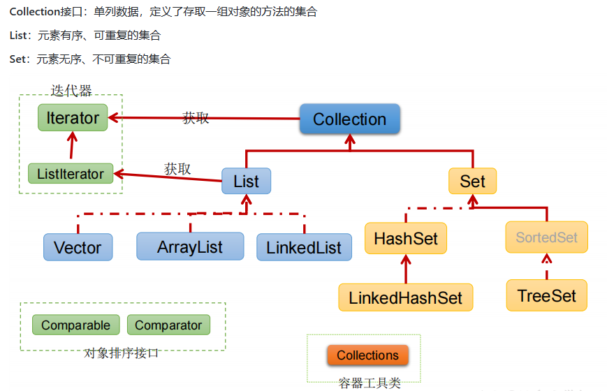

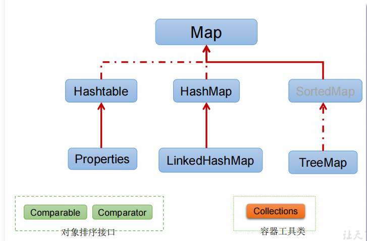

### List和Set的区别

```
List：有序
Set：无序
List：可重复
Set：不可重复
```

Java中的List和Set是两个不同的接口，都是集合框架中的一部分，它们的主要区别在于它们在存储元素时数据是否可以重复。

List是一个有序的集合，它可以存储具有重复元素的多个对象。List中的元素是按照插入顺序排序的，可以通过元素索引进行访问和修改。List也提供了用于添加、删除和更新元素的多个方法，例如add、remove、set和get等。

Set是一个不允许重复元素的集合，可以确保所有元素都是唯一的，不会产生重复。Set实现了equals（）和hashCode（）方法，以确保集合中的元素不具有相同的内容。Set中的元素不按任何特定顺序进行排序，并且不能通过索引进行访问和修改。

因此，当需要存储具有重复元素的集合时，应使用List，而当需要存储不允许重复元素的集合时，应使用Set。综上所述，List和Set在集合元素的排序和唯一性方面具有不同的用途和实现方式。

### ArrayList和LinkedList的区别

```
数组和链表的区别
查找：谁快？
增删改：谁快？
```

Java中的ArrayList和LinkedList都是List接口的实现类，它们都可以用来存储一组按顺序排列的对象。两者的区别主要在于它们底层数据结构不同，对于不同的应用场景，会存在更适合的选择。

ArrayList是基于动态数组实现的，内部维护一个可变长度的数组。因此，ArrayList支持高效的随机访问和修改，而不需要遍历整个列表。但是如果要在列表中插入或删除元素，所有元素都必须向右或向左移动，因此ArrayList在大规模数据插入或删除操作的性能上不如LinkedList。

LinkedList是基于双向链表实现的，每个节点（包含元素值和前后指针）都指向它的前一个和后一个元素。与ArrayList不同的是，LinkedList插入和删除操作的效率更高，因为它不需要移动后面的元素。但是在查找元素方面，LinkedList比ArrayList慢，因为它必须从头开始遍历整个列表，才能寻找到元素。

因此，总的来说，当需要快速随机访问列表中的元素且不需要大量插入和删除操作时，建议使用ArrayList；当需要频繁的插入和删除操作，但访问元素时顺序不那么重要时，建议使用LinkedList。

### ArrayList和数组的区别

ArrayList和数组都可以用来表示一组元素，两者之间的主要区别在于动态性和灵活性。

  数组是一组固定大小的连续内存块，一旦创建，其大小就无法更改。访问数组元素的速度非常快，因为它直接从内存中获取，但是当需要插入或删除元素时，需要将所有的元素依次移动，这会使得操作变得很低效。

  ArrayList是一个动态数组，它可以根据需要自动增加大小。在ArrayList中，可以使用add()方法向列表中添加元素，或使用remove()方法从列表中删除元素，不需要手动调整大小。ArrayList还提供了许多其他方便的方法，例如contains()、indexOf()等，可以更方便地操作数据。

  因此，与数组相比，ArrayList具有更好的灵活性和动态性。它可以根据需要自动增大或收缩，可以更方便地插入或删除元素，并且提供了许多功能强大的API。但是在访问元素时，ArrayList的性能可能不如数组，因为它需要间接引用，这会导致一定的性能损失。


### ArrayList的扩容机制是什么？

ArrayList实现动态扩容的方式是通过增加一个默认的扩容因子来实现的。当ArrayList在执行add()方法时，如果插入元素后的新元素个数超过了当前列表的长度，那么ArrayList会按照以下步骤进行扩容：

1. 计算新的容量大小，新容量大小为当前容量大小的1.5倍（即扩容因子默认为1.5）。
2. 创建一个新的数组，长度为新的容量大小。
3. 把原来数组中的所有元素都复制到新数组中。
4. 把新数组设置为ArrayList内部的数组对象。

由于该实现方式涉及到数组拷贝等操作，因此在进行大数据量插入时，扩容会非常耗费性能。为了尽量避免扩容，可以在使用ArrayList时，尽量预估需要存储的元素数量，提前指定ArrayList的容量大小，避免频繁扩容。这可以通过调用ArrayList的构造方法，传入容量大小参数来实现：

```java
ArrayList<String> list = new ArrayList<>(100); // 指定容量大小为100
```

默认情况下，new ArrayList初始化容量为0，存入1个元素时，首次扩容至默认值10，之后按1.5倍扩容（向下取整）

### ArrayList有哪些特点

(1)ArrayList是一种变长的集合类，基于定长数组实现，使用默认构造方法初始化出来的容量是10(1.7之后都是延迟初始化，即第一次调用add方法添加元素的时候才将elementData容量初始化为10)。

(2)ArrayList允许空值和重复元素，当往ArrayList中添加的元素数量大于其底层数组容量时，其会通过扩容机制重新生成一个更大的数组。ArrayList扩容的长度是原长度的1.5倍

(3)由于ArrayList底层基于数组实现，所以其可以保证在o(1)复杂度下完成随机查找操作。

(4)ArrayList是非线程安全类，并发环境下，多个线程同时操作ArrayList,会引发不可预知的异常或错误。

(5)顺序添加很方便

(6)删除和插入需要复制数组，性能差（可以使用LinkindList)

### List和Map的区别

List和Map是Java中常用的集合类，它们有以下区别：

1. 数据结构不同：List是一个有序的集合，它可以包含重复的元素，而Map是一个无序的键值对集合。
2. 存储方式不同：List中的元素是对象，而Map中的元素是键值对。
3. 访问方式不同：List中的元素可以通过索引进行访问，而Map中的元素需要通过键进行访问。
4. 初始化方式不同：List可以使用Arrays.asList()或者ArrayList.newInstance()等方法进行初始化，而Map可以使用HashMap.newKeyValuePair()或者TreeMap.newNode()等方法进行初始化。
5. 线程安全性不同：List不是线程安全的，如果多个线程同时对同一个List进行修改操作，可能会导致数据不一致的问题。而Map是线程安全的，可以在多线程环境下进行并发访问。
6. 性能差异：由于List需要维护有序性，因此在插入、删除、查找等操作时需要进行比较和排序操作，这些操作会带来一定的性能开销。而Map使用哈希表来实现快速的查找操作，因此在查找操作时性能较高。

总之，List和Map都有各自的优缺点和适用场景，需要根据实际情况选择合适的集合类来进行使用。

### 如何让map存储有序数据

在Java中，Map是一个无序的键值对集合，如果需要存储有序的数据，可以考虑使用LinkedHashMap。

LinkedHashMap继承自HashMap，它可以记录元素的插入顺序或者访问顺序，即元素按照插入或者访问的顺序进行排序。因此，在使用LinkedHashMap时，可以保证元素的顺序与插入或访问的顺序相同。

下面是一个示例代码：

```java
import java.util.LinkedHashMap;
import java.util.Map;

public class LinkedHashMapExample {
    public static void main(String[] args) {
        // 创建一个空的LinkedHashMap对象
        Map<String, Integer> map = new LinkedHashMap<>();

        // 向LinkedHashMap中添加元素，元素会按照插入顺序进行排序
        map.put("A", 1);
        map.put("B", 2);
        map.put("C", 3);

        // 从LinkedHashMap中获取元素，元素也会按照插入顺序进行排序
        System.out.println(map.get("A")); // 输出1
        System.out.println(map.get("B")); // 输出2
        System.out.println(map.get("C")); // 输出3
    }
}

```

需要注意的是，由于LinkedHashMap需要维护元素的插入顺序或者访问顺序，因此它的性能可能会比HashMap略低一些。同时，由于LinkedHashMap是线程不安全的，如果需要在多线程环境下使用，需要进行同步处理。

### 如何创建Map?

在Java中，创建Map可以使用以下几种方式：

    1. 使用HashMap构造函数创建Map对象

```java
Map<String, Integer> map = new HashMap<>();
```

这个示例代码创建了一个键类型为String,值类型为Integer的HashMap对象。需要注意的是，如果没有指定容量，HashMap会根据元素数量自动调整容量大小。

    1. 使用Collections.singletonMap()方法创建Map对象

```java
Map<String, Integer> map = Collections.singletonMap("key", "value");
```

这个示例代码创建了一个只包含一个键值对的Map对象，其中键为"key",值为"value"。需要注意的是，该方法返回的是一个不可变的Map对象。

    1. 使用Map.putAll()方法创建Map对象

```java
Map<String, Integer> map = new HashMap<>();
map.putAll(new HashMap<>());


```

这个示例代码创建了一个空的HashMap对象，并使用Map.putAll()方法将另一个Map对象中的键值对添加到当前Map对象中。需要注意的是，该方法是线程安全的。

    1. 使用Stream API创建Map对象

```java
Map<String, Integer> map = Stream.of(new AbstractMap.SimpleEntry<>("key", "value"))
        .collect(Collectors.toMap(Map.Entry::getKey, Map.Entry::getValue));


```

这个示例代码使用Stream API创建了一个键类型为String,值类型为Integer的Map对象。需要注意的是，该方法返回的是一个临时性的Map对象，如果需要将其转换为真正的Map对象，可以使用toMap()方法进行转换。

### 常用的Map有哪些?

在Java中，常用的Map有以下几种：

**1. HashMap**

HashMap是最常用的Map类型之一，它是基于哈希表实现的。它提供了快速的插入、删除和查找操作，并且支持null键和null值。但是，由于哈希表的结构不稳定，如果发生哈希冲突，会导致链表扩容，从而影响性能。

**2. LinkedHashMap**

LinkedHashMap是继承自HashMap的一种Map类型，它维护了元素的插入顺序或者访问顺序。因此，在使用LinkedHashMap时，可以保证元素的顺序与插入或访问的顺序相同。但是，由于它需要维护链表结构，所以它的性能可能会比HashMap略低一些。

**3. TreeMap**

TreeMap是一种基于红黑树实现的有序Map类型。它提供了按照自然顺序或者自定义排序方式进行排序的能力。由于它是基于红黑树实现的，所以它的性能相对较高。但是，由于它的遍历方式比较特殊，所以对于某些场景可能不太适用。


### 如何在HashMap中插入一个数据

**HashMap的put方法**

将指定的值与此映射中的指定键相关联，如果Map中已经包含了该键的映射，那么旧的映射值将会被替代，也就是说在put时，如果map中已经包含有key所关联的键值对，那么后续put进来的键值对，将会以相同key为准替换掉原来的那一对键值对。

返回的值则将是之前在map中实际与key相关联的Value值（也就是旧的值），如果key没有实际映射值的话那就返回null。

内部实现时则立马调用了其内部putValue方法，并将put进去（覆盖）之前的结果k-v中的v进行了返回，进行值的覆盖

```
// 创建一个 HashMap
HashMap<Integer, String> map = new HashMap<>();
// 往 HashMap 添加一些元素
map.put(1, "11");
map.put(2, "22");
map.put(3, "33");
System.out.println("HashMap: " + map);//HashMap: {1=11, 2=22, 3=33}
//如果存储的key已经存在，则直接覆盖数据
map.put(1,"44");
System.out.println("HashMap: " + map);//HashMap: {1=44, 2=22, 3=33}
```

**总结**

在 HashMap 中，元素是以键值对的形式存储的，可以通过调用 put(key, value) 方法将元素存储到 HashMap 中。具体的操作流程如下：
1.创建一个新的键值对（Entry）对象，将要存储的键和值作为参数传入。
2.对键进行哈希运算，以得到在底层数组中的位置（桶）。
3.如果该位置为空，则将新的键值对放入该位置。
4.如果该位置已经存在键值对，则进行链式存储。新的键值对将成为链表头部，原有键值对将成为链表的后继节点。
5.如果链表长度达到一个阈值（默认为8），则会将链表转化为红黑树结构，以提高查找效率。
6.如果键已经存在于 HashMap 中，则会将原有的值替换为新的值。

### 遍历一个 List 有哪些不同的方式？

1. for 循环遍历，基于计数器。在集合外部维护一个计数器，然后依次读取每一个位置的元素，当读取到最后一个元素后停止。
2. 迭代器遍历，Iterator。Iterator 是面向对象的一个设计模式，目的是屏蔽不同数据集合的特点，统一遍历集合的接口。Java 在 Collections 中支持了 Iterator 模式。
3. foreach 循环遍历。foreach 内部也是采用了 Iterator 的方式实现，使用时不需要显式声明 Iterator 或计数器。优点是代码简洁，不易出错；缺点是只能做简单的遍历，不能在遍历过程中操作数据集合，例如删除、替换。

```
System.out.println("-----------forEach遍历-------------");
list.parallelStream().forEach(k -> {
  System.out.println(k);
});

System.out.println("-----------for遍历-------------");
for (Student student : list) {
  System.out.println(student);
}

System.out.println("-----------Iterator遍历-------------");
Iterator<Student> iterator = list.iterator();
while (iterator.hasNext()) {
  System.out.println(iterator.next());
}
```

### List集合和Map的有序无序以及重复问题

  List和Map都是Java中常用的集合类型，它们都可以存储一组有序或无序的元素。但是，它们在有序和无序以及重复元素方面有一些不同点。

**1.List集合的有序性**

List集合可以是有序的，也可以是无序的。如果需要保持元素的有序性，可以使用Collections.sort()方法对List进行排序；如果不需要保持有序性，可以使用ArrayList或者LinkedList等实现类。

**2.Map集合的有序性**

Map集合中的元素是无序的，因为Map是通过键值对来存储数据的，键值对的顺序是不固定的。如果需要按照键名对Map进行排序，可以使用TreeMap或者LinkedHashMap等实现类。

**3.List集合的重复元素问题**

List集合可以存储重复元素，但是不能保证所有重复元素都会被保留下来。如果需要保留重复元素，可以使用Set集合。

**4.Map集合的重复元素问题**

  Map集合不允许存储重复的键值对，如果尝试插入重复的键值对，会抛出IllegalArgumentException异常。如果需要存储重复的键值对，可以使用HashMap或者ConcurrentHashMap等实现类。需要注意的是，由于HashMap是非线程安全的，所以在多线程环境下使用时需要进行同步处理。

### HashMap和TreeMap区别? ★★★

  HashMap和TreeMap都是Java中常用的集合类型，它们都可以存储一组有序或无序的元素。但是，它们在实现方式、性能以及使用场景等方面有一些不同点。

**1.实现方式**

  HashMap是基于哈希表实现的，它通过哈希函数将键值对映射到数组的某个位置上，从而实现快速的插入、删除和查找操作。由于哈希表的结构不稳定，如果发生哈希冲突，会导致链表扩容，从而影响性能。

TreeMap是基于红黑树实现的，它通过维护红黑树结构来保证元素的有序性。由于它是基于红黑树实现的，所以它的性能相对较高。但是，由于它的遍历方式比较特殊，所以对于某些场景可能不太适用。

**2.性能**

  在单线程环境下，HashMap的性能比TreeMap要好一些，因为HashMap可以通过哈希函数快速定位元素的位置。但是，在多线程环境下，由于哈希冲突的存在，HashMap的性能会受到影响。

在多线程环境下，TreeMap的性能比HashMap要好一些，因为它可以通过红黑树的性质保证元素的有序性。但是，由于TreeMap需要进行遍历操作，所以在并发访问量较大的情况下，可能会出现性能瓶颈。

**3.使用场景**

  HashMap适用于需要快速插入、删除和查找元素的场景，例如缓存、计数器等。由于HashMap的性能较好，所以在这些场景下使用HashMap可以获得较好的性能表现。

  TreeMap适用于需要保持元素有序性的场景，例如按照时间顺序排序或者按照某个属性排序等。由于TreeMap的性能较差，所以在这些场景下使用TreeMap可能会导致性能瓶颈。

**总之，HashMap和TreeMap都有各自的优缺点和适用场景，需要根据具体的需求来进行选择。**

### 为什么1.8中引入红黑树？

当我们的HashMap中存在大量数据时，加入我们某个bucket下对应的链表有n个元素，那么遍历时间复杂度就为O(n)，为了针对这个问题，JDK1.8在HashMap中新增了红黑树的数据结构，进一步使得遍历复杂度降低至O(logn)；

简单总结一下HashMap是使用了哪些方法来有效解决哈希冲突的：

1. 使用链地址法（使用散列表）来链接拥有相同hash值的数据；
2. 使用2次扰动函数（hash函数）来降低哈希冲突的概率，使得数据分布更平均；
3. 引入红黑树进一步降低遍历的时间复杂度，使得遍历更快；

### HashMap的底层原理你了解哪些

参考视频：https://www.bilibili.com/video/BV1nJ411J7AA

**1.什么是Hash**

在说明这个题目之前，咱们可能需要先理解**什么是Hash？**

 	==hash是一个函数==，该函数中的实现就是一种算法，就是通过一系列的算法来得到一个==hash值。==

 	这个时候，我们就需要知道另一个东西，hash表，通过hash算法得到的hash值就在这张==hash表==中，也就是说，hash表就是所有的==hash值==组成的，有很多种hash函数，也就代表着有很多种算法得到hash值，如上面截图的三种，等会我们就拿第一种来说。

>1．**直接寻址法**。取关键字或关键字的某个线性函数值为散列地址。即H(key)=key或H(key) = a·key + b，其中a和b为常数（这种散列函数叫做自身函数）

>2．**数字分析法**。分析一组数据，比如一组员工的出生年月日，这时我们发现出生年月日的前几位数字大体相同，这样的话，出现冲突的几率就会很大，但是我们发现年月日的后几位表示月份和具体日期的数字差别很大，如果用后面的数字来构成散列地址，则冲突的几率会明显降低。因此数字分析法就是找出数字的规律，尽可能利用这些数据来构造冲突几率较低的散列地址。

>3．**平方取中法**。取关键字平方后的中间几位作为散列地址。

>4．**折叠法**。将关键字分割成位数相同的几部分，最后一部分位数可以不同，然后取这几部分的叠加和（去除进位）作为散列地址。

>5．**随机数法**。选择一随机函数，取关键字作为随机函数的种子生成随机值作为散列地址，通常用于关键字长度不同的场合。

>6．**除留余数法**。取关键字被某个不大于散列表表长m的数p除后所得的余数为散列地址。即 H(key) = key MOD p,p<=m。不仅可以对关键字直接取模，也可在折叠、平方取中等运算之后取模。对p的选择很重要，一般取素数或m，若p选的不好，容易产生碰撞。

==HashMap的初始值为16==

**2.那么什么是Map？**

  Map是 Java 中的一个接口，它表示映射表，即==一种将键映射到值的数据结构==。在 Map 中，每个键最多只能映射到一个值。常见的实现类包括 HashMap，TreeMap和 LinkedHashMap。 Map接口提供了一系列方法来操作映射表，例如 put()用于添加键值对，get()用于获取指定键所对应的值等。

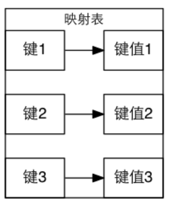

**3.什么是HashMap?**

  基于哈希表的 Map 接口的实现。此实现提供所有可选的映射操作，==并允许使用 null 值和 null 键==。（除了不同步和允许使用 null 之外，HashMap 类与 Hashtable 大致相同。）此类不保证映射的顺序，特别是它==不保证该顺序恒久不变==。另外，HashMap是非线程安全的，也就是说在多线程的环境下，可能会存在问题，而Hashtable是线程安全的。

**4.HashMap是如何实现的？**

HashMap底层实现JDK<1.8数组+链表   JDK>1.8数组+链表+红黑树；

==当链表的长度大于8时，并且数组长度大于64的时候，自动升级为红黑树==

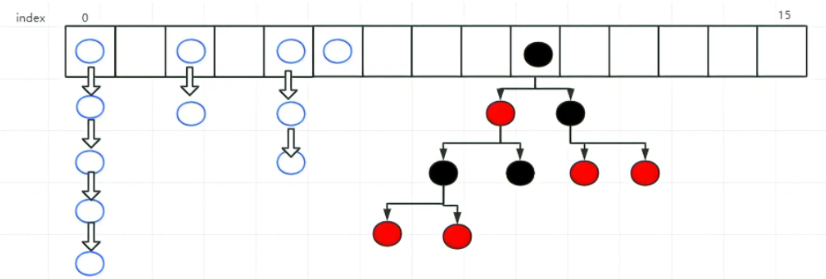


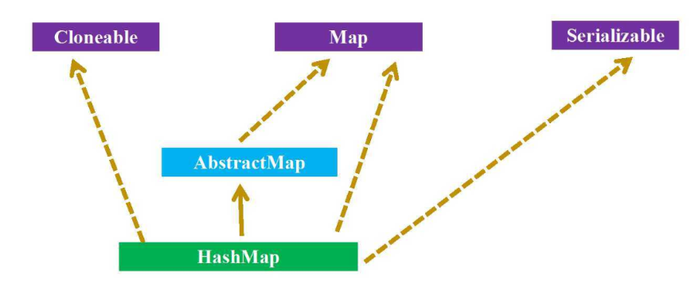

## 面向对象

### 重载和重写的区别★★★

  重载(Overloading)和重写(Overriding)都是Java中面向对象编程的特性，它们都可以让子类继承父类的方法。但是它们之间有一些重要的区别：

- 定义方式：
  - 重载(Overloading)：**在同一个类中**，可以有**多个方法名相同但参数列表不同的方法**。当调用一个方法时，编译器会根据参数的数量、类型和顺序来判断调用哪个方法。
  - 重写(Overriding)：在子类中，必须定义与父类同名、参数类型和返回值类型相同的方法。这样才能覆盖掉父类中的方法，使得子类对象调用该方法时执行的是子类自己的代码。

- 访问权限：
  - 重载(Overloading)：**方法名相同但参数列表不同**，因此它们的访问权限是一样的，都是public、protected或private。
  - 重写(Overriding)：子类中的方法必须使用super关键字来调用父类的方法，这意味着**子类中的方法具有比父类中相同的方法更低的访问权限**。

总之，重载和重写都是Java中多态性的重要特性，但它们的作用和实现方式有所不同。重载允许在同一类中定义多个同名但参数不同的方法，而重写允许子类覆盖父类的方法并提供自己的实现。


### Java的三大特性

Java的三大特性是：

1. **面向对象编程**(Object-Oriented Programming,OOP)：Java是一种纯面向对象的编程语言，它支持封装、继承和多态等面向对象的特性。通过封装，Java可以将数据和方法封装在一起，形成一个类，从而实现对数据的保护；通过继承，Java可以从已有的类中继承属性和方法，避免重复编写代码；通过多态，Java可以让不同的对象对同一个消息做出不同的响应，提高了代码的复用性和灵活性。
2. **平台无关性**(Platform Independence)：Java程序可以在不同的操作系统上运行，这是因为Java编译器将Java源代码编译成字节码(bytecode),然后由Java虚拟机(JVM)将字节码解释执行。因此，无论在哪个平台上安装了Java虚拟机，都可以运行Java程序。这种平台无关性使得Java成为一种非常适合开发跨平台应用程序的语言。
3. **安全性**(Security)：Java提供了多种安全机制来保护应用程序的安全，包括沙箱安全模型、类加载器、安全管理器等。这些机制可以限制应用程序的访问权限，防止恶意代码的执行，保证了应用程序的安全性和稳定性。同时，Java还提供了加密和数字签名等标准安全协议，使得Java应用程序可以方便地与其他系统进行安全通信。

### 请说明一下Super关键字的作用？

在Java类中使用super来调用父类中的指定操作

- super可以用来访问父类中定义的属性

- super可以用于调用父类中定义的成员方法

- super可以同于子类构造器中调用父类的构造器

### static关键字的作用？

在Java中，static关键字有以下几种作用：

**1.修饰类成员变量和方法：**

  * 修饰类成员变量：被static修饰的成员变量是静态变量，**它们属于类而不是对象**。静态变量可以在类的任何地方访问，且只有一份实例。例如：
  * public static int count = 0;。
  * 修饰类成员方法：被static修饰的方法是静态方法，它们不依赖于对象而是直接通过类名调用。静态方法可以在类的任何地方调用，且没有this指针。例如：public static void printCount() { System.out.println(count); }。

**2.修饰局部变量：**

  * 被static修饰的局部变量成为静态局部变量，它们属于类而不是对象。静态局部变量只能在类的静态方法中初始化一次。例如：public static void test() { static int count = 0; count++; System.out.println("count=" + count); }。

3.表示类和接口的常量：

  * 被static修饰的常量是类和接口的常量，它们在整个程序中都是可见的。例如：public static final int MAX_COUNT = 100;。

    1. 表示线程安全：

  * 被static修饰的方法可以保证多线程访问时的安全性。例如：public static synchronized void printCount() { System.out.println(count); }。

总之，static关键字可以用来修饰类、方法、局部变量、常量和线程安全等方面，具有不同的作用和意义。

### final关键字的作用？

在Java中，final关键字有以下几种作用：

1. 修饰类和方法：
   - 修饰类：被final修饰的`类不能被继承`。例如：final class MyClass。
   - 修饰方法：被final修饰的方法不能被子类`重写`。例如：final void myMethod() {}。

2. 修饰变量：
   - 修饰全局变量：被final修饰的全局变量只能在声明时赋值一次。例如：final int MAX_VALUE = 100;。
   - 修饰局部变量：被final修饰的局部变量只能在定义时初始化一次。例如：final int x = 5;。

3. 表示常量：
   - final修饰的常量是不可修改的，一旦赋值就不能再改变。例如：final int MAX_VALUE = 100;。

4. 表示线程安全：
   - final修饰的实例方法可以保证多线程访问时的安全性。例如：final class MyClass { ... }。

总之，final关键字可以用来修饰类、方法、变量和线程安全等方面，具有不同的作用和意义。


### super关键字和this关键字的作用？

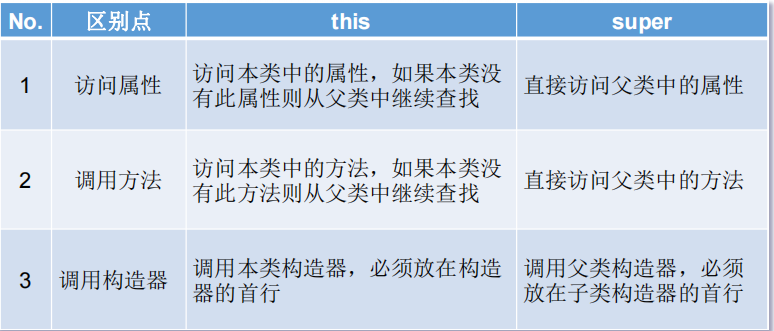

### 面向对象的三大特性★★★

面向对象编程的三大特性是封装、继承和多态。

1. 封装(Encapsulation)：封装是指将**数据和方法捆绑在一起**，形成一个类，对外部隐藏实现细节，只提供必要的接口给外部使用。通过封装，可以保护数据的安全性和完整性，防止外部程序直接访问和修改数据，从而提高程序的可维护性和稳定性。
2. 继承(Inheritance)：继承是指**子类可以从父类中继承属性和方法**，避免重复编写代码。通过继承，可以提高代码的复用性和灵活性，使得程序更加模块化和可扩展。但是需要注意的是，过度的继承会导致代码变得复杂和难以维护。
3. 多态(Polymorphism)：多态是指同**一个方法可以根据不同的参数类型和数量表现出不同的行为**。通过多态，可以提高代码的灵活性和可扩展性，使得程序更加通用和易于维护。Java中的多态主要有两种形式：方法重载(Method Overloading)和方法重写(Method Overriding)。

### 成员变量和局部变量的区别？

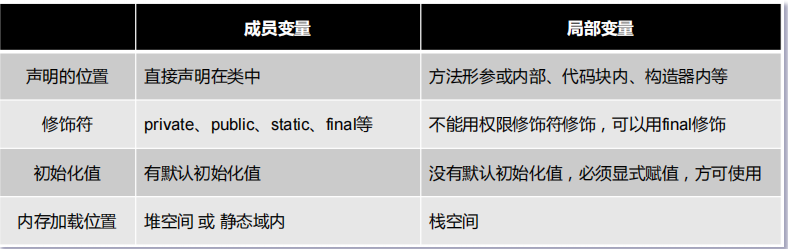


### Java能实现多继承么

  Java不支持多继承，它只支持单继承。这意味着**一个类只能继承自一个直接父类**，而不能同时继承多个父类。

  在Java中，一个类可以实现多个接口。

### 抽象类(abstract class) 与接口(interface)的区别？★★★

抽象类和接口都是用来定义类或类的成员的，但它们之间有以下区别：

  1. 实现方式不同：抽象类必须被子类实现，而接口可以被多个类实现。

  2. 抽象方法和默认方法不同：抽象类中可以定义抽象方法和非抽象方法，而接口只能定义抽象方法。

  3. 构造函数不同：抽象类可以定义构造函数，而接口不能定义构造函数。

  4. final修饰符的使用不同：抽象类中可以定义final修饰符，而接口中的所有方法都不能被final修饰。

  5. 继承限制不同：子类只能继承一个抽象类，而一个类可以实现多个接口。

总之，抽象类更像是一种“半成品”，它提供了一些基本的实现，但还需要子类去完善；而接口则更像是一种规范，它规定了一组方法和常量，但并不提供具体的实现。

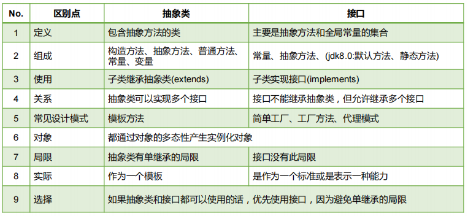

### 能详细解释一下封装么？

**将类的某些信息隐藏在类内部，不允许外部程序直接访问，而是通过该类提供的方法来实现对隐藏信息的操作和访问 成员变量private，提供对应的getXxx()/setXxx()方法**

1. 封装可以被认为是一个保**护屏障，**防止该类的代码和数据被外部类定义的代码随机访问。
2. 要访问该类的代码和数据，必须通过严格的接口控制。
3. 封装最主要的功能在于我们能修改自己的实现代码，而不用修改那些调用我们代码的程序片段。
4. 适当的封装可以让程式码更容易理解与维护，也加强了程式码的安全性。

程序涉及追求——>**高内聚，低耦合**

**高内聚：类的内部数组操作细节自己完成，不允许外部干涉。**

**低耦合：仅对外暴露少量的方法用于使用。**

**关于四种权限修饰符的说明：**

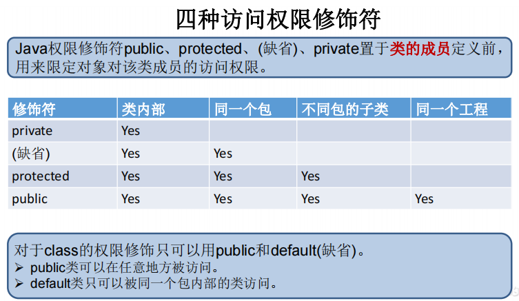

### 继承你了解哪些？

Java中继承是一种面向对象编程的基本概念，它允许一个类(子类)从另一个类(父类)中继承属性和方法。以下是Java中继承的一些基本知识：

  1. 继承的语法：在Java中，使用extends关键字来声明一个类继承另一个类。例如：
```java

class Animal {
  // 父类中的属性和方法
}

class Dog extends Animal {
  // 子类中的额外属性和方法
}


```

  2. 子类可以重写父类的方法：子类可以覆盖(override)父类中定义的方法，以实现自己的行为。例如：
```java

class Animal {
  public void eat() {
    System.out.println("Animal is eating");
  }
}

class Dog extends Animal {
  @Override
  public void eat() {
    System.out.println("Dog is eating");
  }
}

public class Main {
  public static void main(String[] args) {
    Dog dog = new Dog();
    dog.eat(); //输出 "Dog is eating"
  }
}


```

  3. 子类可以访问父类中的公有、受保护和默认(package-private)成员：子类可以访问其继承的父类中的公有、受保护和默认(package-private)成员。例如：
```java

class Animal {
  public int age;
}

class Dog extends Animal {
  public void bark() {
    System.out.println("Woof! My age is " + age);
  }
}

public class Main {
  public static void main(String[] args) {
    Dog dog = new Dog();
    dog.age = 3; //可以修改子类的属性age,但不能修改父类的属性age
    dog.bark(); //输出 "Woof! My age is 3"
  }
}


```

### 多态你了解哪些？

**多态是同一个行为具有多个不同表现形式或形态的能力。**

多态一般分为两种：重写式多态和重载式多态。

**重载式多态**，也叫编译时多态。也就是说这种多态再编译时已经确定好了。重载大家都知道，方法名相同而参数列表不同的一组方法就是重载。在调用这种重载的方法时，通过传入不同的参数最后得到不同的结果。

> 但是这里是有歧义的，有的人觉得不应该把重载也算作多态。因为很多人对多态的理解是：程序中定义的引用变量所指向的具体类型和通过该引用变量发出的方法调用在编程时并不确定，而是在程序运行期间才确定，这种情况叫做多态。 这个定义中描述的就是我们的第二种多态—重写式多态。

**重写式多态**，也叫运行时多态。这种多态通过动态绑定（dynamic binding）技术来实现，是指在执行期间判断所引用对象的实际类型，根据其实际的类型调用其相应的方法。也就是说，只有程序运行起来，你才知道调用的是哪个子类的方法。 这种多态通过函数的重写以及向上转型来实现，我们上面代码中的例子就是一个完整的重写式多态。我们接下来讲的所有多态都是重写式多态，因为它才是面向对象编程中真正的多态。

 总而言之我的理解：重载式多态，在编码等过程中，并没有很好的体现出多态的优势，但是不得否认也是多态的一种编写方式，而给出的重写式多态案例中，相比于重载式多态，在编码思路和代码量以及聚合度方面都较好的体现出了多态的优势。

**多态的优点**

- 消除类型之间的耦合关系
- 可替换性
- 可扩充性
- 接口性
- 灵活性
- 简化性

**多态存在的三个必要条件**

- 继承
- 重写
- 父类引用指向子类对象

```java
public class Test {
    public static void main(String[] args) {
        show(new Cat());  // 以 Cat 对象调用 show 方法
        show(new Dog());  // 以 Dog 对象调用 show 方法
        /**
         * 上面两行可以发现，show方法要求传入的是动物对象，因为猫和狗都继承了动物类，因此符合规范，
         *         同时体现出多态的优势：一个形参可以对应多个实参，同时这也是一个重写式多态
         */


        Animal a = new Cat();  // 向上转型：通过子类实例化父类
        a.eat();               // 调用的是 Cat 的 eat
        //a.work();如果运行这一行就会发现，无法调用work方法，因为动物类只有eat一个方法，从而cat失去了特有方法

        Cat c = (Cat)a;        // 向下转型：通过父类强制转化为子类
        c.work();        // 调用的是 Cat 的 work
        /**
         * 上面两行体现了向下转型的用处，我们可以知道，对象a目前是一个动物对象，不能执行猫或者狗的特有方法
         * 但是，如果通过向下转型，将动物a对象，转化为一个猫c对象，这样就可以调用猫的特有方法了
         */


        /**
         * 得出结论：
         * 向上转型 : 通过子类对象(小范围)实例化父类对象(大范围),这种属于自动转换
         * 向下转型 : 通过父类对象(大范围)实例化子类对象(小范围),这种属于强制转换
         */

    }

    public static void show(Animal a)  {
        a.eat();
        // 类型判断
        if (a instanceof Cat)  {  // 猫做的事情
            Cat c = (Cat)a;
            c.work();
        } else if (a instanceof Dog) { // 狗做的事情
            Dog c = (Dog)a;
            c.work();
        }
    }
}

//定义一个抽象类
abstract class Animal {
    abstract void eat();
}

//下面的每一个类继承抽象类，重写接口中的方法
class Cat extends Animal {
    public void eat() {
        System.out.println("吃鱼");
    }
    public void work() {
        System.out.println("抓老鼠");
    }
}

class Dog extends Animal {
    public void eat() {
        System.out.println("吃骨头");
    }
    public void work() {
        System.out.println("看家");
    }
}
```

## IO流

==关于javaIO流部分参考链接：==[https://blog.csdn.net/qq_44715943/article/details/116501936](https://blog.csdn.net/qq_44715943/article/details/116501936)

### Bit,Byte,Char之间的区别？

Bit最小的二进制单位 ，是计算机的操作部分取值0或者1。

Byte是计算机中存储数据的单元，是一个8位的二进制数，（计算机内部，一个字节可表示一个英文字母，两个字节可表示一个汉字。） 取值（-128-127）

Char是用户的可读写的最小单位，他只是抽象意义上的一个符号。如‘5’，‘中’，‘￥’等等。在java里面由16位bit组成Char 取值（0-65535）

Bit 是最小单位 计算机他只能认识0或者1

Byte是8个字节 是给计算机看的

字符 是看到的东西 一个字符=二个字节

### Java中有几种类型的流？

**按照流的方向**：输入流(inputStream)和输出流(outputStream)

**按照实现功能分**：节点流（可以从或向一个特定的地方（节点）读写数据。如FileReader)和处理流（是对一个已存在的流的连接和封装，通过所封装的流的功能调用实现数据读写。如BufferedReader.。处理流的构造方法总是要带一个其他的流对象做参数。一个流对象经过其他流的多次包装，称为流的链接。)

**按照处理数据的单位**：字节流和字符流。字节流继承于InputStream和OutputStream,字符流继承于InputStreamReader和OutputStreamWriter.


### 字节流和字符流的区别★★★

​		**字节流和字符流是 Java IO 中两种基本的输入输出流类型。**

  字节流(Byte Stream)用于处理二进制数据，如图像、音频、视频等。它以字节为单位读取和写入数据，可以处理任何类型的数据，包括文本、二进制文件等。Java 提供了 FileInputStream、ByteArrayInputStream、BufferedInputStream 等字节流类。

  字符流(Character Stream)用于处理文本数据，如文本文件等。它以字符为单位读取和写入数据，只能处理 ASCII 码表中的字符。Java 提供了 FileReader、BufferedReader、ReaderWriter 等字符流类。

  在实际应用中，我们通常需要同时使用字节流和字符流来处理不同类型的数据。例如，在使用网络协议进行通信时，我们需要使用字节流来传输数据；而在使用文本文件进行读写操作时，则需要使用字符流。

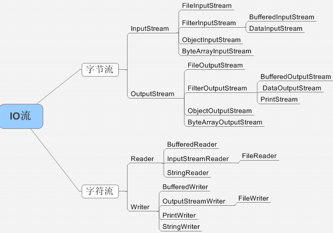

### String， StringBuffer，StringBuilder的区别？★★★

​		String、StringBuffer 和 StringBuilder 都是 Java 中用于处理字符串的类，它们的区别如下：

1. String 是一个不可变对象，一旦被创建就无法被改变。对 String 进行修改操作时，会创建一个新的 String 对象。因此在频繁修改字符串时，创建大量的 String 对象会导致内存浪费。
2. StringBuffer 是可变对象，可以进行字符串修改操作而不是创建新的对象。对 StringBuffer 进行修改操作时，不会创建新的字符串对象，而是直接修改原有的对象。因此，使用 StringBuffer 可以提高程序的性能。
3. StringBuilder 也是可变对象，它提供了与 StringBuffer 相同的功能，但是相对于 StringBuffer 来说，StringBuilder 在执行效率上更高，因为它不需要创建新的字符串对象。

在使用上，一般情况下应该优先考虑使用 StringBuilder,只有在需要返回一个可变字符串时才使用 StringBuffer。如果只需要对字符串进行简单的修改操作，则可以使用 String 类型。


### 对数据流的了解，JavaIO部分?

Java IO(Input/Output)是Java编程语言中用于读写数据的模块。它提供了一组类和接口，可以方便地进行文件读写、网络通信等操作。其中，数据流(Data Stream)是Java IO的一个重要概念。

Java IO中的数据流可以分为**字节流和字符流**两种类型。字节流适用于处理二进制数据，如图片、音频、视频等；字符流适用于处理文本数据，如文件内容、网络传输等。

在Java IO中，常用的数据流类有：

- FileInputStream：从文件中读取字节流
- FileOutputStream：向文件中写入字节流
- DataInputStream：从文件或网络连接中读取字节流
- DataOutputStream：从文件或网络连接中写入字节流
- BufferedInputStream：带有缓存的字节流输入流
- BufferedOutputStream：带有缓存的字节流输出流

除了基本的数据流类外，Java IO还提供了许多高级的数据流类和接口，如ObjectInputStream和ObjectOutputStream、Reader和Writer等，可以满足更多的读写需求。


### Java中Filter流的作用？

​		Java Filter流是一种I/O流，它可以在**读取输入数据或写入输出数据之前或之后对数据进行预处理或过滤**。它的主要作用是在处理文件或流之前或之后对数据进行某种变换或过滤操作，例如，可以将输入的数据进行解密、压缩或转换为其它格式，也可以过滤掉一些无用的数据，以减少对存储空间或带宽的占用。

​		在Java程序中，Filter流通常作为其它输入/输出流的装饰器使用，将其它的I/O流包装起来，以增加它们的功能。

​		在java.io包中主要由4个可用的filter Stream。两个字节filter stream,两个字符filter stream.分别是FilterInputStream,FilterOutputStream,FilterReader and FilterWriter..这些类是抽象类，不能被实例化的。

###  I/O(阻塞、非阻塞，同步、异步)

**同步**：一个任务的完成之前不能做其他操作，必须等待（等于在打电话）

 **异步**：一个任务的完成之前，可以进行其他操作（等于在聊QQ）

 **阻塞**：是相对于CPU来说的， 挂起当前线程，不能做其他操作只能等待 

**非阻塞**：无须挂起当前线程，可以去执行其他操作

### 阻塞IO与非阻塞IO的区别

**阻塞IO**，指的是需要内核IO操作彻底完成后，才返回到用户空间执行用户的操作。阻塞是指用户空间的执行状态。
**非阻塞IO**，指的是用户空间的程序不需要等待内核IO操作彻底完成，可以立即返回用户空间执行用户操作，即处于非阻塞IO状态，内核空间会立即返回给用户一个状态值。

阻塞IO：调用线程一直在等待，不能干别的事情。
非阻塞IO：调用线程拿到内核返回的状态值后，IO操作能干就干2，不能就干别的事情。


### BIO和NI0和AIO的区别以及应用场景？

**同步：java自己去处理io。**

**异步：java将io交给操作系统去处理，告诉缓存区大小，处理完成回调。**

**阻塞：使用阻塞IO时，Java调用会一直阻塞到读写完成才返回。**

**非阻塞：使用非阻塞IO时，如果不能立马读写，Jva调用会马上返回，当o事件分发器通知可读写时在进行读写，不断循环直到读写完成。**

**BIO:同步并阻塞**，服务器的实现模式是一个连接一个线程，这样的模式很明显的一个缺陷是：由于客户端连接数与服务器线程数成正比关系，可能造成不必要的线程开销，严重的还将导致服务器内存流出。当然，这种情况可以通过线程池机制改善，但并不能从本质上消除这个弊端。

**NIO**:在JDK1.4以前，Java的IO模型一直是BIO,但从DK1.4开始，JDK引入的新的IO模型NIO,它是同步非阻塞的。而服务器的实现模式是多个请求一个线程，即请求会注册到多路复用器Selector上，多路复用器轮询到连接有IO请求时才启动一个线程处理。

**AIO**:JDK1.7发布了NIO2.0,这就是真正意义上的异步非阻塞，服务器的实现模式为多个有效请求一个线程，客户端的IO请求都是由OS先完成再通知服务器应用去启动线程处理（回调)。

**应用场景**：并发连接数不多时采用BIO,因为它编程和调试都非常简单，但如果涉及到高并发的情况，应选择NIO或AIO,更好的建议是采用成熟的网络通信框Netty。


### 什么是缓冲区？有什么作用

1. 缓冲区就是一段特殊的内存区域，很多情况下当程序需要频繁地操作一个资源（如文件或数据库）则性能会很低，所以为了提升性能就可以将一部分数据暂时读写到缓存区，以后直接从此区域中读写数据即可，这样就显著提升了性。
2. 对于 Java 字符流的操作都是在缓冲区操作的，所以如果我们想在字符流操作中主动将缓冲区刷新到文件则可以使用 flush() 方法操作。


### 什么是Java序列化，反序列化？

1. 序列化就是一种用来处理对象流的机制，将对象的内容进行流化。可以对流化后的对象进行读写操作，可以将流化后的对象传输于网络之间。序列化是为了解决在对象流读写操作时所引发的问题
2. 序列化的实现：将需要被序列化的类实现Serialize接口，没有需要实现的方法，此接口只是为了标注对象可被序列化的，然后使用一个输出流（如：FileOutputStream）来构造一个ObjectOutputStream(对象流)对象，再使用ObjectOutputStream对象的write(Object obj)方法就可以将参数obj的对象写出

## 多线程

### 并行和并发有什么区别？

并发（concurrency）和并行（parallellism）是：

解释一：并行是指两个或者多个事件在同一时刻发生；而并发是指两个或多个事件在同一时间间隔发生。

解释二：并行是在不同实体上的多个事件，并发是在同一实体上的多个事件。

解释三：在一台处理器上“同时”处理多个任务，在多台处理器上同时处理多个任务。如hadoop分布式集群

所以并发编程的目标是充分的利用处理器的每一个核，以达到最高的处理性能。

### 如何维护线程安全

​		**线程安全是指多个线程同时访问共享资源时，不会出现数据竞争、死锁等问题**。以下是一些维护线程安全的方法：

1. **使用同步机制**：使用 synchronized 关键字或者 Lock 对象等同步机制来保护共享资源的访问。
2. **避免共享状态**：尽量避免多个线程同时修改同一个共享状态，可以使用局部变量或者将共享状态封装成对象等方式来实现。
3. **原子操作**：对于需要进行的操作，如果可以保证其在多线程环境下是原子性的，那么就不需要使用同步机制。
4. **读写分离**：对于读多写少的场景，可以将读操作和写操作分别放在不同的线程中执行，避免出现数据竞争的问题。
5. **减少锁的粒度**：锁的粒度越小，能够保护的代码区域就越小，也就越容易出现死锁等问题。因此，应该尽可能地减少锁的粒度。
6. **使用并发容器**：Java 提供了多种并发容器，如 ConcurrentHashMap、CopyOnWriteArrayList 等，这些容器可以在多线程环境下保证数据的正确性和一致性。

总之，维护线程安全需要综合考虑多个因素，包括数据结构、算法、同步机制等，需要根据具体的场景选择合适的方法来实现。

### 线程有哪些状态？

线程的状态：

- NEW 尚未启动
- RUNNABLE 正在执行中
- BLOCKED 阻塞的（被同步锁或者IO锁阻塞）
- WAITING 永久等待状态
- TIMED_WAITING 等待指定的时间重新被唤醒的状态
- TERMINATED 执行完成

### 多线程的实现方式是什么？

​		多线程的实现方式有多种，以下是其中的几种：

1. 继承Thread类：通过继承Thread类来创建新的线程对象，重写run()方法并在其中编写线程逻辑。这种方式是最常用的多线程实现方式之一。
2. 实现Runnable接口：通过实现Runnable接口来创建新的线程对象，重写run()方法并在其中编写线程逻辑。与继承Thread类不同的是，Runnable接口没有构造函数，只有一个run()方法。
3. 实现Callable接口：通过实现Callable接口来创建新的线程对象，重写call()方法并在其中编写线程逻辑。Callable接口可以返回一个结果，适用于需要执行耗时操作的情况。
4. 使用Executor框架：使用Java中的Executor框架来管理线程池和执行任务。Executor框架提供了多种线程池类型，可以根据具体需求选择合适的类型。

无论采用哪种方式，多线程编程都需要注意线程安全问题，避免出现竞态条件和死锁等问题。

>继承Thread类、实现Runnable接口和实现Callable接口都是多线程编程中常用的实现方式，它们的区别如下：
>
>1. 继承Thread类：通过继承Thread类来创建新的线程对象，重写run()方法并在其中编写线程逻辑。这种方式是最常用的多线程实现方式之一，因为它可以方便地继承Thread类的属性和方法，例如name、state等。但是，如果在多个线程之间共享同一个对象(如局部变量),可能会出现线程安全问题。
>2. 实现Runnable接口：通过实现Runnable接口来创建新的线程对象，重写run()方法并在其中编写线程逻辑。与继承Thread类不同的是，Runnable接口没有构造函数，只有一个run()方法。这种方式适用于需要将一个对象作为参数传递给另一个线程的情况，例如使用FutureTask。但是，如果在多个线程之间共享同一个对象(如局部变量),可能会出现线程安全问题。
>3. 实现Callable接口：通过实现Callable接口来创建新的线程对象，重写call()方法并在其中编写线程逻辑。Callable接口可以返回一个结果，适用于需要执行耗时操作的情况。这种方式适用于需要在另一个线程中调用该线程的结果的情况，例如使用ExecutorService的submit()方法。但是，如果在多个线程之间共享同一个对象(如局部变量),可能会出现线程安全问题。
>4. 使用Executor框架：使用Java中的Executor框架来管理线程池和执行任务。Executor框架提供了多种线程池类型，可以根据具体需求选择合适的类型。例如，FixedThreadPool适用于固定数量的线程池，CachedThreadPool适用于可缓存的线程池，ScheduledThreadPool适用于定时执行任务的线程池等等。使用Executor框架可以避免手动管理线程的复杂性，但需要注意线程安全问题。


###  sleep() 和 wait() 有什么区别？

- 类的不同：sleep() 来自 Thread，wait() 来自 Object。
- 释放锁：sleep() 不释放锁；wait() 释放锁。
- 用法不同：sleep() 时间到会自动恢复；wait() 可以使用 notify()/notifyAll()直接唤醒。

### notify()和 notifyAll()有什么区别？

notifyAll()会唤醒所有的线程，notify()之后唤醒一个线程。

notifyAll() 调用后，会将全部线程由等待池移到锁池，然后参与锁的竞争，竞争成功则继续执行，如果不成功则留在锁池等待锁被释放后再次参与竞争。而 notify()只会唤醒一个线程，具体唤醒哪一个线程由虚拟机控制。

### synchronized 和 Lock 有什么区别？

synchronized 可以给类、方法、代码块加锁；而 lock 只能给代码块加锁。

synchronized 不需要手动获取锁和释放锁，使用简单，发生异常会自动释放锁，不会造成死锁；而 lock 需要自己加锁和释放锁，如果使用不当没有 unLock()去释放锁就会造成死锁。

通过 Lock 可以知道有没有成功获取锁，而 synchronized 却无法办到。

### 线程的 run() 和 start() 有什么区别？

start() 方法用于启动线程，run() 方法用于执行线程的运行时代码。run() 可以重复调用，而 start() 只能调用一次。

### ThreadLocal 是什么？有哪些使用场景？

ThreadLocal是Java中的一个线程本地变量，它可以让每个线程都拥有各自独立的值。在多线程编程中，如果多个线程共享同一个变量，那么就可能会出现线程安全问题，需要采用同步控制等方式来保证线程安全。但是有时候，某些变量是每个线程需要独立拥有的，这个时候就可以使用ThreadLocal来实现。

每个Thread对象都有一个ThreadLocalMap类型的成员变量threadLocals，它是一个ThreadLocal的容器，而ThreadLocal则是一个key-value对，key是ThreadLocal对象本身，value是对应的变量值。通过ThreadLocal的set()方法可以将当前线程的对象存入ThreadLocalMap中，而通过get()方法可以获取当前线程的对象。不同线程之间互不干扰，每个线程都可以获取自己的值进行操作。

ThreadLocal主要用来解决线程安全问题，以及实现线程间数据隔离的需求。它常用于实现一些跟线程有关的上下文信息传递，例如，当前会话、当前用户等信息，这些信息可能会涉及到多个模块和类之间的传递和访问，通过ThreadLocal可以轻松实现每个线程拥有各自独立的信息。


### 什么是死锁？如何避免？

死锁是指两个或多个事务在互相等待对方释放资源的情况下，无法继续执行的状态。当发生死锁时，所有等待的事务都会被阻塞，直到有一个事务先释放资源才能继续执行。

避免死锁的方法有以下几种：

  1. 避免嵌套事务：尽量减少事务的嵌套层数，避免出现循环等待的情况。

  2. 加锁顺序：按照固定的顺序加锁，避免不同事务之间的加锁顺序不一致导致死锁。

  3. 超时机制：设置合理的超时时间，如果一个事务等待的时间超过了设定的阈值，就放弃等待并回滚操作。

  4. 资源预分配：在事务开始执行之前，提前分配好需要使用的资源，避免在事务执行过程中需要重新分配资源导致死锁。

  5. 回滚规则：设置合理的回滚规则，当出现死锁时能够自动回滚并释放资源。

需要注意的是，避免死锁是一个复杂的过程，需要综合考虑多个因素，包括事务的特性、数据库的结构、系统的负载等等。需要根据具体情况进行选择和优化，以达到最佳的性能和可靠性。


## 查找算法

### 基本查找 

基本查找也叫做顺序查找

​        说明：顺序查找适合于存储结构为数组或者链表。

**基本思想**：顺序查找也称为线形查找，属于无序查找算法。从数据结构线的一端开始，顺序扫描，依次将遍历到的结点与要查找的值相比较，若相等则表示查找成功；若遍历结束仍没有找到相同的，表示查找失败。

示例代码：

```java
public class A01_BasicSearchDemo1 {
    public static void main(String[] args) {
        //基本查找/顺序查找
        //核心：
        //从0索引开始挨个往后查找
        //需求：定义一个方法利用基本查找，查询某个元素是否存在
        //数据如下：{131, 127, 147, 81, 103, 23, 7, 79}
        int[] arr = {131, 127, 147, 81, 103, 23, 7, 79};
        int number = 82;
        System.out.println(basicSearch(arr, number));
    }

    //参数：
    //一：数组
    //二：要查找的元素
    //返回值：
    //元素是否存在
    public static boolean basicSearch(int[] arr, int number){
        //利用基本查找来查找number在数组中是否存在
        for (int i = 0; i < arr.length; i++) {
            if(arr[i] == number){
                return true;
            }
        }
        return false;
    }
}
```

### 二分查找★★★

​	也叫做折半查找

说明：元素必须是有序的，从小到大，或者从大到小都是可以的。

如果是无序的，也可以先进行排序。但是排序之后，会改变原有数据的顺序，查找出来元素位置跟原来的元素可能是不一样的，所以排序之后再查找只能判断当前数据是否在容器当中，返回的索引无实际的意义。

　　**基本思想**：也称为是折半查找，属于有序查找算法。用给定值先与中间结点比较。比较完之后有三种情况：

* 相等

  说明找到了

* 要查找的数据比中间节点小

  说明要查找的数字在中间节点左边

* 要查找的数据比中间节点大

  说明要查找的数字在中间节点右边

代码示例：

```java
package com.itheima.search;

public class A02_BinarySearchDemo1 {
    public static void main(String[] args) {
        //二分查找/折半查找
        //核心：
        //每次排除一半的查找范围

        //需求：定义一个方法利用二分查找，查询某个元素在数组中的索引
        //数据如下：{7, 23, 79, 81, 103, 127, 131, 147}

        int[] arr = {7, 23, 79, 81, 103, 127, 131, 147};
        System.out.println(binarySearch(arr, 150));
    }

    public static int binarySearch(int[] arr, int number){
        //1.定义两个变量记录要查找的范围
        int min = 0;
        int max = arr.length - 1;

        //2.利用循环不断的去找要查找的数据
        while(true){
            if(min > max){
                return -1;
            }
            //3.找到min和max的中间位置
            int mid = (min + max) / 2;
            //4.拿着mid指向的元素跟要查找的元素进行比较
            if(arr[mid] > number){
                //4.1 number在mid的左边
                //min不变，max = mid - 1；
                max = mid - 1;
            }else if(arr[mid] < number){
                //4.2 number在mid的右边
                //max不变，min = mid + 1;
                min = mid + 1;
            }else{
                //4.3 number跟mid指向的元素一样
                //找到了
                return mid;
            }

        }
    }
}
```

### 插值查找

在介绍插值查找之前，先考虑一个问题：

​	为什么二分查找算法一定要是折半，而不是折四分之一或者折更多呢？

其实就是因为方便，简单，但是如果我能在二分查找的基础上，让中间的mid点，尽可能靠近想要查找的元素，那不就能提高查找的效率了吗？

二分查找中查找点计算如下：

```
mid=(low+high)/2，即mid=low+1/2*(high-low);
```

我们可以将查找的点改进为如下：

```
mid=low+(key-a[low])/(a[high]-a[low])*(high-low)，
```

这样，让mid值的变化更靠近关键字key，这样也就间接地减少了比较次数。

　　基本思想：基于二分查找算法，将查找点的选择改进为自适应选择，可以提高查找效率。当然，差值查找也属于有序查找。

**细节：**对于表长较大，而关键字分布又比较均匀的查找表来说，插值查找算法的平均性能比折半查找要好的多。反之，数组中如果分布非常不均匀，那么插值查找未必是很合适的选择。

代码跟二分查找类似，只要修改一下mid的计算方式即可。

### 斐波那契查找

在介绍斐波那契查找算法之前，我们先介绍一下很它紧密相连并且大家都熟知的一个概念——黄金分割。

　　黄金比例又称黄金分割，是指事物各部分间一定的数学比例关系，即将整体一分为二，较大部分与较小部分之比等于整体与较大部分之比，其比值约为1:0.618或1.618:1。

　　0.618被公认为最具有审美意义的比例数字，这个数值的作用不仅仅体现在诸如绘画、雕塑、音乐、建筑等艺术领域，而且在管理、工程设计等方面也有着不可忽视的作用。因此被称为黄金分割。

　　在数学中有一个非常有名的数学规律：斐波那契数列：1, 1, 2, 3, 5, 8, 13, 21, 34, 55, 89…….

（从第三个数开始，后边每一个数都是前两个数的和）。

然后我们会发现，随着斐波那契数列的递增，前后两个数的比值会越来越接近0.618，利用这个特性，我们就可以将黄金比例运用到查找技术中。

 

基本思想：也是二分查找的一种提升算法，通过运用黄金比例的概念在数列中选择查找点进行查找，提高查找效率。同样地，斐波那契查找也属于一种有序查找算法。

斐波那契查找也是在二分查找的基础上进行了优化，优化中间点mid的计算方式即可

代码示例：

```java
public class FeiBoSearchDemo {
    public static int maxSize = 20;

    public static void main(String[] args) {
        int[] arr = {1, 8, 10, 89, 1000, 1234};
        System.out.println(search(arr, 1234));
    }

    public static int[] getFeiBo() {
        int[] arr = new int[maxSize];
        arr[0] = 1;
        arr[1] = 1;
        for (int i = 2; i < maxSize; i++) {
            arr[i] = arr[i - 1] + arr[i - 2];
        }
        return arr;
    }

    public static int search(int[] arr, int key) {
        int low = 0;
        int high = arr.length - 1;
        //表示斐波那契数分割数的下标值
        int index = 0;
        int mid = 0;
        //调用斐波那契数列
        int[] f = getFeiBo();
        //获取斐波那契分割数值的下标
        while (high > (f[index] - 1)) {
            index++;
        }
        //因为f[k]值可能大于a的长度，因此需要使用Arrays工具类，构造一个新法数组，并指向temp[],不足的部分会使用0补齐
        int[] temp = Arrays.copyOf(arr, f[index]);
        //实际需要使用arr数组的最后一个数来填充不足的部分
        for (int i = high + 1; i < temp.length; i++) {
            temp[i] = arr[high];
        }
        //使用while循环处理，找到key值
        while (low <= high) {
            mid = low + f[index - 1] - 1;
            if (key < temp[mid]) {//向数组的前面部分进行查找
                high = mid - 1;
                /*
                  对k--进行理解
                  1.全部元素=前面的元素+后面的元素
                  2.f[k]=k[k-1]+f[k-2]
                  因为前面有k-1个元素没所以可以继续分为f[k-1]=f[k-2]+f[k-3]
                  即在f[k-1]的前面继续查找k--
                  即下次循环,mid=f[k-1-1]-1
                 */
                index--;
            } else if (key > temp[mid]) {//向数组的后面的部分进行查找
                low = mid + 1;
                index -= 2;
            } else {//找到了
                //需要确定返回的是哪个下标
                if (mid <= high) {
                    return mid;
                } else {
                    return high;
                }
            }
        }
        return -1;
    }
}

```

### 分块查找 

当数据表中的数据元素很多时，可以采用分块查找。

汲取了顺序查找和折半查找各自的优点，既有动态结构，又适于快速查找

分块查找适用于数据较多，但是数据不会发生变化的情况，如果需要一边添加一边查找，建议使用哈希查找

分块查找的过程：

1. 需要把数据分成N多小块，块与块之间不能有数据重复的交集。
2. 给每一块创建对象单独存储到数组当中
3. 查找数据的时候，先在数组查，当前数据属于哪一块
4. 再到这一块中顺序查找

代码示例：

```java
package com.iflytek.day18;

public class A03_BlockSearchDemo {
    public static void main(String[] args) {
        /*
            分块查找
            核心思想：
                块内无序，块间有序
            实现步骤：
                1.创建数组blockArr存放每一个块对象的信息
                2.先查找blockArr确定要查找的数据属于哪一块
                3.再单独遍历这一块数据即可
        */
        int[] arr = {16, 5, 9, 12,21, 18,
                     32, 23, 37, 26, 45, 34,
                     50, 48, 61, 52, 73, 66};

        //创建三个块的对象
        Block b1 = new Block(21,0,5);
        Block b2 = new Block(45,6,11);
        Block b3 = new Block(73,12,17);

        //定义数组用来管理三个块的对象（索引表）
        Block[] blockArr = {b1,b2,b3};

        //定义一个变量用来记录要查找的元素
        int number = 37;

        //调用方法，传递索引表，数组，要查找的元素
        int index = getIndex(blockArr,arr,number);

        //打印一下
        System.out.println(index);

    }

    //利用分块查找的原理，查询number的索引
    private static int getIndex(Block[] blockArr, int[] arr, int number) {
        //1.确定number是在那一块当中
        int indexBlock = findIndexBlock(blockArr, number);

        if(indexBlock == -1){
            //表示number不在数组当中
            return -1;
        }

        //2.获取这一块的起始索引和结束索引   --- 30
        // Block b1 = new Block(21,0,5);   ----  0
        // Block b2 = new Block(45,6,11);  ----  1
        // Block b3 = new Block(73,12,17); ----  2
        int startIndex = blockArr[indexBlock].getStartIndex();
        int endIndex = blockArr[indexBlock].getEndIndex();

        //3.遍历
        for (int i = startIndex; i <= endIndex; i++) {
            if(arr[i] == number){
                return i;
            }
        }
        return -1;
    }


    //定义一个方法，用来确定number在哪一块当中
    public static int findIndexBlock(Block[] blockArr,int number){ //100

        //从0索引开始遍历blockArr，如果number小于max，那么就表示number是在这一块当中的
        for (int i = 0; i < blockArr.length; i++) {
            if(number <= blockArr[i].getMax()){
                return i;
            }
        }
        return -1;
    }
}

class Block{
    private int max;//最大值
    private int startIndex;//起始索引
    private int endIndex;//结束索引


    public Block() {
    }

    public Block(int max, int startIndex, int endIndex) {
        this.max = max;
        this.startIndex = startIndex;
        this.endIndex = endIndex;
    }

    /**
     * 获取
     * @return max
     */
    public int getMax() {
        return max;
    }

    /**
     * 设置
     * @param max
     */
    public void setMax(int max) {
        this.max = max;
    }

    /**
     * 获取
     * @return startIndex
     */
    public int getStartIndex() {
        return startIndex;
    }

    /**
     * 设置
     * @param startIndex
     */
    public void setStartIndex(int startIndex) {
        this.startIndex = startIndex;
    }

    /**
     * 获取
     * @return endIndex
     */
    public int getEndIndex() {
        return endIndex;
    }

    /**
     * 设置
     * @param endIndex
     */
    public void setEndIndex(int endIndex) {
        this.endIndex = endIndex;
    }

    public String toString() {
        return "Block{max = " + max + ", startIndex = " + startIndex + ", endIndex = " + endIndex + "}";
    }
}
```


## 排序算法

### 冒泡排序★★★

冒泡排序（Bubble Sort）也是一种简单直观的排序算法。

它重复的遍历过要排序的数列，一次比较相邻的两个元素，如果他们的顺序错误就把他们交换过来。

这个算法的名字由来是因为越大的元素会经由交换慢慢"浮"到最后面。

当然，大家可以按照从大到小的方式进行排列。

#### 算法步骤

1. 相邻的元素两两比较，大的放右边，小的放左边
2. 第一轮比较完毕之后，最大值就已经确定，第二轮可以少循环一次，后面以此类推
3. 如果数组中有n个数据，总共我们只要执行n-1轮的代码就可以

#### 动图演示


#### 代码示例

```java
package com.iflytek.day18;

public class A01_BubbleDemo {
    public static void main(String[] args) {
        /*
            冒泡排序：
            核心思想：
            1，相邻的元素两两比较，大的放右边，小的放左边。
            2，第一轮比较完毕之后，最大值就已经确定，第二轮可以少循环一次，后面以此类推。
            3，如果数组中有n个数据，总共我们只要执行n-1轮的代码就可以。
        */


        //1.定义数组
        int[] arr = {2, 4, 5, 3, 1};

        //2.利用冒泡排序将数组中的数据变成 1 2 3 4 5

        //外循环：表示我要执行多少轮。 如果有n个数据，那么执行n - 1 轮
        for (int i = 0; i < arr.length - 1; i++) {
            //内循环：每一轮中我如何比较数据并找到当前的最大值
            //-1：为了防止索引越界
            //-i：提高效率，每一轮执行的次数应该比上一轮少一次。
            for (int j = 0; j < arr.length - 1 - i; j++) {
                //i 依次表示数组中的每一个索引：0 1 2 3 4
                if(arr[j] > arr[j + 1]){
                    int temp = arr[j];
                    arr[j] = arr[j + 1];
                    arr[j + 1] = temp;
                }
            }
        }

        printArr(arr);

    }

    private static void printArr(int[] arr) {
        //3.遍历数组
        for (int i = 0; i < arr.length; i++) {
            System.out.print(arr[i] + " ");
        }
        System.out.println();
    }
}
```


### 选择排序

#### 算法步骤

1. 从0索引开始，跟后面的元素一一比较
2. 小的放前面，大的放后面
3. 第一次循环结束后，最小的数据已经确定
4. 第二次循环从1索引开始以此类推
5. 第三轮循环从2索引开始以此类推
6. 第四轮循环从3索引开始以此类推。 

#### 动图演示


 

```java
public class A02_SelectionDemo {
    public static void main(String[] args) {

        /*
            选择排序：
                1，从0索引开始，跟后面的元素一一比较。
                2，小的放前面，大的放后面。
                3，第一次循环结束后，最小的数据已经确定。
                4，第二次循环从1索引开始以此类推。

         */


        //1.定义数组
        int[] arr = {2, 4, 5, 3, 1};


        //2.利用选择排序让数组变成 1 2 3 4 5
       /* //第一轮：
        //从0索引开始，跟后面的元素一一比较。
        for (int i = 0 + 1; i < arr.length; i++) {
            //拿着0索引跟后面的数据进行比较
            if(arr[0] > arr[i]){
                int temp = arr[0];
                arr[0] = arr[i];
                arr[i] = temp;
            }
        }*/

        //最终代码：
        //外循环：几轮
        //i:表示这一轮中，我拿着哪个索引上的数据跟后面的数据进行比较并交换
        for (int i = 0; i < arr.length -1; i++) {
            //内循环：每一轮我要干什么事情？
            //拿着i跟i后面的数据进行比较交换
            for (int j = i + 1; j < arr.length; j++) {
                if(arr[i] > arr[j]){
                    int temp = arr[i];
                    arr[i] = arr[j];
                    arr[j] = temp;
                }
            }
        }


        printArr(arr);


    }
    private static void printArr(int[] arr) {
        //3.遍历数组
        for (int i = 0; i < arr.length; i++) {
            System.out.print(arr[i] + " ");
        }
        System.out.println();
    }

}

```


### 插入排序

插入排序的代码实现虽然没有冒泡排序和选择排序那么简单粗暴，但它的原理应该是最容易理解的了，因为只要打过扑克牌的人都应该能够秒懂。插入排序是一种最简单直观的排序算法，它的工作原理是通过创建有序序列和无序序列，然后再遍历无序序列得到里面每一个数字，把每一个数字插入到有序序列中正确的位置。

插入排序在插入的时候，有优化算法，在遍历有序序列找正确位置时，可以采取二分查找。

#### 算法步骤

将0索引的元素到N索引的元素看做是有序的，把N+1索引的元素到最后一个当成是无序的。

遍历无序的数据，将遍历到的元素插入有序序列中适当的位置，如遇到相同数据，插在后面。

N的范围：0~最大索引

#### 动图演示


```java
package com.iflytek.day18;


public class A03_InsertDemo {
    public static void main(String[] args) {
        /*
            插入排序：
                将0索引的元素到N索引的元素看做是有序的，把N+1索引的元素到最后一个当成是无序的。
                遍历无序的数据，将遍历到的元素插入有序序列中适当的位置，如遇到相同数据，插在后面。
                N的范围：0~最大索引

        */
        int[] arr = {3, 44, 38, 5, 47, 15, 36, 26, 27, 2, 46, 4, 19, 50, 48};

        //1.找到无序的哪一组数组是从哪个索引开始的。  2
        int startIndex = -1;
        for (int i = 0; i < arr.length; i++) {
            if(arr[i] > arr[i + 1]){
                startIndex = i + 1;
                break;
            }
        }

        //2.遍历从startIndex开始到最后一个元素，依次得到无序的哪一组数据中的每一个元素
        for (int i = startIndex; i < arr.length; i++) {
            //问题：如何把遍历到的数据，插入到前面有序的这一组当中

            //记录当前要插入数据的索引
            int j = i;

            while(j > 0 && arr[j] < arr[j - 1]){
                //交换位置
                int temp = arr[j];
                arr[j] = arr[j - 1];
                arr[j - 1] = temp;
                j--;
            }

        }
        printArr(arr);
    }

    private static void printArr(int[] arr) {
        //3.遍历数组
        for (int i = 0; i < arr.length; i++) {
            System.out.print(arr[i] + " ");
        }
        System.out.println();
    }

}

```


### 快速排序 

快速排序是由东尼·霍尔所发展的一种排序算法。

快速排序又是一种分而治之思想在排序算法上的典型应用。

快速排序的名字起的是简单粗暴，因为一听到这个名字你就知道它存在的意义，就是快，而且效率高！

它是处理大数据最快的排序算法之一了。

#### 算法步骤

1. 从数列中挑出一个元素，一般都是左边第一个数字，称为 "基准数";
2. 创建两个指针，一个从前往后走，一个从后往前走。
3. 先执行后面的指针，找出第一个比基准数小的数字
4. 再执行前面的指针，找出第一个比基准数大的数字
5. 交换两个指针指向的数字
6. 直到两个指针相遇
7. 将基准数跟指针指向位置的数字交换位置，称之为：基准数归位。
8. 第一轮结束之后，基准数左边的数字都是比基准数小的，基准数右边的数字都是比基准数大的。
9. 把基准数左边看做一个序列，把基准数右边看做一个序列，按照刚刚的规则递归排序

#### 动图演示


 ```java
package com.iflytek.day18;

import java.util.Arrays;

public class A05_QuickSortDemo {
    public static void main(String[] args) {
        System.out.println(Integer.MAX_VALUE);
        System.out.println(Integer.MIN_VALUE);
      /*
        快速排序：
            第一轮：以0索引的数字为基准数，确定基准数在数组中正确的位置。
            比基准数小的全部在左边，比基准数大的全部在右边。
            后面以此类推。
      */

        int[] arr = {1,1, 6, 2, 7, 9, 3, 4, 5, 1,10, 8};


        //int[] arr = new int[1000000];

       /* Random r = new Random();
        for (int i = 0; i < arr.length; i++) {
            arr[i] = r.nextInt();
        }*/


        long start = System.currentTimeMillis();
        quickSort(arr, 0, arr.length - 1);
        long end = System.currentTimeMillis();

        System.out.println(end - start);//149

        System.out.println(Arrays.toString(arr));
        //课堂练习：
        //我们可以利用相同的办法去测试一下，选择排序，冒泡排序以及插入排序运行的效率
        //得到一个结论：快速排序真的非常快。

       /* for (int i = 0; i < arr.length; i++) {
            System.out.print(arr[i] + " ");
        }*/

    }


    /*
     *   参数一：我们要排序的数组
     *   参数二：要排序数组的起始索引
     *   参数三：要排序数组的结束索引
     * */
    public static void quickSort(int[] arr, int i, int j) {
        //定义两个变量记录要查找的范围
        int start = i;
        int end = j;

        if(start > end){
            //递归的出口
            return;
        }


        //记录基准数
        int baseNumber = arr[i];
        //利用循环找到要交换的数字
        while(start != end){
            //利用end，从后往前开始找，找比基准数小的数字
            //int[] arr = {1, 6, 2, 7, 9, 3, 4, 5, 10, 8};
            while(true){
                if(end <= start || arr[end] < baseNumber){
                    break;
                }
                end--;
            }
            System.out.println(end);
            //利用start，从前往后找，找比基准数大的数字
            while(true){
                if(end <= start || arr[start] > baseNumber){
                    break;
                }
                start++;
            }


            //把end和start指向的元素进行交换
            int temp = arr[start];
            arr[start] = arr[end];
            arr[end] = temp;
        }

        //当start和end指向了同一个元素的时候，那么上面的循环就会结束
        //表示已经找到了基准数在数组中应存入的位置
        //基准数归位
        //就是拿着这个范围中的第一个数字，跟start指向的元素进行交换
        int temp = arr[i];
        arr[i] = arr[start];
        arr[start] = temp;

        //确定6左边的范围，重复刚刚所做的事情
        quickSort(arr,i,start - 1);
        //确定6右边的范围，重复刚刚所做的事情
        quickSort(arr,start + 1,j);

    }
}
 ```


## 设计模式


### 设计模式你知道哪些?

​		**创建型模式（Creational Pattern）：**对类的实例化过程进行了抽象，能够将软件模块中**对象的创建**和对象的使用分离。

（5种）工厂模式、抽象工厂模式、单例模式、建造者模式、原型模式

```text
记忆口诀：创工原单建抽（创公园，但见愁）
```

**结构型模式（Structural Pattern）**：关注于对象的组成以及对象之间的依赖关系，描述如何将类或者对象结合在一起形成更大的结构，就像**搭积木**，可以通过简单积木的组合形成复杂的、功能更为强大的结构。

（7种）适配器模式、装饰者模式、代理模式、外观模式、桥接模式、组合模式、享元模式

```text
记忆口诀：结享外组适代装桥（姐想外租，世代装桥）
```

**行为型模式（Behavioral Pattern）**：关注于对象的行为问题，是对在不同的对象之间划分责任和算法的抽象化；不仅仅关注类和对象的结构，而且重点关注它们之间的**相互作用**。

（11种）策略模式、模板方法模式、观察者模式、迭代器模式、责任链模式、命令模式、备忘录模式、状态模式、访问者模式、中介者模式、解释器模式

```text
记忆口诀：行状责中模访解备观策命迭（形状折中模仿，戒备观测鸣笛）
```


### 工厂模式

工厂模式是一种非常常用的创建型设计模式，其提供了创建对象的最佳方式。在创建对象时，不会对客户端暴露对象的创建逻辑，而是通过使用共同的接口来创建对象。

**工厂模式的优点**

- 解耦：将对象的创建和使用进行分离
- 可复用：对于创建过程比较复杂且在很多地方都使用到的对象，通过工厂模式可以提高对象创建的代码的复用性。
- 降低成本：由于复杂对象通过工厂进行统一管理，所以只需要修改工厂内部的对象创建过程即可维护对象，从而达到降低成本的目的。

工厂模式可以分为**3**类：

- 简单工厂模式
- 工厂方法模式
- 抽象工厂模式


**简单工厂模式**

> 简单工厂模式本身是违背开闭原则的，虽可通过反射+配置文件解决，但总体来说不友好。

- 何时使用简单工程模式？
  - 需要创建的对象少
  - 客户端不需要关注对象的创建过程
- 优点
  - 调用者想创建一个对象，只需要知道其名称即可
- 缺点
  - 违背开闭原则，每增加一个对象都需要修改工厂类。
- 总结
   简单工厂模式代码简单，虽有多处if分支且违背开闭原则，但扩展性和可读性尚可，这样的代码在大多数情况下并无问题。

**工厂方法模式**

> 简单工厂模式违背了开闭原则，而工厂方法模式则是简单工厂模式的进一步深化，其不像简单工厂模式通过一个工厂来完成所有对象的创建，而是**通过不同的工厂来创建不同的对象**，每个对象有对应的工厂创建。

- 何时使用工厂方法模式？
  - 一个类不需要知道所需对象的类，只需要知道具体类对应的工厂类。
  - 一个类通过其子类来决定创建哪个对象，工厂类只需提供一个创建对象的接口。
  - 将创建对象的任务委托给具体工厂，也可以动态指定由哪个工厂的子类创建。
- 简单工厂模式和工厂方法模式对比
   当对象的创建过程比较复杂，需要组合其他类对象做各种初始化操作时，推荐使用**工厂方法模式**，将复杂的创建逻辑拆分到多个工厂类中使得每个工厂类不过于复杂。而使用简单工厂模式则会将所有的创建逻辑都放到一个工厂类，会导致工厂类过于复杂。
- 优点
  - 调用者想创建一个对象，只需要知道其名称即可。
  - 扩展性高，如果增加一个类，只需要扩展一个工厂类。
  - 对调用者屏蔽对象具体实现，调用者只需要关注接口。
- 缺点
  - 当增加一个具体类时，需要增加其对应的工厂类，在一定程度上增加了系统的复杂度。

**抽象工厂模式**

> 抽象工厂模式是对工厂方法模式的进一步深化。在工厂方法模式中，工厂仅可创建一种对象；然而，在抽象工厂模式中，工厂**不仅可创建一种对象，还可创建一组对象**。

- 何时使用抽象工厂模式？
  - 需要一组对象完成某种功能或多组对象完成不同的功能。
  - 系统稳定，不会额外增加对象
- 优点
  - 扩展性高，可通过一组对象实现某个功能
- 缺点
  - 一旦增加就需要修改原有代码，不符合开闭原则，所以尽可能用在不需要修改的场景。

### 单例模式★★★

当一个类的实例可以有且只可以一个的时候就需要用到了。为什么只需要有一个呢？有人说是为了节约内存，但这只是单例模式带来的一个好处。只有一个实例确实减少内存占用，可是我认为这不是使用单例模式的理由。我认为使用单例模式的时机是当实例存在多个会引起程序逻辑错误的时候。比如类似有序的号码生成器这样的东西，怎么可以允许一个应用上存在多个呢？

Singleton模式主要作用是保证在Java应用程序中，一个类Class只有一个实例存在。

一般Singleton模式通常有三种形式:

第一种形式:懒汉式，也是常用的形式。

 

```java
public class SingletonClass{
    private static SingletonClass instance=null;
    public static　synchronized　SingletonClass getInstance(){
        if(instance==null){
               instance=new SingletonClass();
        }
        return instance;
    }
    private SingletonClass(){
    }
}
```

 

第二种形式:饿汉式

 

```java
//对第一行static的一些解释
// java允许我们在一个类里面定义静态类。比如内部类（nested class）。
//把nested class封闭起来的类叫外部类。
//在java中，我们不能用static修饰顶级类（top level class）。
//只有内部类可以为static。
public class Singleton{
    //在自己内部定义自己的一个实例，只供内部调用
    private static final Singleton instance = new Singleton();
    private Singleton(){
        //do something
    }
    //这里提供了一个供外部访问本class的静态方法，可以直接访问
    public static Singleton getInstance(){
        return instance;
    }
}
```

第三种形式: 双重锁的形式。

```java
public class Singleton{
    private static volatile Singleton instance=null;
    private Singleton(){
        //do something
    }
    public static  Singleton getInstance(){
        if(instance==null){
            synchronized(Singleton.class){
                if(instance==null){
                    instance=new Singleton();
                }
            }
        }
        return instance;
     }
}
//这个模式将同步内容下方到if内部，提高了执行的效率，不必每次获取对象时都进行同步，只有第一次才同步，创建了以后就没必要了。
//这种模式中双重判断加同步的方式，比第一个例子中的效率大大提升，因为如果单层if判断，在服务器允许的情况下，
//假设有一百个线程，耗费的时间为100*（同步判断时间+if判断时间），而如果双重if判断，100的线程可以同时if判断，理论消耗的时间只有一个if判断的时间。
//所以如果面对高并发的情况，而且采用的是懒汉模式，最好的选择就是双重判断加同步的方式。
```


### 适配器模式

​	适配器模式（Adapter Pattern）是作为两个不兼容的接口之间的桥梁。这种类型的设计模式属于结构型模式，它结合了两个独立接口的功能。

​	这种模式涉及到一个单一的类，该类负责加入独立的或不兼容的接口功能。举个真实的例子，读卡器是作为内存卡和笔记本之间的适配器。您将内存卡插入读卡器，再将读卡器插入笔记本，这样就可以通过笔记本来读取内存卡。

**意图：**将一个类的接口转换成客户希望的另外一个接口。适配器模式使得原本由于接口不兼容而不能一起工作的那些类可以一起工作。

**主要解决：**主要解决在软件系统中，常常要将一些"现存的对象"放到新的环境中，而新环境要求的接口是现对象不能满足的。

**何时使用：** 1、系统需要使用现有的类，而此类的接口不符合系统的需要。 2、想要建立一个可以重复使用的类，用于与一些彼此之间没有太大关联的一些类，包括一些可能在将来引进的类一起工作，这些源类不一定有一致的接口。 3、通过接口转换，将一个类插入另一个类系中。（比如老虎和飞禽，现在多了一个飞虎，在不增加实体的需求下，增加一个适配器，在里面包容一个虎对象，实现飞的接口。）

**如何解决：**继承或依赖（推荐）。

**关键代码：**适配器继承或依赖已有的对象，实现想要的目标接口。

**应用实例：** 

​	1、美国电器 110V，中国 220V，就要有一个适配器将 110V 转化为 220V。 

​	2、JAVA JDK 1.1 提供了 Enumeration 接口，而在 1.2 中提供了 Iterator 接口，想要使用 1.2 的 JDK，则要将以前系统的 Enumeration 接口转化为 Iterator 接口，这时就需要适配器模式。 

​	3、在 LINUX 上运行 WINDOWS 程序。 

​	4、JAVA 中的 jdbc。

**优点：** 

​	1、可以让任何两个没有关联的类一起运行。 

​	2、提高了类的复用。 

​	3、增加了类的透明度。 

​	4、灵活性好。

**缺点：** 

​	1、过多地使用适配器，会让系统非常零乱，不易整体进行把握。比如，明明看到调用的是 A 接口，其实内部被适配成了 B 接口的实现，一个系统如果太多出现这种情况，无异于一场灾难。因此如果不是很有必要，可以不使用适配器，而是直接对系统进行重构。 

​	2.由于 JAVA 至多继承一个类，所以至多只能适配一个适配者类，而且目标类必须是抽象类。

**使用场景：**有动机地修改一个正常运行的系统的接口，这时应该考虑使用适配器模式。

**注意事项：**适配器不是在详细设计时添加的，而是解决正在服役的项目的问题。


### 代理模式

#### 定义

**代理模式：对某一个目标对象提供它的代理对象，并且由代理对象控制对原对象的引用。**

例如，我们想访问某个对象A时，不能直接访问，需要由对象A的代理对象A Proxy进行代理。通俗来说，A Proxy我们可以认为是A的助理、中介、对外联络人。

所以，整个类图十分简单，如下所示。

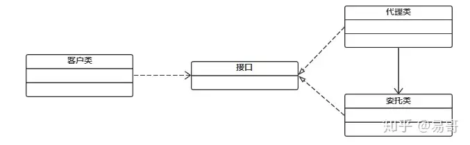

原本客户需要直接调用目标类（委托类），而现在客户需要通过代理类来调用目标类。


#### 作用

在客户类和委托类中增加了代理类这一层，就可以在代理类中增加一些功能，例如起到下面的作用：

- **隔离作用**：可以防止对目标对象的直接访问，实现目标对象与外部的隔离，从而提供安全保障等。例如：在代理中增加权限身份验证。
- **扩展功能**：代理对象可以在目标对象的基础上增加功能。例如：Java切面操作通过建立代理实现。
- **直接替换**：代理对象可以直接替换目标对象的功能，带来全新的实现方式。例如：RPC通过建立代理，直接实现了不存在的接口实现（消费者中只有接口，没有实现类，RPC直接把对实现类的访问转走了）。

#### 静态代理

静态代理就是按照代理模式书写的代码，其**特点是代理类和目标类在代码中是确定的**，因此是静态的。

通过静态代理，我们在目标方法的前后增加了一些操作。

但是，静态代理显然不够灵活。

- 必须要为每个对象创建一个实现了相同接口的代理对象，并且代理对象中的方法也要设置的和原对象一致。因此任何目标对象的变动，代理对象都要变
- 所有代码写死了，不够灵活，不能在运行时改变。

这时，就需要动态代理。他能在代码运行时动态地改变某个对象的代理，并且能为代理对象动态地增加方法、增加行为。

 

#### 动态代理★★★

 有些时候，我们想要根据运行环境（客户类传来的参数等）动态决定代理类的行为，甚至是动态决定要调用哪个目标类。这就需要动态代理。

动态代理有以下特点:

1. 代理对象，不需要实现接口

2. 代理对象的生成，是利用JDK的API，动态的在内存中构建代理对象(需要我们指定创建代理对象/目标对象实现的接口的类型)

3. 动态代理也叫做:JDK代理，接口代理


### 观察者模式★★★

​	当对象间存在一对多关系时，则使用观察者模式（Observer Pattern）。比如，当一个对象被修改时，则会自动通知依赖它的对象。观察者模式属于行为型模式。

**意图：**定义对象间的一种一对多的依赖关系，当一个对象的状态发生改变时，所有依赖于它的对象都得到通知并被自动更新。

**主要解决：**一个对象状态改变给其他对象通知的问题，而且要考虑到易用和低耦合，保证高度的协作。

**何时使用：**一个对象（目标对象）的状态发生改变，所有的依赖对象（观察者对象）都将得到通知，进行广播通知。

**如何解决：**使用面向对象技术，可以将这种依赖关系弱化。

**关键代码：**在抽象类里有一个 ArrayList 存放观察者们。

**应用实例：** 1、拍卖的时候，拍卖师观察最高标价，然后通知给其他竞价者竞价。 2、西游记里面悟空请求菩萨降服红孩儿，菩萨洒了一地水招来一个老乌龟，这个乌龟就是观察者，他观察菩萨洒水这个动作。

**优点：** 1、观察者和被观察者是抽象耦合的。 2、建立一套触发机制。

**缺点：** 1、如果一个被观察者对象有很多的直接和间接的观察者的话，将所有的观察者都通知到会花费很多时间。 2、如果在观察者和观察目标之间有循环依赖的话，观察目标会触发它们之间进行循环调用，可能导致系统崩溃。 3、观察者模式没有相应的机制让观察者知道所观察的目标对象是怎么发生变化的，而仅仅只是知道观察目标发生了变化。

**使用场景：**

- 一个抽象模型有两个方面，其中一个方面依赖于另一个方面。将这些方面封装在独立的对象中使它们可以各自独立地改变和复用。
- 一个对象的改变将导致其他一个或多个对象也发生改变，而不知道具体有多少对象将发生改变，可以降低对象之间的耦合度。
- 一个对象必须通知其他对象，而并不知道这些对象是谁。
- 需要在系统中创建一个触发链，A对象的行为将影响B对象，B对象的行为将影响C对象……，可以使用观察者模式创建一种链式触发机制。

**注意事项：** 

​	1、JAVA 中已经有了对观察者模式的支持类。

​	 2、避免循环引用。 

​	3、如果顺序执行，某一观察者错误会导致系统卡壳，一般采用异步方式。


### 责任链模式

​	顾名思义，责任链模式（Chain of Responsibility Pattern）为请求创建了一个接收者对象的链。这种模式给予请求的类型，对请求的发送者和接收者进行解耦。这种类型的设计模式属于行为型模式。

​	在这种模式中，通常每个接收者都包含对另一个接收者的引用。如果一个对象不能处理该请求，那么它会把相同的请求传给下一个接收者，依此类推。

**意图：**避免请求发送者与接收者耦合在一起，让多个对象都有可能接收请求，将这些对象连接成一条链，并且沿着这条链传递请求，直到有对象处理它为止。

**主要解决：**职责链上的处理者负责处理请求，客户只需要将请求发送到职责链上即可，无须关心请求的处理细节和请求的传递，所以职责链将请求的发送者和请求的处理者解耦了。

**何时使用：**在处理消息的时候以过滤很多道。

**如何解决：**拦截的类都实现统一接口。

**关键代码：**Handler 里面聚合它自己，在 HandlerRequest 里判断是否合适，如果没达到条件则向下传递，向谁传递之前 set 进去。

**应用实例：** 1、红楼梦中的"击鼓传花"。 2、JS 中的事件冒泡。 3、JAVA WEB 中 Apache Tomcat 对 Encoding 的处理，SpringMVC的拦截器，jsp servlet 的 Filter。

**优点：** 1、降低耦合度。它将请求的发送者和接收者解耦。 2、简化了对象。使得对象不需要知道链的结构。 3、增强给对象指派职责的灵活性。通过改变链内的成员或者调动它们的次序，允许动态地新增或者删除责任。 4、增加新的请求处理类很方便。

**缺点：** 1、不能保证请求一定被接收。 2、系统性能将受到一定影响，而且在进行代码调试时不太方便，可能会造成循环调用。 3、可能不容易观察运行时的特征，有碍于除错。

**使用场景：** 1、有多个对象可以处理同一个请求，具体哪个对象处理该请求由运行时刻自动确定。 2、在不明确指定接收者的情况下，向多个对象中的一个提交一个请求。 3、可动态指定一组对象处理请求。

**注意事项：**在 JAVA WEB 中遇到很多应用。


 	责任链模式在我们生活中有着诸多的应用。比如，在我们玩打扑克的游戏时，某人出牌给他的下家，下家会看看手中的牌，如果要不起上家的牌，则将出牌请求再转发给他的下家，其下家再进行判断，如此反复。一个循环下来，如果其他人都要不起该牌，则最初的出牌者可以打出新的牌。在这个过程中，扑克牌作为一个请求沿着一条链(环)在传递，每一位纸牌的玩家都可以处理该请求。在设计模式中，我们也有一种专门用于处理这种 请求链式传递问题 的模式，即责任链模式 (Chain of Responsibility Pattern)。

　此外，采购的分级审批问题也是责任链模式的一个应用典范。我们知道，采购审批往往是分级进行的。也就是说，其常常根据采购金额的不同由不同层次的主管人员来审批。例如，主任可以审批 5 万元以下（不包括 5 万元）的采购单，副董事长可以审批 5 万元至 10 万元（不包括 10 万元）的采购单，董事长可以审批 10 万元至 50 万元（不包括 50 万元）的采购单，50 万元及以上的采购单就需要开董事会讨论决定。此案例如图所示：

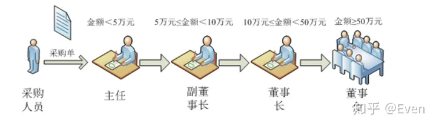


# SQL篇（31题）

==如果需要了解常用SQL语句可以通过下面链接进行学习！==

**推荐在牛客网进行刷题：**[https://www.nowcoder.com/exam/oj?page=1&tab=SQL%E7%AF%87&topicId=199](https://www.nowcoder.com/exam/oj?page=1&tab=SQL%E7%AF%87&topicId=199)

### 数据库表设计的三范式

​		数据库表设计的三范式是指关系数据库中，每个表必须满足三个规范化条件，以确保数据的**完整性、一致性和可维护性**。这三个规范化条件分别是：

1. 第一范式(1NF)：每个属性都是原子性的，即不可再分。这意味着每个属性只能包含一个值，不能有多个值或者组合值。例如，一个订单表应该只包含订单编号、客户编号、订单日期等不可再分的属性。
2. 第二范式(2NF)：每个非主键属性都完全依赖于码(主键)，即不存在部分依赖的情况。这意味着如果一个属性只依赖于主键的一部分，那么它应该被分解成多个表来存储。例如，一个学生表应该包含学生编号、姓名、年龄等完全依赖于码的属性。
3. 第三范式(3NF)：每个非主属性都不传递依赖于主键。这意味着如果一个属性既不完全依赖于主键，也不传递依赖于其他非主属性，那么它应该被分解成多个表来存储。例如，一个订单表应该包含订单编号、客户编号、订单日期等只传递依赖于主键的属性，而不包含任何与订单无关的属性。

通过遵循这三个规范化条件，可以确保数据库表的设计是合理的、高效的和可靠的，能够支持各种复杂的数据操作和查询。


### MySQL 索引的作用，什么情况下使用索引？

  **索引是数据库中的一种数据结构，用于加速数据库表的查询操作。具体来说，索引可以提高对指定列或列组合的查询速度，因为它能够将这些数据存储在内存中，以便快速访问。**

以下是使用索引的一些情况：

  1. 频繁查询的列：如果某个列被频繁地查询，那么使用索引可以显著提高查询性能。例如，在一个订单表中，如果经常需要查询订单编号、客户编号和订单日期等列，那么可以在这些列上创建索引。

  2. 排序和分组：如果需要对表中的数据进行排序或分组操作，那么使用索引可以提高这些操作的效率。例如，在一个员工表中，如果需要按照员工编号进行排序，那么可以在员工编号列上创建一个索引。

  3. 连接操作：如果需要在多个表之间执行连接操作(如联合查询)，那么使用索引可以提高连接操作的性能。例如，在一个订单表和一个产品表之间执行联合查询，可以使用连接字段(如订单编号)创建一个索引。

  需要注意的是，虽然索引可以提高查询性能，但它们也会增加插入、更新和删除操作的开销。因此，应该根据具体情况来决定是否需要为表创建索引。同时，为了避免索引造成过度占用内存的情况，也应该适当地选择索引类型和设置索引的相关参数。

### MySQL的分页有哪些方法？

​		MySQL的分页是一种将数据库结果集按照指定大小进行分割的方法，以便于快速地显示数据。以下是MySQL中常见的分页方法：

  1. LIMIT和OFFSET：这是最常见的分页方法，它使用LIMIT和OFFSET关键字来限制查询结果的数量和偏移量。例如，要获取第2-5个记录，可以使用LIMIT 4 OFFSET 2。

  2. ORDER BY：通过在SELECT语句中添加ORDER BY子句，可以对查询结果进行排序并进行分页。例如，要按照ID字段对结果进行排序并获取前10条记录，可以使用SELECT * FROM table ORDER BY ID ASC LIMIT 10。

  3. GROUP BY：通过在SELECT语句中添加GROUP BY子句，可以将结果集根据一个或多个字段进行分组。然后，可以使用聚合函数(如SUM、COUNT等)来计算每个分组的总数，并使用LIMIT和OFFSET来获取指定数量的记录。

  4. UNION：如果需要同时获取多组数据，可以使用UNION关键字将多个SELECT语句的结果合并为一个结果集。然后，可以使用LIMIT和OFFSET来获取指定数量的记录。

需要注意的是，不同的分页方法适用于不同的场景和需求。例如，在使用ORDER BY进行分页时，需要确保查询结果的顺序是正确的；而在使用GROUP BY进行分页时，需要确保聚合函数的使用正确并且结果是可重复的。因此，在实际应用中应该根据具体情况选择合适的分页方法。

### inner join 和left join的区别？

​		INNER JOIN和LEFT JOIN是MySQL中常用的两种连接查询方式，它们的区别如下：

1. INNER JOIN返回匹配的行：INNER JOIN只会返回两个表中都存在的匹配行。如果一个表中有数据而另一个表中没有，则不会返回该行。
2. LEFT JOIN返回左表中的所有行，包括NULL值：LEFT JOIN会返回左表中的所有行，即使右表中没有匹配的行。如果右表中的一列有NULL值，则左表中对应列的值也会是NULL。
3. RIGHT JOIN返回右表中的所有行，包括NULL值：RIGHT JOIN会返回右表中的所有行，即使左表中没有匹配的行。如果左表中的一列有NULL值，则右表中对应列的值也会是NULL。
4. INNER JOIN比LEFT JOIN更精确：由于INNER JOIN只返回匹配的行，所以它比LEFT JOIN更精确。在某些情况下，使用INNER JOIN可以避免不必要的数据传输和处理。
5. LEFT JOIN比RIGHT JOIN更容易理解：LEFT JOIN更直观，因为它返回的是左表中的所有行。而RIGHT JOIN需要理解右表中的数据是如何得到的。

需要注意的是，INNER JOIN和LEFT JOIN都是不包含重复行的，也就是说它们都会去除重复的记录。如果需要保留重复的记录，可以使用子查询或者UNION语句来实现。

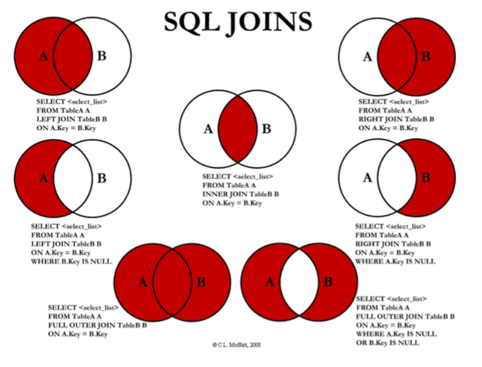

### 你知道的mysql的存储引擎有哪些，他们有什么区别？

  MySQL中的存储引擎有InnoDB、MyISAM等类型。它们的区别如下：

- InnoDB：支持事务处理、行级锁定和外键约束等功能，适用于大型数据库系统。它使用B+树作为索引结构，支持多版本并发控制(MVCC)机制。但是，它的性能相对较低，对于大量重复数据的查询效率不高。
- MyISAM：不支持事务处理和行级锁定等功能，适用于小型数据库系统。它使用B树作为索引结构，支持全文检索和压缩等功能。但是，它的性能相对较高，对于大量重复数据的查询效率很高。

  

### 数据库的基本属性是哪些？★★★

​		ACID是数据库系统中的四个基本属性，用于描述事务的正确性、一致性、隔离性和持久性。

- A代表**原子性**(Atomicity)，指一个事务是一个不可分割的整体，要么全部执行成功，要么全部失败回滚。
- C代表**一致性**(Consistency)，指事务执行的结果必须符合一定的约束条件，如外键约束、唯一性约束等。
- I代表**隔离性**(Isolation)，指多个事务同时操作同一个数据时，每个事务都应该感觉不到其他事务的存在，即事务之间相互隔离。
- D代表**持久性**(Durability)，指一旦事务提交，其对数据的修改应该是永久性的，即使系统发生故障或崩溃也不会丢失。

这些属性保证了数据库系统的可靠性和稳定性，使得数据库可以被广泛应用于各种应用程序中。


### 索引在什么情况下会失效？

- 针对索引使用函数

- 索引列算数运算
- 索引列隐式转换

- ！= 和NULL判断
- LIKE “%_”百分号在前

### Mysql中主键默认是索引么？

​		在MySQL中，主键默认是索引。

  当创建一个新的表时，如果没有显式地指定主键，MySQL会自动为每个非空的列定义一个名为“PRIMARY”的主键索引。例如，如果创建了一个包含三个非空列的表，MySQL会自动为这三个列创建一个名为“PRIMARY”的主键索引。

  需要注意的是，虽然主键默认是索引，但这并不意味着所有的主键都是必要的。如果某个主键列没有被频繁地查询或更新，那么将其设置为主键可能会增加插入、更新和删除操作的开销。因此，应该根据具体情况来决定是否需要将某个列设置为主键。

### Mysql锁你了解哪些？

​		MySQL中常见的锁包括：

1. 行级锁(Row-level Locking)：也称为共享锁(Shared Lock)，它允许事务读取一行数据，但不允许其他事务修改该行数据。行级锁适用于读多写少的场景。
2. 表级锁(Table-level Locking)：也称为排他锁(Exclusive Lock)，它允许事务独占整个表，防止其他事务对表进行任何操作。表级锁适用于写操作频繁的场景。
3. 页面锁(Page Locking)：它是一种特殊的锁，用于锁定数据库中的页面(通常为4KB)。页面锁可以防止其他事务修改同一页上的数据，从而提高并发性能。
4. InnoDB引擎的行级锁和事务隔离级别：InnoDB是MySQL中最常用的存储引擎之一，它支持多种事务隔离级别，如读未提交(Read Uncommitted)、读已提交(Read Committed)、可重复读(Repeatable Read)和串行化(Serializable)。不同的隔离级别会影响到InnoDB的锁机制，例如在可重复读隔离级别下，所有写操作都需要获取行级锁，而在串行化隔离级别下，所有写操作都需要获取表级锁。

除了上述常见的锁之外，还有一些其他的锁机制，如记录级锁、间隙锁等。不同的锁机制适用于不同的场景，需要根据具体情况来选择合适的锁策略。

### 10.Mysql的事务隔离级别★★★

​		InnoDB是MySQL中最常用的存储引擎之一，它支持多种事务隔离级别，包括：

  1. 读未提交(Read Uncommitted)：允许事务读取未提交的数据，其他事务可以对这些数据进行修改或删除，存在脏读、不可重复读和幻读等问题。

  2. 读已提交(Read Committed)：只允许事务读取已提交的数据，对其他事务修改或删除的数据不产生影响，解决了脏读问题，但仍存在不可重复读和幻读等问题。

  3. 可重复读(Repeatable Read)：要求事务在整个执行期间都能够读取相同的数据，即保证每个事务都看到相同的数据快照。这种隔离级别可以避免不可重复读的问题，但仍存在幻读问题。

  4. 串行化(Serializable)：强制所有事务以串行的方式执行，即每个事务必须在前一个事务完成之前才能开始执行。这种隔离级别可以解决所有的并发问题，但会导致性能下降。

在InnoDB中，默认的事务隔离级别为可重复读(Repeatable Read)，可以通过以下语句进行设置：

```sql
SET TRANSACTION ISOLATION LEVEL READ COMMITTED;
```

或者使用以下语句将事务隔离级别设置为可重复读：

```csharp
SET TRANSACTION ISOLATION LEVEL READ UNCOMMITTED;
```

  需要注意的是，不同的隔离级别适用于不同的场景，需要根据具体情况来选择合适的隔离级别。例如，在高并发写入操作的场景下，可以选择可重复读隔离级别来保证数据的一致性；而在读取操作较多的场景下，可以选择读已提交隔离级别来提高性能。

### 什么是脏读、幻读、和不可重复读?

  **脏读(Dirty Read)、幻读(Phantom Read)和不可重复读(Non-repeatable Read)是并发事务中常见的问题，这些问题通常是由于事务隔离级别不当导致的。**

  1. 脏读(Dirty Read)：指一个事务读取了另一个事务尚未提交的数据，这个数据在后续的事务执行中可能会被修改或删除。例如，在一个事务中读取一个行，而另一个事务在这个行上插入了新数据，那么第一个事务仍然会读取到旧的数据而不是新数据。

  2. 幻读(Phantom Read)：指一个事务在执行时，看到了一个不存在的记录。这可能是由于其他事务插入了新的记录，但是当前事务还没有来得及读取这些记录。

  3. 不可重复读(Non-repeatable Read)：指一个事务在执行时，多次读取同一个数据的结果不一致。例如，在一个事务中读取一个行，然后另一个事务在这个行上插入了新数据，那么第一个事务再次读取这个行时，可能会得到不同的结果。

  这些问题通常是由于事务隔离级别不当导致的。在**可重复读**(Repeatable Read)隔离级别下，可以**避免脏读**和**不可重复读**的问题，但仍可能存在幻读问题。在更高级别的隔离级别下，如串行化(Serializable)，可以解决所有的并发问题，但会导致性能下降。因此，需要根据具体的应用场景来选择合适的事务隔离级别。

### 什么是悲观锁和乐观锁

**悲观锁和乐观锁是并发控制机制的两种不同方式。**

  **悲观锁**(Pessimistic Locking)：是一种保守的并发控制方式，**它认为并发访问可能会导致数据不一致，因此在任何时候都会对共享资源进行加锁**，保证数据的一致性和完整性。当一个事务要对共享资源进行修改时，需要先获取锁，其他事务无法获得该锁，直到该事务完成修改并释放锁。悲观锁的优点是实现简单、可靠性高，但缺点是会影响并发性能，因为每次访问共享资源都需要获取锁，会阻塞其他事务的执行。

  **乐观锁**(Optimistic Locking)：是一种较为灵活的并发控制方式，**它认为并发访问不会导致数据不一致，因此在读取共享资源时不会加锁**，而是在**提交更新之前先检查共享资源是否被其他事务修改过**，如果没有则更新该资源，否则回滚操作。乐观锁的优点是可以提高并发性能，因为不需要每次访问共享资源都加锁，但缺点是实现相对复杂，需要考虑多版本并发控制等问题。

### SQL优化你了解哪些？★★★

**SQL优化是提高数据库性能的重要手段。以下是一些常见的SQL优化技巧：**

  1. `避免全表扫描`：全表扫描是指在没有索引的情况下，对整个表进行扫描以查找所需数据。这会导致性能下降。因此，应该使用索引来加速查询。

  2. 避免使用`SELECT *`：只选择需要的列可以减少数据传输量和查询时间。如果不需要所有列，可以使用SELECT列名的方式来指定需要的列。

  3. 避免使用子查询：子查询会增加数据库的负担，导致性能下降。如果可能的话，应该尽量避免使用子查询。

  4. `使用JOIN代替子查询`：JOIN可以将多个查询合并为一个查询，从而减少数据库的负担。如果可能的话，应该尽量使用JOIN代替子查询。

  5. 避免使用WHERE子句中的函数：WHERE子句中的函数会对整个表进行计算，这会导致性能下降。如果可能的话，应该尽量避免使用WHERE子句中的函数。

  6. 避免使用ORDER BY中的函数：ORDER BY子句中的函数会对整个结果集进行计算，这会导致性能下降。如果可能的话，应该尽量避免使用ORDER BY子句中的函数。

  7. 使用`EXPLAIN`命令分析查询计划：使用EXPLAIN命令可以查看查询执行计划，从而确定哪些部分需要优化。根据EXPLAIN命令的结果，可以调整查询语句以提高性能。


总之，SQL优化是一个综合性的过程，需要综合考虑多个因素。通过合理的SQL编写和优化，可以提高数据库的性能和效率。

### 关于mysql的索引，你觉得他的优点是什么？

1. 提高查询效率：索引可以加快数据库的查询速度，特别是在大量数据的情况下。

2. 改善排序性能：通过创建合适的索引，可以提高对数据的排序性能。

3. 优化分组操作：索引可以加速对数据的分组操作，从而提高查询效率。

4. 支持范围查询：索引可以支持基于范围的查询，如大于、小于等操作。


### 说说char和varchar的区别？

在MySQL中，CHAR和VARCHAR都是用来存储字符串类型的数据。它们的区别在于：

1. 存储方式不同：CHAR是固定长度的字符串类型，它会根据定义的长度来自动截断多余的字符；而VARCHAR是可变长度的字符串类型，它会根据实际存储的数据长度来占用空间。

2. 索引效率不同：由于CHAR是固定长度的，所以在创建索引时，只需要索引部分字符即可，因此它的索引效率比VARCHAR高。

3. 存储容量不同：由于CHAR是固定长度的，所以它的存储容量相对较小，适合存储较短的字符串；而VARCHAR是可变长度的，所以它的存储容量相对较大，适合存储较长的字符串。

4. 安全性不同：由于CHAR是固定长度的，所以它不能有效地存储特殊符号或中文等非ASCII字符，容易导致安全漏洞；而VARCHAR可以有效地存储这些字符，提高了数据的安全性。

综上所述，CHAR适合用于存储较短、不需要进行分词或全文搜索等操作的字符串类型数据，而VARCHAR适合用于存储较长、需要进行分词或全文搜索等操作的字符串类型数据。

### 如何设计Mysql索引？

设计MySQL索引是一个非常重要的数据库管理任务，它可以显著提高查询性能。以下是一些设计MySQL索引的基本原则：

1. 首先，需要对表中的列进行分析，确定哪些列是最经常用于查询和排序的。这些列通常是索引的好候选。
2. 对于数值类型的列，应该选择适当的数据类型，如整数或浮点数。对于字符类型的列，应该选择适当的长度，以避免截断或浪费空间。
3. 对于经常用于连接的列，应该创建索引。例如，如果两个表之间经常有连接操作，那么在这两个表之间的连接列上创建索引是非常重要的。
4. 对于经常用于排序的列，也应该创建索引。这可以大大提高排序操作的效率。
5. 对于经常用于分组的列，也应该创建索引。这可以大大提高分组操作的效率。
6. 在创建索引时，应该避免使用过多的索引。过多的索引会降低写入性能，并且会增加维护成本。一般来说，每个表最好不要超过10个索引。
7. 在创建索引时，应该选择合适的索引类型。MySQL支持多种索引类型，包括B树索引、哈希索引、全文索引等。不同的索引类型适用于不同的场景，需要根据具体情况进行选择。
8. 在修改表结构时，应该谨慎地添加或删除索引。这可能会影响到查询性能，需要进行测试和评估。

总之，设计MySQL索引需要综合考虑多个因素，包括数据类型、连接操作、排序操作、分组操作等。需要根据具体情况进行选择和优化，以达到最佳的查询性能。

### Mysql日志你了解哪些，有什么作用？

MySQL有多种类型的日志，包括二进制日志和文本日志等。

  1. 二进制日志(Binary Log)：MySQL的二进制日志是一种重载的、归档的日志文件，记录了所有对MySQL数据库进行修改操作的信息，如增删改表、更新数据等等。二进制日志可以用于主从复制、数据备份和恢复等场景。在主从复制中，主服务器会将所有的binlog写入磁盘，然后通过异步的方式将binlog发送给从服务器，从服务器再将binlog应用到自己的本地数据库中。在数据备份和恢复中，二进制日志可以用于还原数据库到指定时间点的状态。

  2. 慢查询日志(Slow Query Log)：MySQL的慢查询日志可以记录执行时间超过指定阈值的SQL语句，可以帮助DBA或者开发人员找出性能瓶颈所在。慢查询日志可以通过设置阈值来控制记录频率，也可以通过配置参数来调整记录长度和保存天数等。

  3. 错误日志(Error Log)：MySQL的错误日志可以记录MySQL运行时发生的错误信息，例如连接问题、权限问题等等。错误日志可以帮助DBA或者开发人员快速定位和解决问题。

这些日志都可以提供有用的信息，帮助DBA或者开发人员更好地管理和维护MySQL数据库。

### 针对一条慢 SQL，通常会怎样去优化它？

针对一条慢 SQL，通常可以采取以下几种优化方式：

  1. 优化SQL语句：检查SQL语句的执行计划，优化查询条件、表连接方式、索引使用等，以提高SQL语句的执行效率。可以使用MySQL自带的EXPLAIN语句来分析SQL语句的执行计划，找出性能瓶颈所在。

  2. 添加索引：对经常被查询的列建立索引，可以大大提高查询效率。但是需要注意的是，过多的索引会降低写入性能，并且会增加维护成本。需要根据具体情况进行选择和优化。

  3. 分页查询：对于数据量较大的表，可以使用分页查询的方式来避免一次性查询所有数据，从而减少查询时间。

  4. 缓存结果集：对于一些计算复杂的SQL语句，可以将查询结果缓存起来，避免重复计算。可以使用MySQL自带的查询缓存或者第三方缓存框架来实现。

  5. 调整服务器配置：如果以上方法无法解决慢 SQL 的问题，可以考虑对服务器进行调整，例如增加内存、优化硬盘读写等方式来提高数据库性能。

需要注意的是，在进行SQL语句优化时，需要综合考虑多个因素，包括数据量、查询频率、硬件配置等等。需要根据具体情况进行选择和优化，以达到最佳的查询性能。

### 什么是B+树

B+树是一种多路搜索树，常用于数据库和文件系统中的索引结构。它是一种自平衡的树形数据结构，其中每个节点最多只有M个子节点，且所有叶子节点都位于同一层。B+树有以下特点：

  1. 每个节点存储M个关键字(或者称为记录)，可以存储较多的数据。

  2. 所有非叶子节点都有指向子节点的指针，这些指针形成了一棵树状结构。

  3. 根节点、中间节点和叶子节点都是独立的节点，它们之间通过指针相互连接。

  4. 在插入和删除操作时，只需要调整少量的节点指针，就可以改变大量数据的顺序。

由于B+树具有高度平衡、磁盘读写性能好、查询效率高等优点，因此被广泛应用于数据库和文件系统中的索引结构中。

### 常用关键字总结

（1）SELECT 语句用于从数据库中选取数据，结果被存储在一个结果表中，称为结果集。

（2）SELECT `DISTINCT` 语句用于返回唯一不同的值

（3）WHERE 子句用于提取那些满足指定条件的记录

（4） AND & OR 如果第一个条件和第二个条件都成立，则 AND 运算符显示一条记录。如果第一个条件和第二个条件中只要有一个成立，则 OR 运算符显示一条		  记录

（5）ORDER BY 关键字默认按照升序对记录进行排序。如果需要按照降序对记录进行排序，您可以使用 DESC 关键字

（6）INSERT INTO 语句用于向表中插入新记录

（7）UPDATE 语句用于更新表中已存在的记录

（8）DELETE 语句用于删除表中的行

（9）SQL通配符

| 通配符 | 描述                |
| :----- | :------------------ |
| %      | 替代 0 个或多个字符 |
| _      | 替代一个字符        |

（10）IN 操作符允许您在 WHERE 子句中规定多个值

（11）BETWEEN 操作符选取介于两个值之间的数据范围内的值。这些值可以是数值、文本或者日期

### 常用函数有哪些？★★★

（1）AVG() 函数返回数值列的平均值。

（2）COUNT() 函数返回匹配指定条件的行数

（3）FIRST() 函数返回指定的列中第一个记录的值

（4）LAST() 函数返回指定的列中最后一个记录的值。

（5）MAX() 函数返回指定列的最大值。

（6）MIN() 函数返回指定列的最小值。

（7）SUM() 函数返回数值列的总数。

（8）GROUP BY 语句可结合一些聚合函数来使用

（9）HAVING 子句可以让我们筛选分组后的各组数据

（10）EXISTS 运算符用于判断查询子句是否有记录，如果有一条或多条记录存在返回 True，否则返回 False

（11）UCASE() 函数把字段的值转换为大写

（12）LCASE() 函数把字段的值转换为小写

（13）LEN() 函数返回文本字段中值的长度

（14）日期函数

| 函数                                                         | 描述                                |
| :----------------------------------------------------------- | :---------------------------------- |
| [NOW()](https://www.runoob.com/sql/func-now.html)            | 返回当前的日期和时间                |
| [CURDATE()](https://www.runoob.com/sql/func-curdate.html)    | 返回当前的日期                      |
| [CURTIME()](https://www.runoob.com/sql/func-curtime.html)    | 返回当前的时间                      |
| [DATE()](https://www.runoob.com/sql/func-date.html)          | 提取日期或日期/时间表达式的日期部分 |
| [EXTRACT()](https://www.runoob.com/sql/func-extract.html)    | 返回日期/时间的单独部分             |
| [DATE_ADD()](https://www.runoob.com/sql/func-date-add.html)  | 向日期添加指定的时间间隔            |
| [DATE_SUB()](https://www.runoob.com/sql/func-date-sub.html)  | 从日期减去指定的时间间隔            |
| [DATEDIFF()](https://www.runoob.com/sql/func-datediff-mysql.html) | 返回两个日期之间的天数              |
| [DATE_FORMAT()](https://www.runoob.com/sql/func-date-format.html) | 用不同的格式显示日期/时间           |

### 连接查询操作有哪些？

**INNER JOIN 关键字**

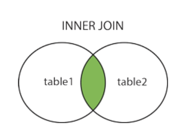

```sql
SELECT column_name(s)
FROM table1
INNER JOIN table2
ON table1.column_name=table2.column_name;
```

==INNER JOIN 关键字在表中存在至少一个匹配时返回行==


**LEFT JOIN 关键字**

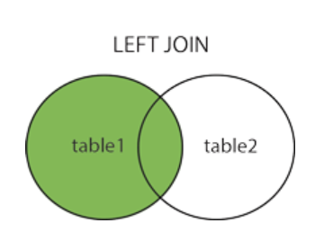


```sql
SELECT column_name(s)
FROM table1
LEFT JOIN table2
ON table1.column_name=table2.column_name;
```

==LEFT JOIN 关键字从左表（table1）返回所有的行，即使右表（table2）中没有匹配。如果右表中没有匹配，则结果为 NULL==


**RIGHT JOIN 关键字**

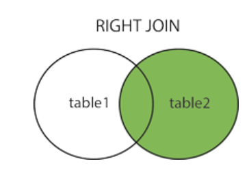

```sql
SELECT column_name(s)
FROM table1
RIGHT JOIN table2
ON table1.column_name=table2.column_name;
```

==RIGHT JOIN 关键字从右表（table2）返回所有的行，即使左表（table1）中没有匹配。如果左表中没有匹配，则结果为 NULL==


**FULL OUTER JOIN 关键字**

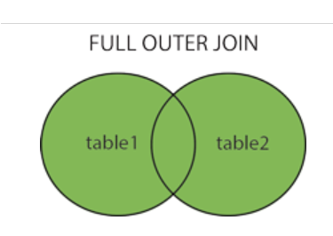

```sql
SELECT column_name(s)
FROM table1
FULL OUTER JOIN table2
ON table1.column_name=table2.column_name;
```

==FULL OUTER JOIN 关键字只要左表（table1）和右表（table2）其中一个表中存在匹配，则返回行.==


### 31.视图

视图是虚拟的表。与包含数据的表不一样，视图只包含使用时动态检索数据的查询。

- 视图不能加快查询速度

- MySql没有**物化视图**。 通过触发器，比如当我们有新增数据的时候，触发该数据插入到一张虚拟的物化视图表中。

**为什么使用视图**

1、重用sql语句

2、简化复杂的sql操作。在编写查询后，可以很方便的重用他，而不必知道他的基本查询细节。

3、使用表的组成部分而不是整个表。

4、保护数据。可以给用户授予表的特定部分的访问权限。

5、更改数据的格式和表示。视图可返回与底层表的表示与格式不同的数据。

性能注意：因为视图不包含数据，所以每次使用它时，都必须处理查询执行时所需的任一个检索。如果你用多个联结和过滤创建了复杂的视图或者嵌套了视图，可能会发现性能下降的很厉害。因此在部署大量的视图应用之前，需要对视图的性能做测试。


**视图的规则和限制**

  

下面是对于视图的创建和使用的一些最常见的规则与限制：

1、与表一样视图必须唯一命名。（不能给视图取和别的视图或者是表相同的名字）

2、对于可以创建的视图个数是没有限制的。

3、为了创建视图，必须有足够的权限，这些权限是有数据库管理员授予的。

4、视图可以嵌套，即可以利用从其他视图中检索数据的查询来构建一视图。

5、ORDER BY可以使用在视图上，但是如果从该视图中检索数据的SELECT中如果也包含ORDER BY 语句，则视图中的ORDER 将会被覆盖。

6、视图不能过索引，也不能有关联的触发器或默认值。

7、视图可以和表一起使用。例如，编写一条连接视图与表的SELECT语句。

 

# 框架篇（37题）

## Spring

### 什么是Spring框架？Spring框架有哪些主要模块？

​	Spring框架是一个为Java应用程序的开发提供了综合、广泛的基础性支持的Java平台。Spring帮助开发者解决了开发中基础性的问题，使得开发人员可以专注于应用程序的开发。Spring框架本身亦是按照设计模式精心打造，这使得我们可以在开发环境中安心的集成Spring框架，不必担心Spring是如何在后台进行工作的。

 	Spring框架至今已集成了20多个模块。这些模块主要被分如下图所示的核心容器、数据访问/集成,、Web、AOP（面向切面编程）、工具、消息和测试模块。

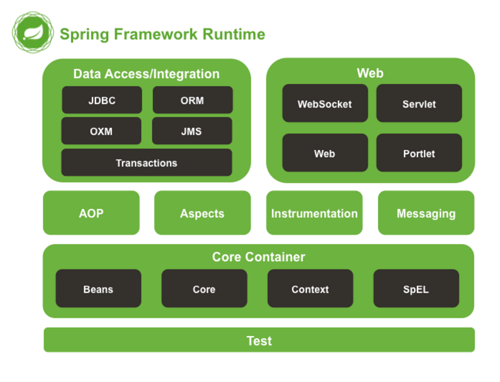


### Spring有几种配置方式？

将Spring配置到应用开发中有以下三种方式：

- 基于XML的配置
- 基于注解的配置
- 基于Java的配置


### Spring框架中的单例Beans是线程安全的么？

​	Spring框架并没有对单例bean进行任何多线程的封装处理。关于单例bean的线程安全和并发问题需要开发者自行去搞定。但实际上，大部分的Spring bean并没有可变的状态(比如Servie类和DAO类)，所以在某种程度上说Spring的单例bean是线程安全的。如果你的bean有多种状态的话（比如 View Model 对象），就需要自行保证线程安全。

​	最浅显的解决办法就是将多态bean的作用域由“singleton”变更为“prototype”。


### Spring 框架中都用到了哪些设计模式？★★★

Spring框架中使用到了大量的设计模式，下面列举了比较有代表性的： 

- 代理模式—在AOP和remoting中被用的比较多。

- 单例模式—在spring配置文件中定义的bean默认为单例模式。

- 模板方法—用来解决代码重复的问题。比如. RestTemplate, JmsTemplate, JpaTemplate。
- 工厂模式—BeanFactory用来创建对象的实例。


### Spring AOP在实际项目中的应用★★★

权限管理、表单验证、事务管理、信息过滤、拦截器、过滤器、页面转发等等。


### 阐述一下Bean的生命周期？

在Spring框架中，Bean的生命周期通常包括以下几个阶段：

    1. 实例化Bean对象：当Spring容器需要一个Bean时，会调用Bean类的构造方法创建一个新的Bean实例。
    
    2. Bean属性赋值：Spring容器会在创建Bean实例后，将Bean类中的属性值赋给实例变量。
    
    3. Bean初始化：Spring容器会在Bean实例化后，调用@PostConstruct注解标注的方法对Bean进行初始化操作。这个方法可以有多个，并且是按照声明顺序执行的。
    
    4. Bean使用：Spring容器会在需要使用Bean的时候，调用getBean方法获取Bean实例。此时，Bean已经被创建并初始化完毕，可以直接使用了。
    
    5. Bean销毁：当Spring容器不再需要Bean时，会调用destroy方法销毁Bean实例。在销毁之前，Spring容器会先调用deallocate方法释放Bean占用的资源。如果在Bean中使用了ThreadLocal等线程本地变量，则会在线程结束时自动清理。

下面是一个简单的示例，展示了Spring中Bean的生命周期：

```java
public class MyBean {
    private int count;

    public MyBean(int count) {
        this.count = count;
    }

    @PostConstruct
    public void init() {
        System.out.println("Initializing MyBean, count=" + count);
    }

    public void doSomething() {
        System.out.println("Doing something with MyBean, count=" + count);
    }
}

@Configuration
public class AppConfig {
    @Bean
    public MyBean myBean(int count) {
        return new MyBean(count);
    }
}

public class App {
    public static void main(String[] args) throws Exception {
        ApplicationContext context = new ClassPathXmlApplicationContext("applicationContext.xml");
        MyBean bean = (MyBean) context.getBean("myBean");
        bean.init(); // Initializing MyBean, count=0
        bean.doSomething(); // Doing something with MyBean, count=0
        context.close(); // 关闭应用程序上下文，销毁所有bean实例和资源
    }
}

// applicationContext.xml文件内容如下：
<bean id="myBean" class="com.example.MyBean">
    <property name="count">0</property>
</bean>


```

### Spring 中有哪些方式可以把 Bean 注入到 IOC 容器？

在Spring中，有以下几种方式可以把Bean注入到IOC容器：

    1. 构造函数注入：通过在Bean类的构造函数上使用@Autowired注解，将需要注入的Bean作为参数传递给构造函数。
    
    2. Setter方法注入：通过在setter方法上使用@Autowired注解，将需要注入的Bean作为参数传递给setter方法。
    
    3. 字段注入：通过在Bean类的属性上使用@Autowired注解，将需要注入的Bean作为属性值直接赋值。
    
    4. @Resource注解：使用@Resource注解标注一个静态方法或类，该方法或类会自动装配一个指定类型的Bean实例。
    
    5. @ComponentScan注解：使用@ComponentScan注解扫描指定包下的所有类，并将被扫描到的类自动装配到IOC容器中。
    
    6. @Import注解：使用@Import注解导入其他配置文件中定义的Bean，这些Bean会被自动装配到IOC容器中。
    
    7. @Qualifier注解：使用@Qualifier注解指定需要装配的具体Bean的名称，以便在多个相同类型的Bean之间进行选择。

### SpringData有了解么吗？

    1. Spring Data JPA Repositories：提供了一些高级功能，如查询构造器、分页、排序等，使得开发人员可以更加方便地进行JPA数据访问。
    
    2. Spring Data REST Repositories：提供了一些高级功能，如RESTful风格的接口、JSON序列化和反序列化等，使得开发人员可以更加方便地进行RESTful数据访问。
    
    3. Spring Data Elasticsearch Repositories：提供了一些高级功能，如支持Elasticsearch的索引和搜索、集成Elasticsearch模板等，使得开发人员可以更加方便地进行Elasticsearch数据访问。
    
    4. Spring Data MongoDB：提供了一些高级功能，如支持MongoDB的索引和搜索、集成MongoDB模板等，使得开发人员可以更加方便地进行MongoDB数据访问。

总之，Spring Data提供了多种数据访问技术的支持，可以根据不同的需求选择合适的技术进行数据访问。同时，Spring Data还提供了很多高级功能和扩展性，可以帮助开发人员更加方便地进行数据访问和管理。

### Spring的IOC你了解哪些？★★★

Spring IoC (Inversion of Control) 是一种依赖注入(Dependency Injection,DI)的实现方式，它可以解决 Java 应用程序中组件之间的耦合问题。

在 Spring IoC 中，组件不再直接依赖于其他组件，而是通过容器(IoC Container)来管理它们的依赖关系。当需要使用一个组件时，容器会自动将该组件注入到调用它的代码中，从而实现了解耦和松散耦合。

Spring IoC 主要由以下几个部分组成：

1. 容器(IoC Container)：负责管理应用程序中的所有组件，并将它们组合在一起以创建完整的应用程序。Spring IoC 默认使用的是 Tomcat 作为 IoC Container。
2. 配置文件(Configuration File)：用于定义应用程序中所有组件的依赖关系。Spring IoC 通过 XML 或 Java 配置文件来实现配置。
3. 注解(Annotation)：用于描述组件之间的依赖关系。Spring IoC 支持多种注解，如 @Autowired、@Inject 等。
4. 代理(Proxy)：Spring IoC 在运行时动态地创建一个代理对象，用于管理组件之间的依赖关系。代理对象可以拦截方法调用，并在调用前或调用后执行一些额外的操作。

总之，Spring IoC 可以大大简化 Java 应用程序的开发过程，提高代码的可维护性和可测试性。

### @Resource 和 @Autowired 的区别

`@Resource` 和 `@Autowired` 都是Spring框架中用于自动装配Bean的注解，它们的作用是一样的，都是将一个或多个Bean注入到目标对象中。

不过，它们之间还是有一些区别的：

    1. `@Resource` 是Java EE标准中的注解，而`@Autowired` 是Spring框架中的注解。因此，如果你使用的是Java EE标准规范，那么你可以使用`@Resource`注解；如果你使用的是Spring框架，那么你可以使用`@Autowired`注解。
    
    2. `@Resource`注解可以同时指定多个Bean进行注入，而`@Autowired`注解只能指定一个Bean进行注入。例如：

```java
@Resource
private UserService userService;

@Autowired
private UserService userService; // 只指定了一个UserService Bean
```

    3. `@Resource`注解可以指定Bean的名称，而`@Autowired`注解不能直接指定Bean的名称。如果需要指定Bean的名称，可以通过`@Qualifier`注解来指定。例如：

```java
@Resource(name="userService")
private UserService userService;

@Autowired
@Qualifier("userService")
private UserService userService; // 通过@Qualifier指定了bean的名称为"userService"


```

总之，`@Resource`和`@Autowired`注解的主要区别在于它们的来源和使用方式。如果你使用的是Java EE标准规范，那么你可以使用`@Resource`注解；如果你使用的是Spring框架，那么你可以使用`@Autowired`注解。无论使用哪种注解，都需要根据实际情况选择合适的方式进行Bean的注入。

### Spring的AOP你了解哪些？★★★

Spring AOP (Aspect-Oriented Programming) 是一种面向切面编程(Aspect-Oriented Programming,AOP)的实现方式，它可以解决 Java 应用程序中横切关注点(Cross-Cutting Concerns)的问题。

在 Spring AOP 中，我们可以将横切关注点从业务逻辑代码中分离出来，通过定义切面(Aspect)来统一处理。切面是一个包含一系列通知(Advice)的模块化单元，通知可以在程序执行的不同阶段执行，如方法调用前、方法调用后、异常处理等。

Spring AOP 主要由以下几个部分组成：

    1. 切面(Aspect)：定义一个或多个通知，用于描述横切关注点的处理逻辑。
    
    2. 实现接口(Interface)：定义切面接口，并实现其中的方法。
    
    3. 织入(Weaving)：将切面应用到目标对象中，使其具有横切关注点的处理能力。Spring AOP 支持两种织入方式，即基于代理的织入和基于 CGLIB 的织入。
    
    4. AOP 配置文件(Aspect Configuration File)：用于定义切面的声明和切点表达式等信息。Spring AOP 通过 XML 或注解方式来实现配置。

总之，Spring AOP 可以大大简化 Java 应用程序的开发过程，提高代码的可维护性和可测试性。


## SpringMVC

### SpringMVC执行流程图★★★

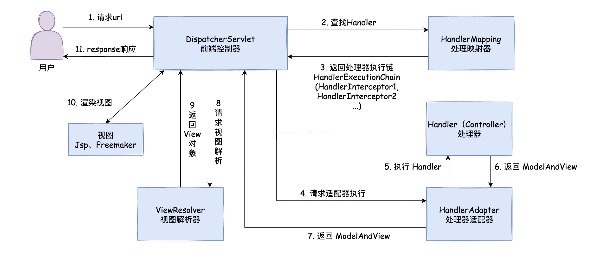

1、 用户发送请求至前端控制器DispatcherServlet

2、 DispatcherServlet收到请求调用HandlerMapping处理器映射器。

3、 处理器映射器根据请求url找到具体的处理器，生成处理器对象及处理器拦截器(如果有则生成)一并返回给DispatcherServlet。

4、 DispatcherServlet通过HandlerAdapter处理器适配器调用处理器

5、 执行处理器(Controller，也叫后端控制器)。

6、 Controller执行完成返回ModelAndView

7、 HandlerAdapter将controller执行结果ModelAndView返回给DispatcherServlet

8、 DispatcherServlet将ModelAndView传给ViewReslover视图解析器

9、 ViewReslover解析后返回具体View

10、 DispatcherServlet对View进行渲染视图（即将模型数据填充至视图中）。

11、 DispatcherServlet响应用户


### SpringMVC的注解★★★

Spring MVC是一个基于Spring框架的Web应用程序框架，它提供了许多注解来简化控制器(Controller)和视图(View)的配置。以下是一些常用的Spring MVC注解及其作用：

    1. @Controller：用于标记一个类，表示这个类是一个控制器。
    
    2. @RestController：用于标记一个类，等同于@Controller+@ResponseBody
    
    3. @RequestMapping：用于映射HTTP请求的URL和HTTP方法到控制器的方法上。
    
    4. @GetMapping：用于将HTTP GET请求映射到控制器的方法上。
    
    5. @PostMapping：用于将HTTP POST请求映射到控制器的方法上。
    
    6. @PutMapping：用于将HTTP PUT请求映射到控制器的方法上。
    
    7. @DeleteMapping：用于将HTTP DELETE请求映射到控制器的方法上。
    
    8. @ModelAttribute：用于将请求参数绑定到控制器方法的参数上。
    
    9. @RequestParam：用于获取HTTP请求中的参数值。
    
    10. @PathVariable：用于获取HTTP请求中路径变量的值。
    
    11. @RequestBody：用于将HTTP请求体中的数据绑定到控制器方法的参数上。
    
    12. @ResponseBody：用于将控制器方法的返回值作为HTTP响应体返回给客户端。

这些注解可以帮助开发人员快速构建Spring MVC应用程序，并使其更加易于维护和扩展。


## Spring Boot


### Spring Boot的优点

Spring Boot是一个基于Spring框架的快速开发工具，它提供了许多优点，包括：

    1. 快速启动和构建应用程序：Spring Boot可以自动配置许多常见的应用程序组件，如数据库、Web服务器、安全等，从而大大减少了开发人员的工作量。
    
    2. 简化依赖管理：Spring Boot使用Maven或Gradle等构建工具来管理应用程序的依赖关系，使得应用程序的依赖关系更加清晰和易于管理。
    
    3. 提高开发效率：Spring Boot提供了许多自动化功能，如自动配置、自动重启等，可以大大提高开发人员的工作效率。
    
    4. 提高应用程序的可测试性：Spring Boot提供了丰富的测试框架和工具，可以帮助开发人员更好地测试应用程序的功能和性能。
    
    5. 提高应用程序的安全性和可靠性：Spring Boot提供了许多安全性和可靠性方面的功能和特性，如加密、身份验证、数据保护等，可以帮助开发人员更好地保护应用程序的安全性和可靠性。

总之，Spring Boot是一个非常强大的开发工具，可以帮助开发人员更快地构建高质量的应用程序，并提高开发效率和应用程序的质量。


### SpringBoot的注解你知道哪些？

Spring Boot是一个基于Spring框架的快速开发应用程序的工具，它提供了许多注解来简化配置和加速开发过程。以下是一些常用的Spring Boot注解及其作用：

  1. @SpringBootApplication：标注一个主类，表示这是一个Spring Boot应用程序。

  2. @RestController：用于标记一个类，表示这个类处理HTTP请求并返回JSON格式的数据。

  3. @RequestMapping：用于映射HTTP请求的URL和HTTP方法到控制器的方法上。

  4. @GetMapping：用于将HTTP GET请求映射到控制器的方法上。

  5. @PostMapping：用于将HTTP POST请求映射到控制器的方法上。

  6. @PutMapping：用于将HTTP PUT请求映射到控制器的方法上。

  7. @DeleteMapping：用于将HTTP DELETE请求映射到控制器的方法上。

  8. @Autowired：自动注入一个bean实例。

  9. @Qualifier：用于指定bean的名称，以避免命名冲突。

  10. @Value：用于获取配置文件中的属性值。

  11. @ConfigurationProperties：用于将配置文件中的属性值注入到Java类中。

  12. @EnableAutoConfiguration：启用自动配置功能，根据依赖关系自动配置应用程序。

这些注解可以帮助开发人员快速构建Spring Boot应用程序，并使其更加易于维护和扩展。

### SpringBoot监视器是什么？

SpringBoot监视器是一种用于监控和管理Spring Boot应用程序的工具。它提供了实时的监控和警报，可以帮助开发人员及时发现和解决应用程序中的问题。

SpringBoot监视器可以监控各种指标，如应用程序的性能、响应时间、内存使用情况、数据库连接数等等。此外，它还可以提供日志记录和警报功能，以帮助开发人员更好地了解应用程序的行为和状态。

SpringBoot监视器通常是一个独立的应用程序，可以通过JMX(Java Management Extensions)或其他API进行配置和监控。开发人员可以使用SpringBoot监视器来诊断和优化他们的应用程序，以确保它们始终处于最佳状态。

### 如何使用Spring Boot实现异常处理？

Spring Boot提供了一种简单而强大的方式来处理应用程序中的异常。以下是使用Spring Boot实现异常处理的步骤：

  1. 创建一个类并继承自`org.springframework.web.bind.annotation.ControllerAdvice`或`org.springframework.web.bind.annotation.RestControllerAdvice`。

  2. 在类中定义一个或多个异常处理方法，使用`@ExceptionHandler`注解标记这些方法。例如：
```less

@ControllerAdvice
public class MyExceptionHandler {

    @ExceptionHandler(Exception.class)
    public ResponseEntity<String> handleException(Exception e) {
        return new ResponseEntity<>("An error occurred: " + e.getMessage(), HttpStatus.INTERNAL_SERVER_ERROR);
    }
}
```

上面的代码将处理所有未被捕获的异常，并返回一个包含错误消息的`ResponseEntity`对象。您可以根据需要添加其他异常处理方法。

  3. 在应用程序中调用异常处理方法。例如，如果您有一个控制器方法，可以像这样调用它：
```python

@GetMapping("/hello")
public String hello() {
    throw new RuntimeException("Oops!");
}


```

当该方法被调用时，它将抛出一个运行时异常，这将触发`handleException`方法的执行。

除了使用`@ExceptionHandler`注解之外，Spring Boot还提供了其他一些注解和API来处理异常。例如，您可以使用`@RestControllerAdvice`注解处理HTTP请求中的异常，或者使用`@ErrorHandler`注解处理特定的异常类型。

### 如何理解 Spring Boot 配置加载顺序？

Spring Boot 配置加载顺序如下：

  1. 系统属性：首先，Spring Boot 将检查与应用程序相关的系统属性。这些属性可以是 JVM 属性或操作系统属性。例如，如果设置了 `spring.config.name` 系统属性，则它将优先于其他配置文件。

  2. 命令行参数：接下来，Spring Boot 将检查命令行参数。这些参数可以通过 `-Dspring.config.name` 和 `--spring.config.name` 标志指定。

  3. 配置文件：Spring Boot 将查找以下位置的配置文件：

  * classpath：在类路径下查找 `application.properties` 或 `application.yml` 文件。
  * resource：在类路径下查找 `/META-INF/spring.factories` 中的配置资源。
  * environment：在环境变量中查找名为 `SPRING_CONFIG_LOCATION` 的变量，并将其值解析为配置文件的位置。

  1. Spring Boot 默认配置：如果没有找到任何配置文件，则使用默认配置。这些默认配置可以在 `src/main/resources/application.properties` 或 `src/main/resources/application.yml` 文件中找到。

总之，Spring Boot 将按照上述顺序加载配置文件，并且优先级由高到低为命令行参数、系统属性、类路径下的配置文件、环境变量和默认配置。


## MyBatis

### MyBatis架构图★★★

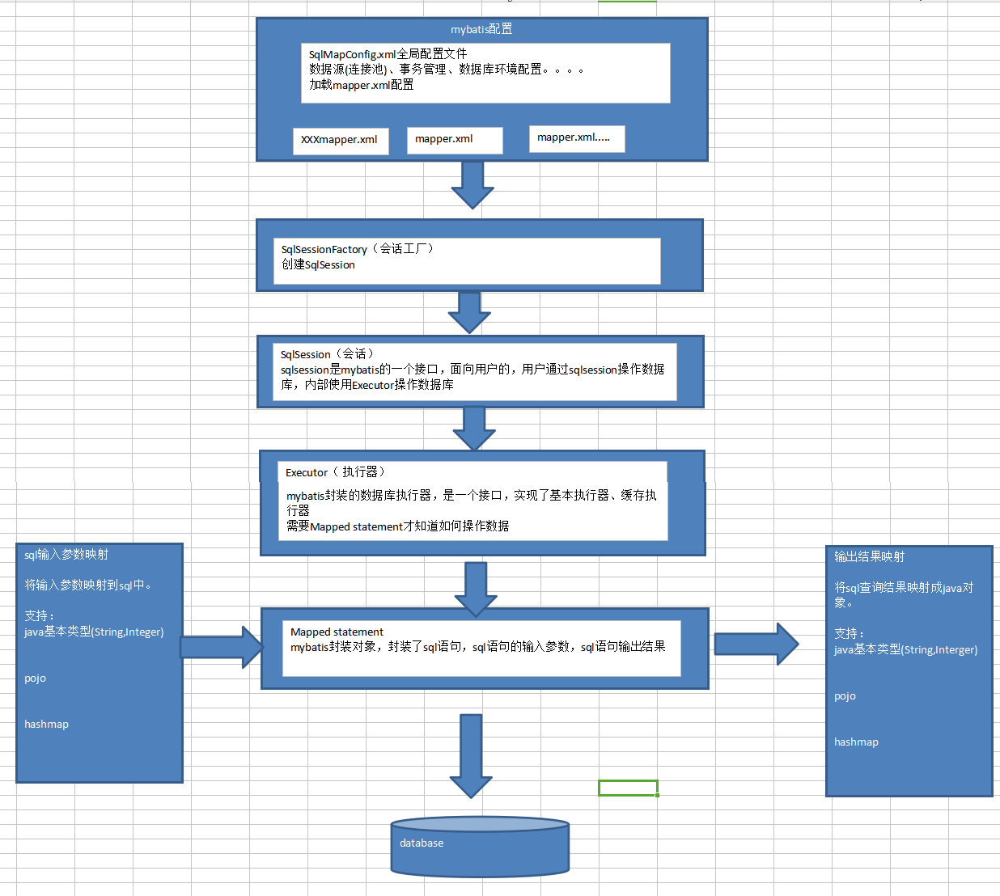


1、 mybatis配置

SqlMapConfig.xml，此文件作为mybatis的全局配置文件，配置了mybatis的运行环境等信息。

mapper.xml文件即sql映射文件，文件中配置了操作数据库的sql语句。此文件需要在SqlMapConfig.xml中加载。

2、 通过mybatis环境等配置信息构造SqlSessionFactory即会话工厂

3、 由会话工厂创建sqlSession即会话，操作数据库需要通过sqlSession进行。

4、 mybatis底层自定义了Executor执行器接口操作数据库，Executor接口有两个实现，一个是基本执行器、一个是缓存执行器。

5、 Mapped Statement也是mybatis一个底层封装对象，它包装了mybatis配置信息及sql映射信息等。mapper.xml文件中一个sql对应一个Mapped Statement对象，sql的id即是Mapped statement的id。

6、 Mapped Statement对sql执行输入参数进行定义，包括HashMap、基本类型、pojo，Executor通过Mapped Statement在执行sql前将输入的java对象映射至sql中，输入参数映射就是jdbc编程中对preparedStatement设置参数。

Mapped Statement对sql执行输出结果进行定义，包括HashMap、基本类型、pojo，Executor通过Mapped Statement在执行sql后将输出结果映射至java对象中，输出结果映射过程相当于jdbc编程中对结果的解析处理过程。


### MyBatis常见注解★★★

MyBatis是一个Java持久化框架，它提供了一些注解来简化SQL语句的编写和映射。以下是一些常用的MyBatis注解及其作用：

    1. @Select：用于标记一个查询方法。
    
    2. @Update：用于标记一个更新方法。
    
    3. @Insert：用于标记一个插入方法。
    
    4. @Delete：用于标记一个删除方法。
    
    5. @Results：用于指定查询结果的映射关系。
    
    6. @ResultMap：用于指定查询结果的映射关系，可以对查询结果进行进一步的映射处理。
    
    7. @Param：用于指定SQL语句中的参数名称。
    
    8. @Options：用于指定执行SQL语句时的选项，如缓存、事务等。
    
    9. @Where：用于标记查询条件。
    
    10. @OrderBy：用于标记查询结果的排序规则。

这些注解可以帮助开发人员快速构建MyBatis应用程序，并使其更加易于维护和扩展。同时，MyBatis还提供了许多其他注解和配置文件，可以根据具体需求进行选择和使用。


### Mapper代理开发规范★★★

​	Mapper接口开发方法只需要程序员编写Mapper接口（相当于Dao接口），由Mybatis框架根据接口定义创建接口的动态代理对象，代理对象的方法体同上边Dao接口实现类方法。

Mapper接口开发需要遵循以下规范：

1、 Mapper.xml文件中的namespace与mapper接口的类路径相同。

2、 Mapper接口方法名和Mapper.xml中定义的每个statement的id相同 

3、 Mapper接口方法的输入参数类型和mapper.xml中定义的每个sql 的parameterType的类型相同

4、 Mapper接口方法的输出参数类型和mapper.xml中定义的每个sql的resultType的类型相同


### MyBatis一级缓存和二级缓存★★★

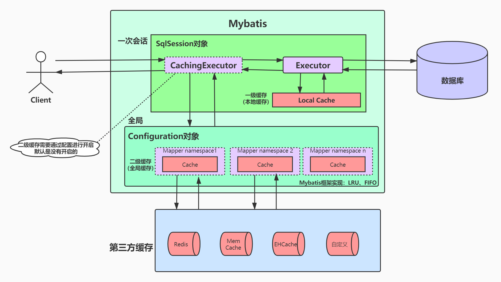

一级缓存是默认开启的，二级缓存默认关闭。

- 作用范围
  - 一级缓存是会话级别的缓存，即sqlSession级别，会话结束，清除会话中的缓存数据，实际代码中通过通过开启事务让多个数据库操作共享一个sqlSession。
  - 二级缓存: 全局级别，也叫namespace级别，会话结束，缓存依然存在，多个请求可以共享缓存数据。

- 缓存位置
  - 一级缓存由于是sqlSession级别，本质上是在JVM中创建一个Map集合对象保存缓存数据，所以缓存数据保留的地方是本地JVM内存中。
  - 二级缓存默认也是保存在JVM中，但是可以通过配置将缓存数据保存到第三方缓存中，比如ehcache、redis。保存在redis这些的分布式缓存中，能提供更好的分布式场景的支持。

- 缓存过期
  - 一级缓存无过期时间，只有生命周期，缓存会先放在一级缓存中，当sqlSession会话提交或者关闭时才会将一级缓存刷新到二级缓存中；开启二级缓存后，用户查询时，会先去二级缓存中找，找不到在去一级缓存中找，然后才去数据库查询；
  - 二级缓存的过期时间默认是1小时，如果这个cache存活了一个小时，那么将整个清空一下。需要注意的是，并不是key-value的过期时间，而是这个cache的过期时间，是flushInterval，意味着整个清空缓存cache，所以不需要后台线程去定时检测，每当存取数据的时候，都有检测一下cache的生命时间。


> 一级缓存的作用在我看来在实际业务场景中作用真的非常有限，因为需要在一个事务方法中重复查询的需求场景真的太少，而且由于Mysql数据库的MVCC机制以及事务隔离机制-可重复读的能力，会导致同一个事务方法内多次执行相同的查询必定会得到相同的结果，所以在事务范围内的重复查询基本没什么实际作用。
> 设计一级缓存设计的意义，可能更多的是为二级缓存的实现做铺垫。
> 所以，如果关闭了mybatis的一级缓存，二级缓存将不会生效。


### MyBatis-Plus注解

MyBatis-Plus是MyBatis的一个增强工具，它提供了许多注解和API来简化开发。以下是一些常用的MyBatis-Plus注解及其作用：

    1. @Select：用于标记一个查询方法。
    2. @Update：用于标记一个更新方法。
    3. @Insert：用于标记一个插入方法。
    4. @Delete：用于标记一个删除方法。
    5. @BatchInsert：用于批量插入数据。
    6. @TableField：用于指定实体类中的字段与数据库表中的字段映射关系。
    7. @TableName：用于指定查询的数据库表名。
    8. @Version：用于添加版本号字段。
    9. @LogicDelete：用于标记逻辑删除字段。
    10. @TableId：用于自动生成主键。

这些注解可以帮助开发人员快速构建MyBatis-Plus应用程序，并使其更加易于维护和扩展。同时，MyBatis-Plus还提供了许多其他注解和API，可以根据具体需求进行选择和使用。

### MyBatisplus分页是如何实现的?

MyBatis-Plus是一个基于MyBatis的增强工具，它提供了一些便捷的CRUD操作和分页查询功能。在分页查询方面，MyBatis-Plus采用了以下两种方式：

    1. 使用数据库原生的分页查询(如MySQL中的LIMIT、OFFSET)：

MyBatis-Plus会根据Mapper接口中定义的方法参数，自动生成SQL语句，并将查询结果封装成Page对象返回给调用者。例如，假设Mapper接口中有以下方法：

```java
public interface UserMapper extends BaseMapper<User> {
    List<User> selectUsersWithPage(int pageNum, int pageSize);
}
```

那么对应的SQL语句就是：

```sql
SELECT * FROM user LIMIT ? OFFSET ?
```

其中，pageNum和pageSize是传入的参数，用于指定要查询的页数和每页的数据条数。调用上述方法即可实现分页查询：

```java
Page<User> page = new Page<>(pageNum, pageSize);
List<User> users = userMapper.selectUsersWithPage(pageNum, pageSize);
page.setRecords(users);
return page;


```

    1. 自定义分页插件：

如果需要更加灵活地控制分页查询的实现方式，可以使用自定义分页插件。MyBatis-Plus提供了一个PaginationInterceptor拦截器，可以用于拦截SQL执行过程中的分页操作。通过继承PaginationInterceptor并重写相应的方法，可以实现自定义的分页逻辑。

### Mybatis动态SQL如何实现

Mybatis动态SQL可以通过两种方式实现：

    1. 使用if、choose、when、otherwise等标签进行条件判断和分支处理，例如：

```xml
<select id="selectUser" resultType="User">
  select * from user
  <where>
    <if test="username != null">
      and username like #{username}%
    </if>
  </where>
</select>


```

    1. 使用foreach标签遍历集合或数组，并根据元素的属性值动态拼接SQL语句，例如：

```xml
<select id="selectUserByIdList" resultType="User">
  select * from user where id in
  <foreach collection="idList" item="id" open="(" close=")">
    #{id}
  </foreach>
</select>


```

在第二种方式中，需要注意以下几点：

  * foreach标签中的item属性表示当前循环迭代的对象，open属性表示开始拼接字符串时使用的符号，close属性表示结束拼接字符串时使用的符号。
  * 如果遍历的集合或数组比较大，建议将其中的属性值转换为Java对象的属性名，以提高SQL语句的可读性和性能。


### MyBatis 使用了哪些设计模式？★★★

在 MyBatis 中，常见的设计模式有以下几种：

  1. 工厂模式(Factory Pattern)：MyBatis 中的 SqlSessionFactoryBuilder、SqlSessionFactory 等都是工厂模式的典型应用。

  2. 单例模式(Singleton Pattern)：MyBatis 中的 Configuration、SqlSessionFactory 等都是单例模式的应用。

  3. 代理模式(Proxy Pattern)：MyBatis 中的 Mapper 接口和映射文件都是代理模式的应用。Mapper 接口是被代理的对象，而映射文件则是代理的方式。

  4. 装饰器模式(Decorator Pattern)：MyBatis 中的 ResultHandler、Executor、StatementHandler 等都是装饰器模式的应用。

  5. 观察者模式(Observer Pattern)：MyBatis 中的 SqlSessionListener 接口就是观察者模式的应用。当 MyBatis 的 SqlSession 状态发生变化时，会触发相应的回调方法。

总之，MyBatis 在实现过程中使用了很多常见的设计模式，这些设计模式使得 MyBatis 能够更加灵活、高效地完成任务。

### #{}和${}的区别是什么？★★★

在 MyBatis 中，`#{}` 和 `${}` 都是用来占位的语法，但它们的作用范围和使用方式有所不同。

  1. `#{}` 占位符：用于绑定参数值到 SQL 语句中的占位符。它可以绑定基本类型、Java 对象、Map 等数据类型。例如：
```sql
SELECT * FROM users WHERE username = #{username} AND password = #{password}
```

  2. `${}` 占位符：用于绑定常量值到 SQL 语句中的占位符。它只能绑定常量值，不能绑定动态数据。例如：
```sql
SELECT * FROM users WHERE age = ${age} AND gender = #{gender}
```

总之，`#{}` 和 `${}` 在 MyBatis 中都是占位符，但它们的作用范围和使用方式有所不同。`#{}` 可以绑定任意类型的数据，而 `${}` 只能绑定常量值。

### MyBatis 中实体类中的属性名和表中的字段名不一样 ，怎么办 ？

在 MyBatis 中，实体类中的属性名和表中的字段名不一致时，可以使用 `@Param` 注解来指定参数名称。例如：

```java
public class User {
    @Id
    private Long id;
    
    @Column(name = "user_name")
    private String userName;
    
    @Column(name = "age")
    private Integer age;
    
    // ... 其他属性
}

public interface UserMapper {
    @Select("SELECT * FROM users WHERE user_name = #{userName} AND age = #{age}")
    @Options(useGeneratedKeys = true, keyProperty = "id", keyColumn = "id")
    int getUserByNameAndAge(@Param("userName") String userName, @Param("age") Integer age);
}
```

在上面的例子中，`@Column` 注解中的 `name` 属性与实体类中的属性名不同，但我们可以通过指定 `@Param` 注解的参数名称来解决这个问题。这样，MyBatis 就能够正确地将参数绑定到 SQL 语句中的占位符上。

### 说说MyBatis的优点和缺点

MyBatis 是一款优秀的持久层框架，具有以下优点：

  1. 灵活性高：MyBatis 支持自定义 SQL、动态 SQL、存储过程等，能够满足各种复杂的数据库操作需求。

  2. 易于学习和使用：MyBatis 的 API 简单易懂，文档详细，学习成本较低。同时，MyBatis 还提供了强大的插件机制，可以方便地扩展和定制功能。

  3. 性能优秀：MyBatis 的 SQL 解析和执行效率较高，能够提高应用程序的性能和响应速度。

  4. 与 Spring 集成紧密：MyBatis 与 Spring 框架集成紧密，可以方便地进行数据访问和业务逻辑处理。

然而，MyBatis 也存在一些缺点：

  1. XML 配置繁琐：MyBatis 需要通过 XML 文件来进行配置，如果 XML 文件写得不好，会导致代码冗长、难以维护。

  2. 对 SQL 语句的支持有限：虽然 MyBatis 支持自定义 SQL，但是对于复杂的查询和联表操作，需要编写大量的 SQL 代码，增加了开发难度和维护成本。

  3. 对于大型项目的支持不够完善：由于 MyBatis 采用的是基于 XML 的配置方式，对于大型项目来说，XML 文件会变得非常庞大，不易维护和更新。

总之，MyBatis 具有灵活性强、易于学习和使用、性能优秀等优点，但也存在 XML 配置繁琐、对 SQL 语句的支持有限、对于大型项目的支持不够完善等缺点。在使用 MyBatis 时需要根据具体情况进行权衡和选择。


## Redis

### Redis的使用场景

Redis是一种高性能的内存键值存储数据库，常用于以下场景：

    1. 缓存：Redis可以作为缓存系统使用，将常用的数据缓存到内存中，提高访问速度。例如，可以将热点数据、频繁访问的数据等缓存到Redis中，减少对后端数据库的访问压力。
    
    2. 消息队列：Redis支持发布-订阅模式，可以作为轻量级的消息队列使用。例如，可以将用户提交的消息、网站的注册验证信息等发布到Redis中，并通过订阅机制进行处理。
    
    3. 计数器：Redis提供了原子性的操作，可以用于实现计数器功能。例如，可以使用Redis的incr命令对某个键进行自增操作，实现访问次数统计等功能。
    
    4. 排行榜：Redis可以作为排行榜系统使用，支持对不同维度的数据进行排名和统计。例如，可以使用有序集合(sorted set)类型存储用户的积分、点赞数、评论数等信息，并通过分页查询等方式实现排行榜功能。
    
    5. 分布式锁：Redis提供了分布式锁的功能，可以用于实现分布式系统中的互斥操作。例如，在多个进程或线程同时访问同一个资源时，可以使用Redis的setnx命令获取分布式锁，保证只有一个进程或线程能够访问该资源。
    
    6.基于Redis实现共享session

总之，Redis具有高性能、高可用性、易扩展性等特点，适用于各种需要快速读写数据的场景。


### Redis支持的数据类型

Redis是一种高性能的内存键值存储数据库，支持多种数据类型。以下是Redis中的五种基本数据类型：

    1. 字符串(String)：字符串是Redis中最简单的数据类型，可以存储任何二进制数据，包括文本、图片、音频等。字符串类型的值最大可存储512MB。
    
    2. 列表(List)：列表是一个双向链表结构，可以快速地在头部和尾部进行插入和删除操作。列表内部的元素是字符串类型。
    
    3. 集合(Set)：集合是无序的、不重复的元素集合，支持交、并、差集等操作。集合内部的元素是字符串类型。
    
    4. 有序集合(Sorted Set)：有序集合是集合的一种特殊形式，每个成员都与一个分数相关联，可以按分数从小到大排序。有序集合内部的元素同样是字符串类型。
    
    5. 哈希表(Hash)：哈希表是一种键值对映射的数据结构，支持添加、删除、查询等操作。哈希表内部的键和值都是字符串类型。

这些基本数据类型提供了Redis最基本的存储和处理能力，同时也支持一些高级的数据类型，如位图、HyperLogLog等，可以满足不同场景下的需求。

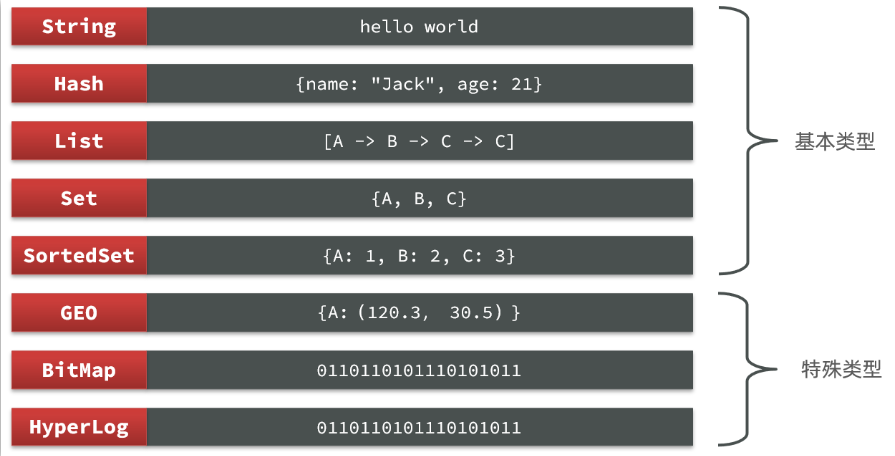

### 如何在Redis中实现分布式锁

在Redis中实现分布式锁通常有两种方式：使用Redis的setnx命令和使用Redis的分布式锁框架。

    1. 使用Redis的setnx命令实现分布式锁

使用setnx命令可以在Redis中实现一个简单的分布式锁，具体步骤如下：

(1)客户端向Redis发送加锁请求，使用SETNX命令将一个特定的键值对设置到Redis中，如果该键不存在，则表示获取到了锁；

(2)如果获取到了锁，客户端执行业务逻辑；

(3)客户端执行完业务逻辑后，使用DEL命令删除之前设置的键值对，释放锁。

需要注意的是，使用setnx命令实现分布式锁时，需要考虑以下几点：

  * 如果多个客户端同时发送加锁请求，只有一个客户端能够成功获取到锁；
  * 如果某个客户端崩溃或意外退出，其他客户端仍然可以继续访问共享资源；
  * 如果需要过期时间，可以使用EXPIRE命令设置键的过期时间。

    1. 使用Redis的分布式锁框架实现分布式锁

除了使用setnx命令外，还可以使用一些开源的Redis分布式锁框架来实现分布式锁。常见的Redis分布式锁框架包括Redisson、Jedis、Lettuce等。这些框架都提供了简单易用的API接口，可以方便地实现分布式锁的功能。

以Redisson为例，使用Redisson实现分布式锁的步骤如下：

(1)引入Redisson依赖；

(2)创建RedissonClient对象；

(3)使用RLock接口获取分布式锁；

(4)执行业务逻辑；

(5)使用Unlock接口释放锁。

需要注意的是，不同的Redis分布式锁框架可能有不同的使用方法和实现细节，具体使用方法需要参考相应的文档说明。

### Redis和Mysql的事务有什么区别？

Redis和Mysql是两种不同的数据库类型，它们在事务处理方面有以下区别：

    1. 事务的原子性不同：Redis使用基于命令的事务模型，即每个命令被视为一个单独的事务。如果一个命令执行失败，整个事务将被回滚。而Mysql使用基于表的事务模型，即所有对数据库的操作都被视为一个事务。如果一个操作失败，整个事务将被回滚。
    
    2. 隔离级别不同：Redis支持读写锁和单例模式等隔离级别，可以根据实际需求进行选择。而Mysql支持四个隔离级别：未提交读(READ UNCOMMITTED)、已提交读(READ COMMITTED)、可重复读(REPEATABLE READ)和串行化(SERIALIZABLE)。
    
    3. 持久化方式不同：Redis通常不需要持久化，因为它是一种内存数据库。而Mysql需要通过定期备份或日志来保证数据的持久性。
    
    4. 事务处理的复杂性不同：由于Redis是基于命令的事务模型，因此它的事务处理相对简单。而Mysql的事务处理较为复杂，需要考虑多个数据表之间的关系以及锁定机制等因素。

总之，Redis和Mysql在事务处理方面有一些不同之处，具体使用哪种数据库应该根据实际需求来选择。如果需要高并发、低延迟的应用场景，可以考虑使用Redis;如果需要支持复杂的事务处理和高可靠性的数据存储，可以使用Mysql。

### Redis缓存穿透如何解决？

​		**Redis 缓存穿透是指查询缓存和数据库中都不存在的数据，但是访问了该数据所在的数据库，导致大量请求直接打到数据库上**，使得数据库负载过高，甚至宕机。为了解决这个问题，可以采用以下几种方法：

1. 布隆过滤器(Bloom Filter)：布隆过滤器是一种空间效率极高的随机数据结构，它能快速判断一个元素是否可能存在于集合中。可以将 Bloom Filter 与 Redis 缓存一起使用，当请求的数据在 Redis 缓存中不存在时，先去查询数据库，如果查询结果为空，则将数据写入 Redis 缓存中并返回空对象；如果查询结果不为空，则直接返回查询结果。这样可以有效地避免缓存穿透问题。

2. 缓存空对象：当请求的数据在 Redis 缓存中不存在时，可以直接返回一个空对象，而不是一个空字符串或者 null。这样可以保证代码的健壮性，并且不会对后续的业务造成影响。

3. 设置短期过期时间：对于一些高频率访问的数据，可以设置较短的过期时间，这样即使缓存未命中，也不会一直占用缓存空间。同时，当缓存中的数据发生变化时，需要及时更新缓存。

4. 使用互斥锁：当多个线程同时访问同一个数据时，可能会出现缓存穿透的问题。可以使用互斥锁来避免这种情况的发生。当一个线程要访问某个数据时，首先获取互斥锁，然后查询数据库并将数据存入 Redis 缓存中。如果查询结果为空，则释放互斥锁并返回空对象；否则将数据存入 Redis 缓存中并继续处理其他请求。

总之，Redis 缓存穿透是一个常见的问题，可以通过布隆过滤器、缓存空对象、设置短期过期时间和使用互斥锁等方法来解决。需要根据具体情况选择合适的方法来应对不同的场景。

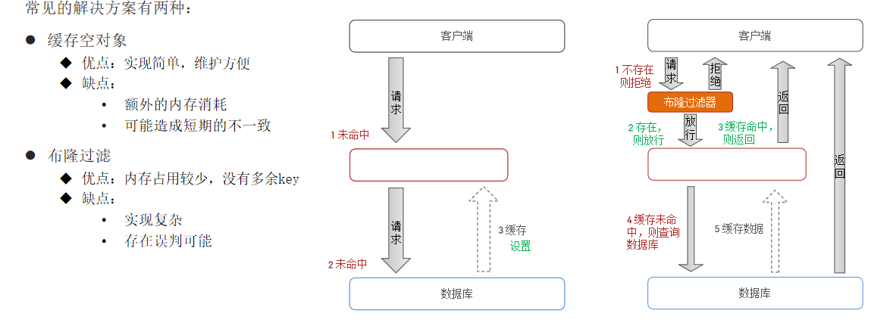

==关于缓存穿透、雪崩、击穿问题可参考链接==：[https://juejin.cn/post/7185923117611483196](https://juejin.cn/post/7185923117611483196)

### Redis缓存雪崩如何解决？

​		**Redis缓存雪崩是指在某个时间点，缓存中大量数据同时失效，导致请求直接打到数据库上**，使得数据库负载过高，甚至宕机。为了解决这个问题，可以采用以下几种方法：

1. 设置热点数据永不过期：对于业务访问频率较高的数据，可以设置永不过期，这样即使缓存失效，也不会对业务造成太大的影响。

2. 分布式锁控制：使用分布式锁来控制缓存的访问和更新操作，避免多个线程同时操作同一个缓存，导致缓存雪崩。当一个线程要访问某个数据时，首先获取分布式锁，然后查询数据库并将数据存入缓存中；释放分布式锁并返回结果。

3. 缓存预热：在系统启动时，可以将一些热点数据预先加载到缓存中，并设置较长的过期时间。这样可以避免在系统正式运行时出现缓存雪崩的情况。

4. Redis集群：使用 Redis 集群来分散缓存的访问压力，提高系统的可用性和稳定性。Redis 集群可以将缓存数据分片存储在多个节点上，避免单点故障和缓存雪崩的问题。

5. 数据分区：将数据按照一定的规则进行分区，每个分区的数据独立存储，互不干扰。这样即使某个分区的数据失效，也不会影响其他分区的使用。

总之，Redis缓存雪崩是一个常见的问题，可以通过设置热点数据永不过期、使用分布式锁、缓存预热、Redis集群和数据分区等方法来解决。需要根据具体情况选择合适的方法来应对不同的场景。

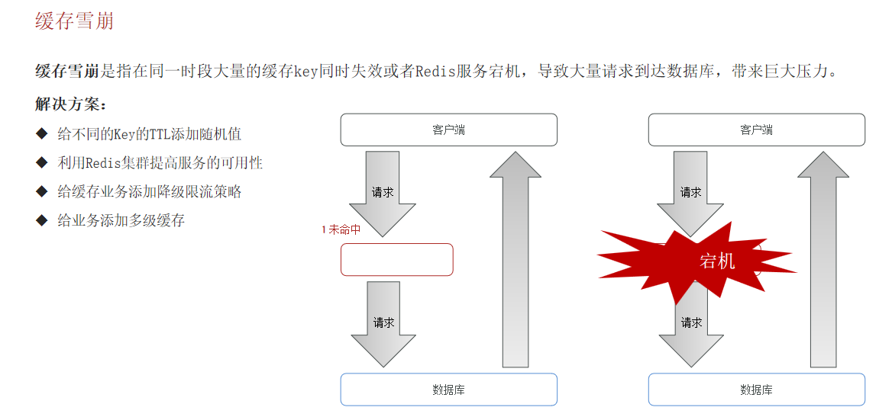


### 什么是缓存击穿，如何解决？

​		**缓存击穿也称为热Key问题是指在 Redis 中，Redis中一个热点key在失效的同时，大量的请求过来，从而会全部到达数据库，压垮数据库**。

**解决方案：**

1.互斥锁：线程1先发来请求，并且获取到了互斥锁。这时线程1就可以去查询数据库，接着将查询到的数据缓存到redis中，最后记得释放锁，不然以后别的线程无法访问数据库。如果在线程1获取互斥锁成功并且还未重建缓存、释放互斥锁的时候，线程2的请求到达，那么线程2无法在redis中获取到缓存，无法获取到互斥锁，那么我们就让线程休眠一会，比方休眠50毫秒，再让线程2去查询缓存，如果还是查询不到，那么再重新休眠，再重新查询。

2.逻辑过期，意味着永不过期。缓存击穿问题产生的原因是某个热点key过期了，请求都打到数据库了，造成数据库压力过大。因此我们可以提前准备一个不过期的热点key （比如参加活动的商品），不设置它的过期时间，将这个key保存到redis中，这样理论上总能命中redis。那是怎么判断这个key逻辑上过期了？答案是这个key的value存储一个过期时间，我们判断这个key是否过期的依据，就是这个key的value保存的过期时间。


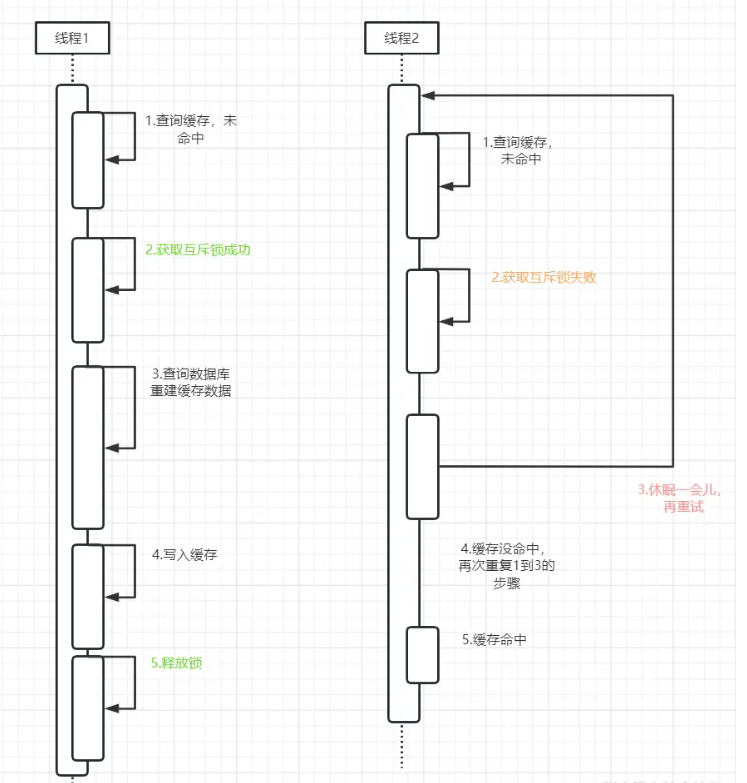

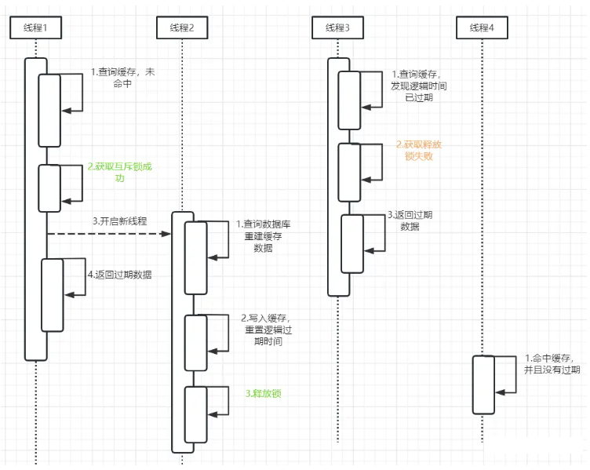

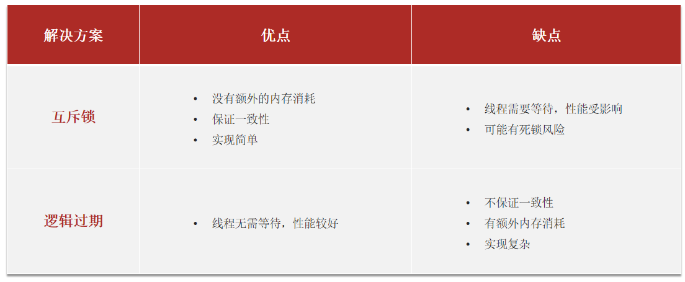

### Redis是单线程模式的，为什么还那么快？

​		Redis 之所以能够实现非常高的性能，主要是因为其采用了一些优秀的设计和技术，使得单线程的处理能力得到了极大的提升。

​		首先，Redis 采用了基于内存的数据存储方式，避免了磁盘 I/O 的开销，从而大大提高了数据的读写速度。同时，Redis 还采用了多种数据结构，如哈希表、有序集合等，这些数据结构的特殊性质也对性能有很大的影响。

​		其次，Redis 采用了异步非阻塞式的 I/O 模型，通过事件循环机制来处理客户端的请求和响应。这种模型可以避免由于网络连接等原因导致的阻塞和延迟，从而提高 Redis 的并发处理能力。

​		此外，Redis 还采用了一些优化策略，如使用多个 CPU 核心、使用多路复用技术、使用批量操作等，这些都可以帮助 Redis 提高性能。

​		总之，Redis 能够实现高性能的原因主要是因为其采用了基于内存的数据存储方式、异步非阻塞式的 I/O 模型、多种高效的数据结构和优化策略等多种因素的综合作用。

### Redis数据持久化的方式？

Redis提供了两种持久化方式：RDB(Redis数据库)快照和AOF(Append-Only File)日志。

    1. RDB持久化：

RDB持久化是将Redis内存中的数据集写入磁盘的一种方式。它可以在指定的时间间隔内自动执行，也可以手动执行。在执行RDB持久化时，Redis会将内存中的数据集转换为二进制文件，并将其保存到磁盘上。RDB持久化的优点是可以将内存中的数据集快速备份到磁盘上，缺点是可能会丢失最近一次操作的数据。

要启用RDB持久化，请在Redis配置文件中设置以下选项：

```python
save 900 1
save 300 10
save 60 10000
```

上面的示例将每900秒执行一次完整的RDB快照，每300秒执行一次部分快照，每60秒执行一次增量快照。另外，您还可以使用BGSAVE命令手动执行RDB持久化。

    1. AOF持久化：

AOF持久化是将Redis服务器对客户端的所有写操作记录到一个日志文件中的一种方式。当Redis服务器重启时，它会重新执行所有以前的写操作来重建数据集。AOF持久化的优点是可以保证数据的可靠性和一致性，缺点是可能会占用大量的磁盘空间。

要启用AOF持久化，请在Redis配置文件中设置以下选项：

```python
appendonly yes
dir /var/lib/redis/aof
maxmemory-policy allkeys-lru
appendfsync always
save 300 10
save 60 10000
```

上面的示例将每个键的修改都添加到AOF文件中，并在每次写操作后保存当前时间戳和修改的数量。此外，还设置了最大内存策略、刷新策略和保存策略。

### Redis中分布式锁的特征有哪些？

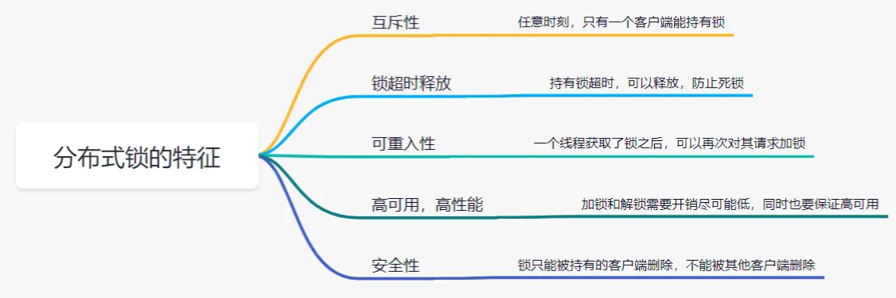

**实现分布式锁的方式**：[https://juejin.cn/post/6936956908007850014](https://juejin.cn/post/6936956908007850014)

# 项目篇（18题）

### 消息队列用过哪些?

消息队列(Message Queue)是一种在分布式系统中用于传递消息的通信机制。它允许应用程序发送和接收消息，而不需要直接相互通信。

在消息队列中，消息被发送到一个中央消息存储库(也称为消息队列服务器或消息中间件)，然后由订阅了该消息的应用程序进行处理。这种方式可以提高系统的可伸缩性、可靠性和灵活性，因为它可以将消息分布到多个节点上，从而减轻单个节点的负载压力。

通常情况下，消息队列使用发布/订阅模式(Publish/Subscribe pattern)进行通信。发布者(Publisher)将消息发布到消息队列中，而订阅者(Subscriber)则从消息队列中订阅特定类型的消息。当发布者发布一条消息时，所有订阅了该类型消息的订阅者都会收到该消息。

常见的消息队列产品包括 Apache Kafka、RabbitMQ、ActiveMQ等。

    1. Apache Kafka：这是一个分布式的高吞吐量消息系统，可以处理数百万条消息。它被广泛应用于实时数据流处理、日志聚合和大数据处理等领域。
    
    2. RabbitMQ：这是一个开源的消息代理，支持多种协议，包括AMQP、STOMP和MQTT等。RabbitMQ适用于构建分布式系统和服务端应用程序。
    
    3. ActiveMQ：这是一个开源的消息代理，支持多种协议，包括JMS、AMQP和STOMP等。ActiveMQ适用于构建企业级应用程序和服务端应用程序。
    
    4. Redis：虽然Redis本身不是专门的消息队列，但它可以通过发布订阅功能实现简单的消息队列功能。Redis适用于异步通信、事件驱动的应用程序和服务端应用程序。

### 前端中怎么存储用户的身份?

在前端中存储用户身份的方式有很多种，以下是其中一些常见的方式：

  1. Cookie：Cookie 是一种在客户端存储用户身份信息的机制。当用户登录后，服务器会将一个包含用户身份信息的 Cookie 发送给客户端。客户端随后可以使用该 Cookie 来识别用户并验证其身份。但是，使用 Cookie 存储敏感信息存在一定的安全风险，因为它可以被窃取和篡改。

  2. LocalStorage：LocalStorage 是 HTML5 提供的一种客户端存储机制，用于在浏览器本地存储数据。可以将用户身份信息存储在 LocalStorage 中，以便在下次访问网站时自动恢复。但是，LocalStorage 也存在安全风险，因为它可以被窃取和篡改。

  3. SessionStorage：SessionStorage 是 HTML5 提供的一种客户端存储机制，用于在浏览器本地存储临时数据。可以将用户身份信息存储在 SessionStorage 中，以便在用户关闭浏览器或刷新页面时自动清除。但是，SessionStorage 也有安全风险，因为它可以被窃取和篡改。

  4. JavaScript Object Notation(JSON)：JSON 是一种轻量级的数据交换格式，可以在客户端和服务器之间传输数据。可以将用户身份信息存储在 JSON 对象中，然后将其发送到服务器进行处理。这种方式比较安全，因为数据不存储在浏览器端，而是在服务器端进行处理。

需要注意的是，无论使用哪种方式存储用户身份信息，都应该采取必要的安全措施来保护用户的隐私和数据安全。例如，对数据进行加密、定期清理过期数据、限制数据的访问权限等。

### 项目中如何使用设计模式？

在Java项目中使用设计模式可以提高代码的可维护性、可扩展性和可重用性。以下是一些使用设计模式的一般步骤：

  1. **了解设计模式**：首先需要了解常用的设计模式，以及它们的作用和应用场景。可以通过阅读相关书籍、博客或者参加培训课程来学习。

  2. **根据需求选择合适的模式**：根据项目的需求和特点，选择合适的设计模式。例如，如果需要处理复杂的对象关系，可以使用工厂模式或者适配器模式；如果需要处理大量的业务逻辑，可以使用策略模式或者观察者模式。

  3. **实现设计模式**：根据所选的设计模式，实现相应的代码。需要注意的是，设计模式并不是一成不变的模板，而是可以根据具体的情况进行调整和优化。

  4. **测试和优化**：完成设计模式的实现后，需要进行测试和优化。测试可以帮助发现潜在的问题和缺陷，优化可以提高代码的性能和可维护性。

  5. **文档化**：最后需要将设计模式的实现和使用方法进行文档化，以便后续的开发人员能够理解和使用。文档可以包括设计模式的原理、使用方法、示例代码等。

​		在Java项目中，常用的设计模式包括单例模式、工厂模式、代理模式、装饰器模式、观察者模式等。这些模式可以帮助开发人员解决常见的软件设计问题，提高代码的质量和效率。

### 项目中如何实现文件上传和下载的?

在Spring Boot项目中，可以通过以下步骤实现文件上传和下载：

1. 添加依赖

   首先需要在项目的pom.xml文件中添加相关依赖，包括spring-boot-starter-web、spring-boot-starter-websocket和commons-fileupload等。

2. 配置文件上传

   在application.properties文件中添加以下配置：

   ```
   # 设置上传文件的保存路径
   spring.servlet.multipart.location=/tmp/uploads/
   spring.servlet.multipart.max-file-size=10MB
   spring.servlet.multipart.max-request-size=20MB
   spring.servlet.multipart.enabled=true
   ```

   

   这里将上传的文件保存到/tmp/uploads/目录下，并限制了上传文件的大小为10MB和请求大小为20MB。

  3. 创建Controller类处理文件上传请求

     创建一个Controller类来处理文件上传请求，可以使用@RestController注解标记它是一个RESTful接口。在控制器类中添加一个POST方法来接收文件上传请求，如下所示：

     ```
     
     @RestController
     public class FileUploadController {
     
         @PostMapping("/upload")
         public String uploadFile(@RequestParam("file") MultipartFile file) throws IOException {
             // 将上传的文件保存到指定目录下
             String filename = file.getOriginalFilename();
             Path path = Paths.get(System.getProperty("user.dir") + "/uploads/" + filename);
             file.transferTo(path);
     
             return "File uploaded successfully: " + filename;
         }
     
     }
     
     ```

     

     在这个方法中，我们使用@RequestParam注解来获取上传的文件，然后将其保存到指定目录下。注意，这里使用了Java 8中的Path类来表示文件路径。如果需要支持旧版的Java环境，可以使用String类型的文件路径。

  4. 在页面上添加文件上传表单

     在页面上添加一个表单来允许用户上传文件。可以使用Spring Boot提供的Bootstrap组件来简化这个过程。首先，在index.html文件中添加以下内容：

     ```html
     <form method="post" action="/upload" enctype="multipart/form-data" class="form-horizontal">
         <div class="form-group">
             <label for="file">Select file to upload:</label>
             <input type="file" name="file" id="file" class="form-control-file">
         </div>
         <button type="submit" class="btn btn-primary">Upload</button>
     </form>
     ```

     

### 如何解决Redis和Mysql数据不同步的问题？

Redis和MySQL是两种不同的数据库系统，它们的数据存储方式和操作方式也不同，因此在某些情况下可能会出现Redis和MySQL数据不同步的问题。以下是一些可能的解决方案：

  1. 使用事务：在Redis中执行插入、更新或删除操作时，可以使用事务来确保这些操作被原子性地执行，并且要么全部成功，要么全部失败。如果事务成功，则可以更新MySQL中的数据；否则，需要回滚Redis中的操作并处理错误。

  2. 使用消息队列：将Redis中的数据通过消息队列发送到MySQL中，以实现异步更新。这样可以避免在Redis和MySQL之间进行直接的数据同步，从而提高性能和可扩展性。

  3. 定期同步：定期检查Redis和MySQL中的数据是否一致，并根据需要进行同步。这种方法需要定期进行数据比较和同步操作，会增加系统的负担和复杂度。

  4. 使用分布式锁：在Redis中使用分布式锁来锁定某个数据项，以确保只有一个客户端可以更新该数据项。当MySQL中的数据发生变化时，只需要等待Redis中的锁被释放即可。

需要注意的是，无论采用哪种方法，都需要考虑数据的一致性和可靠性，以及对系统性能的影响。同时，也需要对系统进行监控和维护，及时发现和解决问题。

### 项目中如何使用Spring中的AOP的？★★★

在Spring中，可以使用AOP(面向切面编程)来实现一些横切面的通用功能，如事务管理、安全性控制、日志记录等。以下是使用Spring AOP的一些基本步骤：

  1. 配置AOP：在Spring应用程序的配置文件中启用AOP支持，例如在XML配置文件中添加以下配置：

```xml
<aop:aspectj-autoproxy />
```

这将自动为所有被注解了@AspectJ注解的类创建代理对象。

  1. 定义切面：切面是跨越多个方法的通用功能，通常以一个带有@AspectJ注解的类表示。例如，下面是一个简单的切面，用于记录每个请求的时间戳：

```java

@Aspect
public class LoggingAspect {
    @Before("execution(* com.example.controller.*.*(..))")
    public void logRequest(JoinPoint joinPoint) {
        ServletRequestAttributes attributes = (ServletRequestAttributes) RequestContextHolder.getRequestAttributes();
        HttpServletRequest request = attributes.getRequest();
        String timestamp = String.valueOf(System.currentTimeMillis());
        log.info("Request {} at {}", request.getRequestURI(), timestamp);
    }
}


```

在这个切面中，我们使用@Before注解来指定在哪些方法执行之前记录日志。在切面方法中，我们使用JoinPoint来获取调用当前方法的方法名和参数列表。然后，我们从ServletRequestAttributes中获取HttpServletRequest对象，并使用它来获取请求的时间戳。最后，我们记录日志。

  1. 在需要进行横切面功能的类上加上@AspectJ注解：例如，在上面的示例中，我们在控制器类上加上了@AspectJ注解。

  2. 在需要进行横切面功能的类的方法上加上@Around注解：例如，在上面的示例中，我们在控制器类的方法上加上了@Around注解。@Around注解会拦截被该注解标注的方法的执行过程，并在执行前后执行切面方法。如果方法有异常抛出，则切面方法也会被捕获并处理。

需要注意的是，在使用AOP时应该遵循一定的规范，例如避免循环依赖、减少代理对象的数量等。同时，也要注意切面的性能问题，尽量减少切面的代理对象数量和拦截的方法数量。

### 项目中为什么使用SpringBoot？

Spring Boot是一个基于Spring框架的快速应用开发框架，它提供了一种简单、快速的方式来构建独立的、生产级别的Spring应用程序。如果面试官问我为什么在项目中使用Spring Boot，我可能会回答以下几点：

  1. 快速启动和构建应用程序：Spring Boot提供了许多自动配置选项和约定优于配置的原则，可以帮助我们快速启动和构建应用程序，减少了繁琐的配置工作。

  2. 简化依赖管理：Spring Boot内置了Maven和Gradle等依赖管理工具，可以轻松地管理应用程序的依赖关系，避免了手动下载和安装依赖项的过程。

  3. 提高开发效率：Spring Boot提供了许多开箱即用的组件和工具，例如Web应用程序、数据访问、安全认证等，可以让我们专注于业务逻辑的开发，提高开发效率。

  4. 提高可维护性：Spring Boot的自动配置和约定优于配置原则可以帮助我们编写更加松散耦合的代码，提高了代码的可维护性。

  5. 适应不同的部署环境：Spring Boot可以根据不同的部署环境(例如开发、测试、生产)自动配置应用程序的行为，使应用程序更加灵活和可扩展。

总之，Spring Boot是一个非常强大的框架，它可以为我们提供许多便利和优势，使我们的应用程序更加高效、灵活和易于维护。

### 如何提高系统吞吐量？

提高系统吞吐量是优化系统性能的一个重要目标。以下是一些可以提高系统吞吐量的方法：

  1. 减少I/O操作：I/O操作是系统性能的瓶颈之一，因此需要尽可能减少I/O操作的数量和时间。可以通过使用缓存、批量处理、异步IO等技术来减少I/O操作的数量和时间。

  2. 优化数据库查询：数据库查询也是系统性能的瓶颈之一，因此需要对数据库进行优化。可以使用索引、分区表、缓存等技术来优化数据库查询的速度。

  3. 分布式计算：如果系统的负载过大，可以考虑使用分布式计算来分担负载。可以使用集群、分布式存储等技术来实现分布式计算。

  4. 并行化处理：对于一些计算密集型的任务，可以使用并行化处理来提高系统吞吐量。可以使用多线程、多进程、协程等技术来实现并行化处理。

  5. 减少锁的使用：锁是同步机制的一种，过多的锁会降低系统的并发性能，因此需要尽量减少锁的使用。可以使用无锁算法、读写分离等技术来减少锁的使用。

总之，提高系统吞吐量需要综合考虑多个方面，包括I/O操作、数据库查询、分布式计算、并行化处理和锁的使用等。只有综合考虑这些因素，才能有效地提高系统的吞吐量。

### git的合并冲突有了解么，如何解决？

是的，我了解git的合并冲突。当两个分支有相同的文件且在同一个位置上进行了不同的更改时，就会发生合并冲突。

解决合并冲突的方法通常有以下几种：

  1. 手动解决冲突：您可以手动编辑包含冲突的文件，以解决冲突。通常，您需要将两个版本的更改放在一起进行比较，并选择保留哪个版本。

  2. 使用git stash命令保存当前工作状态：如果您不确定如何解决冲突，或者想要暂时中止合并操作，可以使用git stash命令将当前工作状态保存下来。这将使您能够回到当前的工作状态，稍后再回来解决冲突。

  3. 使用git mergetool命令自动解决冲突：Git提供了一个名为mergetool的工具，可以帮助您自动解决合并冲突。您可以使用以下命令调用该工具：

```css
git mergetool --conflict /path/to/file
```

该命令将打开一个GUI界面，其中包含了所有包含冲突的文件。您可以选择其中一个文件，然后该工具将自动解决冲突并帮助您完成合并操作。

无论哪种方法，解决合并冲突后，您需要运行以下命令来提交您的更改：

```sql
git add <filename>
git commit -m "Resolved merge conflicts"
```

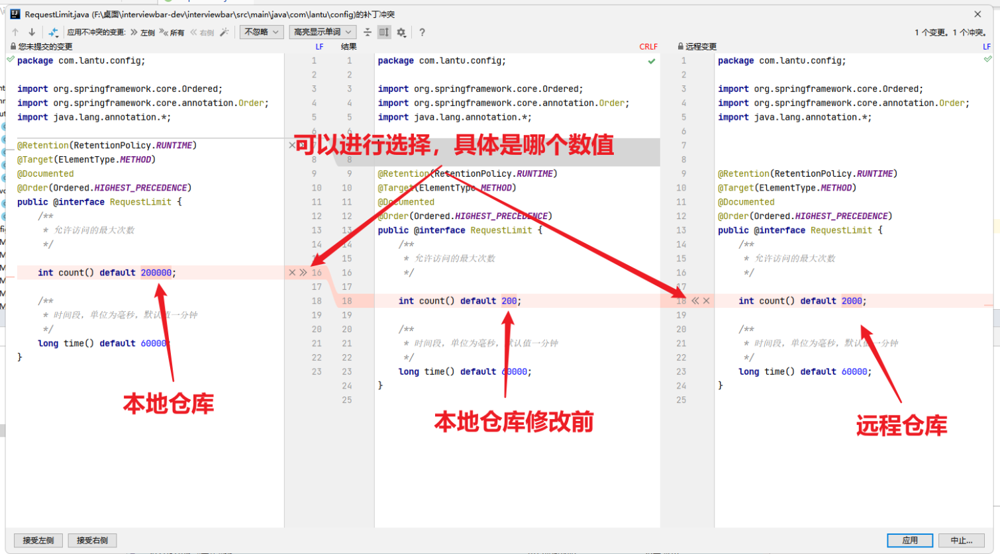

### 项目中的日志是如何记录的？

日志记录在项目中是一个非常重要的组成部分，它可以帮助开发人员和运维人员了解应用程序的运行情况，诊断错误并进行优化。以下是一些常见的日志记录方法：

  1. **控制台输出**：这是最常见的日志记录方法之一。开发人员可以在代码中使用printf()函数或cout语句等来输出日志信息。这种方法简单易用，但只能在开发过程中记录日志。

  2. **日志文件输出**：开发人员可以将日志信息写入文本文件中，以供后续查看。这种方法可以记录更长时间内的日志信息，并且可以通过分析日志文件来发现潜在的问题。

  3. **数据库输出**：开发人员可以将日志信息存储到数据库中，以便稍后进行分析。这种方法可以提供更好的可扩展性和灵活性，并且可以对日志信息进行分类、搜索和过滤等操作。

  4. **第三方库**：有许多开源的日志记录库可供选择，例如Log4j、Logback、SLF4J等。这些库提供了更高级别的抽象，使得开发人员可以更容易地配置和管理日志记录器。

无论采用哪种日志记录方法，都应该注意以下几点：

  1. 记录清晰的信息：确保日志信息包含足够的上下文和细节，以便开发人员和运维人员能够快速定位问题。

  2. 适当的级别：根据不同的情况选择适当的日志级别。例如，调试信息应该只记录在开发环境中，而生产环境中应该只记录错误和警告信息。

  3. 定期清理日志：定期清理日志文件可以减少磁盘空间的使用，并且可以提高性能。但是，应该确保不会丢失任何重要信息。

### 如何配置项目安全的，用了什么框架？

配置项目安全需要考虑多个方面，包括代码安全、网络安全、数据安全等。以下是一些常见的安全配置方法和框架：

  1. 代码安全：使用代码混淆工具可以使源代码更难以理解和篡改。常用的代码混淆工具包括ProGuard、yGuard等。此外，还可以使用静态分析工具来检测潜在的漏洞和错误，例如FindBugs、Checkstyle等。

  2. 网络安全：在开发过程中，应该使用HTTPS协议来保护通信安全。此外，还应该对输入进行验证和过滤，以防止SQL注入、XSS攻击等网络攻击。常用的网络安全框架包括Spring Security、Apache Shiro等。

  3. 数据安全：对于敏感数据，应该使用加密算法进行保护。常用的数据加密算法包括AES、RSA等。此外，还可以使用数据库加密插件来保护数据库中的数据。常用的数据库加密插件包括Hibernate SecureString、MyBatis SQL Cipher等。

  4. 其他安全配置：还需要考虑其他方面的安全配置，例如权限管理、日志监控等。常用的安全配置框架包括Spring Security、Shiro等。

总之，项目安全的配置需要综合考虑多个方面，并选择合适的安全配置方法和框架来实现。

### 项目中如何实现负载均衡的？

在项目中实现负载均衡通常需要以下步骤：

  1. 部署多个服务器：首先需要在不同的服务器上部署相同的应用程序，以便进行负载均衡。这些服务器可以在同一数据中心或不同数据中心中。

  2. 配置负载均衡器：使用负载均衡器来将请求分发到多个服务器上。常用的负载均衡器包括Nginx、Apache、HAProxy等。

  3. 设置权重和轮询：在负载均衡器中，可以设置每个服务器的权重和轮询策略。权重表示该服务器处理请求的能力，轮询策略决定如何分配请求到服务器上。

  4. 监控和优化：需要定期监控负载均衡器的性能和可用性，并根据实际情况进行优化。例如，增加服务器数量、调整权重和轮询策略等。

总之，实现负载均衡需要在项目中部署多个服务器，并使用负载均衡器来分发请求。同时，还需要设置权重和轮询策略，并定期监控和优化负载均衡器的性能和可用性。

### 项目中如何解决高并发的？

在项目中解决高并发通常需要以下步骤：

  1. 优化数据库：高并发通常会导致数据库负载过高，因此需要对数据库进行优化。例如，使用索引、分区表、缓存等技术来提高数据库性能。

  2. 分布式缓存：使用分布式缓存可以减轻数据库的负载，提高系统的响应速度。常用的分布式缓存包括Redis、Memcached等。

  3. 异步处理：对于一些耗时的操作，可以使用异步处理来提高系统的并发能力。例如，使用消息队列来异步处理任务。

  4. 负载均衡：通过使用负载均衡器可以将请求分发到多个服务器上，从而提高系统的并发能力。

  5. 代码优化：在代码层面上也可以进行优化，例如减少不必要的查询、避免重复计算等。

总之，解决高并发需要综合考虑多个方面，包括数据库优化、分布式缓存、异步处理、负载均衡和代码优化等。根据实际情况选择合适的技术和方案来提高系统的并发能力和性能。

### 项目中如何实现高内聚、低耦合？

高内聚、低耦合是面向对象设计中的重要原则，可以使代码更加模块化、可维护和可扩展。以下是在项目中实现高内聚、低耦合的一些方法：

  1. 单一职责原则：每个类应该只有一个责任，即只负责完成一个特定的任务。这样可以避免类之间的依赖关系过于复杂，从而降低耦合度。

  2. 开放封闭原则：软件实体(类、模块等)应该是对扩展开放的，对修改关闭的。这意味着可以在不修改现有代码的情况下添加新的功能。

  3. 里式替换原则：子类应该能够替换它们的父类，而不影响程序的其他部分。这可以避免类之间的依赖关系过于紧密，从而提高内聚度。

  4. 接口隔离原则：客户端不应该依赖于它不需要的接口。这可以避免类之间的依赖关系过于复杂，从而提高系统的灵活性和可维护性。

  5. 依赖倒置原则：高层模块不应该依赖于底层模块，它们都应该依赖于抽象。抽象不应该依赖于具体实现，具体实现应该依赖于抽象。这可以降低模块之间的耦合度。

总之，实现高内聚、低耦合需要在设计阶段就考虑到这些问题，并在代码实现过程中遵循相应的原则。这样可以使代码更加清晰、易于理解和维护。

### 你认为一个完整项目的开发流程是什么？

一个项目的开发流程通常包括以下几个阶段：

  1. **需求分析和规划阶段**：在这个阶段，开发团队会与客户沟通，了解客户的需求和期望，并根据这些需求制定项目计划和开发方案。这个阶段还包括确定项目的目标、范围、时间表和预算等。

  2. **设计阶段**：在设计阶段，开发团队会根据需求分析的结果进行系统设计，包括软件架构、数据库设计、用户界面设计等。这个阶段还需要进行代码评审和技术评估，以确保设计的可行性和可靠性。

  3. **编码阶段**：在编码阶段，开发团队会根据设计文档编写代码。这个阶段需要进行代码审查和测试，以确保代码的质量和稳定性。

  4. **测试阶段**：在测试阶段，开发团队会对已经编写的代码进行各种测试，包括单元测试、集成测试、系统测试等。这个阶段还需要进行性能测试和安全测试，以确保系统的可靠性和安全性。

  5. **部署和维护阶段**：在部署和维护阶段，开发团队会将已经测试通过的代码部署到生产环境中，并对系统进行维护和更新。这个阶段还需要进行故障排除和修复工作，以确保系统的稳定性和可用性。

以上是一个典型的项目开发流程，不同的项目可能会有一些差异，但总体上都遵循类似的步骤。

### 你的项目中前后端如何实现数据交互的？

在我的模型中，前后端之间通过RESTful API进行数据交互。具体来说，前端使用JavaScript编写的应用程序通过HTTP请求来向后端API发出请求，后端API则返回JSON格式的数据给前端应用程序。

以下是一个简单的示例，说明了如何在前端和后端之间实现数据交互：

  1. 在前端应用程序中，我们可以使用XMLHttpRequest对象或fetch函数来发送HTTP请求。例如，下面的代码演示了如何使用fetch函数向后端API发出GET请求：

```javascript

fetch('/api/users')
  .then(response => response.json())
  .then(data => console.log(data))
  .catch(error => console.error(error));


```

在这个示例中，我们使用fetch函数向'/api/users'发送GET请求，并将响应解析为JSON格式的数据。然后，我们可以打印出获取到的数据。

  1. 在后端应用程序中，我们可以使用各种Web框架(如Spring Boot、Express等)来处理HTTP请求。通常，我们会定义API接口来处理不同的请求类型，并返回JSON格式的数据给客户端。例如，下面是一个Spring Boot的示例：

```less

@RestController
public class UserController {
    
    @GetMapping("/api/users")
    public List<User> getUsers() {
        // 从数据库中获取用户列表
        List<User> users = userRepository.findAll();
        
        return users;
    }
    
}

public class User {
    private Long id;
    private String name;
    
    // ...getter and setter methods omitted for brevity
}


```

在这个示例中，我们定义了一个名为'getUsers'的API接口，它返回一个包含所有用户的List集合。在后端应用程序中，我们可以使用Spring Data JPA来访问数据库，并将查询结果转换为JSON格式的数据返回给客户端。

### 如何使用NoSQL数据库？

NoSQL(Not Only SQL)是一种非关系型数据库，与传统的关系型数据库不同，它不需要严格的结构化数据存储方式。NoSQL数据库通常适用于大规模、高并发、分布式的数据存储场景，例如社交网络、移动应用、物联网等。

在项目中使用nosql数据库可以带来以下好处：

1. 高可扩展性：nosql数据库可以轻松地扩展到成千上万台服务器上，以应对不断增长的数据量和高并发访问。
2. 高性能：nosql数据库通常采用内存映射技术，将数据存储在内存中，从而提高读写性能。
3. 灵活的数据模型：nosql数据库支持多种不同的数据模型，例如键值对、文档型、列族型等，可以根据不同的业务需求选择合适的数据模型。
4. 高可用性：nosql数据库通常采用分布式架构，可以通过副本集、分片等方式实现数据的备份和容错。

当然，nosql数据库也有一些缺点，例如数据一致性难以保证、查询复杂度高等。因此，在选择是否使用nosql数据库时需要根据具体的业务需求进行权衡。


### 项目中如何减少对数据库的压力？

在项目中，减少对数据库的压力是非常重要的，因为数据库是应用程序的核心组件之一。以下是一些减少对数据库压力的方法：

1. **使用缓存**：将频繁访问的数据存储在缓存中，可以大大提高应用程序的性能。例如，可以使用Redis、Memcached等内存缓存系统来存储热点数据。
2. **优化查询语句**：编写高效的查询语句可以减少对数据库的负载。可以使用索引、避免全表扫描等技术来优化查询语句。
3. 分页加载数据：当需要加载大量数据时，可以使用分页技术来减少一次性加载所有数据的负载。例如，可以使用懒加载或者异步加载等方式来减少对数据库的负载。
4. **使用消息队列**：当应用程序需要处理大量的并发请求时，可以使用消息队列来分散请求负载。例如，可以使用RabbitMQ、Kafka等消息队列系统来处理消息传递和解耦应用程序的不同部分。
5. **定期清理无用数据**：定期清理无用的数据可以减少数据库的负载。例如，可以使用DELETE命令或者触发器来清理过期的数据。

  6. **使用分布式数据库**：如果应用程序需要处理大量的数据，可以考虑使用分布式数据库来分担数据库的负载。例如，可以使用MySQL Cluster、Cassandra等分布式数据库系统来处理大规模数据。


### 页面静态化

FreeMarker 是一款模板引擎： 即一种基于模板和要改变的数据， 并用来生成输出文本(HTML网页，电子邮件，配置文件，源代码等)的通用工具。 它不是面向最终用户的，而是一个Java类库，是一款程序员可以嵌入他们所开发产品的组件。


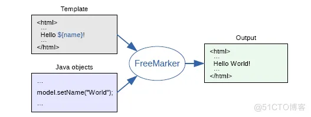

模板 + 数据 = 静态文件

> **常用的java模板引擎还有哪些？**
> Jsp、Freemarker、Thymeleaf 、Velocity 等。


### 软件开发瀑布模型

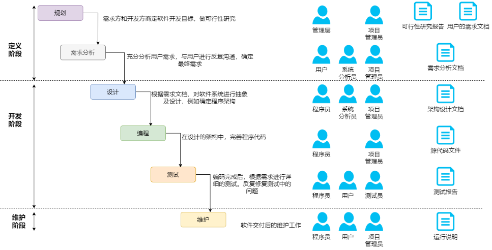

### 敏捷开发

​	敏捷开发以用户的需求进化为核心，采用迭代、循序渐进的方法进行软件开发。在敏捷开发中，软件项目在构建初期被切分成多个子项目，各个子项目的成果都经过测试，具备可视、可集成和可运行使用的特征。换言之，就是把一个大项目分为多个相互联系，但也可独立运行的小项目，并分别完成，在此过程中软件一直处于可使用状态。


```
https://learn.microsoft.com/zh-cn/devops/plan/what-is-agile-development

https://blog.csdn.net/u014685547/article/details/125227422
```


### 持续集成

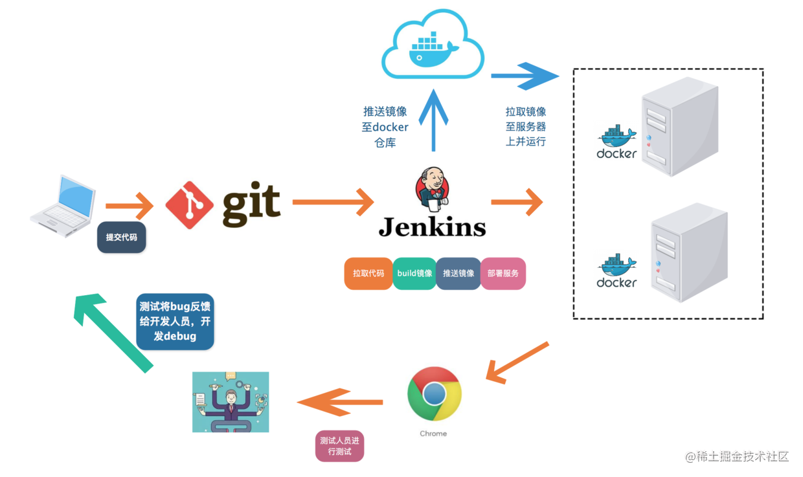

### 单元测试

  单元测试是一种测试方法，它旨在**验证程序中的最小功能模块或单元的正确性**。这些单元通常是方法、函数或代码块，它们可以独立地测试，而不需要依赖于其他代码或外部依赖项。通过单元测试，开发人员可以快速识别和修复代码中的异常，确保程序的正确性和稳定性，并在开发的早期阶段捕获潜在的问题。单元测试也可以帮助开发团队减少代码错误和缺陷，提高代码质量和可维护性。


### 黑盒测试和白盒测试

黑盒测试和白盒测试是软件测试中常用的两种不同的测试技术。

  黑盒测试，它**不需要了解被测试系统的内部结构和功能实现**，而是基于对系统的外部或功能特性进行测试。黑盒测试主要关注系统的功能性、可靠性、兼容性、易用性等特征，并基于这些特征来率先设计测试用例，以评估系统的性能。黑盒测试通常由测试人员执行，测试人员需要了解业务需求和用户使用场景，以便测试系统的功能是否符合用户期望。

  相反，白盒测试，它需要了解被测试系统的内部结构和实现细节。测试人员将仔细检查代码、算法、数据结构等内部组件，以确保系统的正确性、可靠性、可维护性、性能等方面。在白盒测试中，测试人员通常会使用动态分析和静态分析等技术来评估系统的质量。

综上所述，两者的主要区别在于黑盒测试仅关注系统的外部特征而不关心内部实现，而白盒测试则需关注系统内部实现和代码的正确性。

### 集成测试

  集成测试是软件测试的一种类型，**旨在测试不同软件模块之间的交互、协作和集成**，以验证系统能够按预期的功能进行协调和整合，避免模块之间互相干扰或产生不兼容问题。集成测试的目标是发现系统或组件之间的错误或故障，以及评估系统在多个组件之间的集成质量。

  在集成测试中，测试人员往往会使用自动化测试工具进行测试，以确保完成任务时测试的准确性、可靠性和可操作性。测试用例通常基于不同组件之间的应用编排进行设计，同时强调并行、负载和并发测试，以评估系统的性能和可伸缩性。

  集成测试可分为两种类型：自上而下的集成测试和自下而上的集成测试。自上而下的集成测试从高级别模块开始，通过逐渐添加低级别模块来深入测试和排查相关问题。自下而上的集成测试从底层模块开始，在添加高级模块时逐渐深入测试和排查问题。测试人员可以根据实际情况选择相应的集成测试方法。


### 压力测试

  压力测试是一种测试方法，**用于测试系统在高负载和高压力下的稳定性和性能**。在压力测试期间，测试人员将通过逐渐增加负载、并发用户和数据量等方式来模拟系统负载的极限情况。主要目的是评估系统的性能参数，例如响应时间、吞吐量、并发性和资源利用率等，并确保系统在高负载情况下的性能和稳定性。

  在压力测试中，测试人员会使用性能测试工具模拟并发用户的访问和操作，以测试系统在高压力和压力下的性能和稳定性。测试人员会通过分析和记录系统的响应时间、负载均衡、容错性和容灾性等关键性能指标，从而识别和排除系统中性能瓶颈和错误，以确保系统性能和可靠性达到预期要求。

  压力测试往往是系统测试的最后一步，因为前面的测试用例可以为压力测试提供很多参考和基础数据。当系统通过压力测试并且达到所需的性能水平，测试人员就可以将软件应用程序发布到生产环境中。


# 👿附加一：面试官刁难题！

**1.你如何评价自己的今天面试表现？**

**2.说说你的缺点吧！**

**3.你觉得你和其他面试者对比，我为什么要选择你？**

**4.你认为实习这件事情对你有什么意义和你对实习有什么理解？**

**5.我发现你对底层了解的不多，对于这一点你如何弥补？**

**6.为什么没有过四级？**

**7.我们有时候经常加班，你对加班的看法？**

**8.在设计接口的的时候，遇到了错误，你是怎么解决的？**

**9.大学期间让你感觉到最遗憾的事情是什么？**

**10.现在假如说，让你设计一个模块开发，技术栈超出了你的范围，你该如何做？**

**11.如果现在你负责的接口，同事帮你测试接口，出现了一些问题，你现在手头还有其他事要做，你怎么处理？**

**12.现在让你负责一个模块，让你写增删改查，你最多多长时间能实现？**

**13.在开发一个业务模块的时候，如果你和同时的意见不一致，你会怎么做？**

**14.如果让你做前端你接受么(面试后端岗位)？**

**15.你感觉在你学习过程中哪一个模块最难？**

# 🧐附加二：面试需要注意哪些问题？

1. **提前准备**：在面试前，应该对自己的简历和职业背景进行充分的准备，包括了解公司、职位要求、常见问题等。

2.**着装得体**：穿着得体可以给面试官留下良好的第一印象。应该选择整洁、干净、合适的服装。

3.**注意言行举止**：在面试中，要注意自己的言行举止，保持礼貌、自信、专注的态度。避免使用粗俗语言或做出不适当的举动。

4.**认真倾听**：在面试中，要认真听取面试官的问题，并思考后再回答。如果不确定答案，可以诚实地说出来，但也要表达自己的想法和观点。

5.**展现技能**：在面试中，应该充分展现自己的技能和经验，以证明自己是最适合这个职位的人选。可以通过举例说明自己的优点和成就。

6.**问问题**：在面试结束时，可以问一些有关公司、职位、工作环境等方面的问题，以了解更多信息。这也可以表现出自己的兴趣和热情。

7.**谢谢面试官**：最后一定要感谢面试官的时间和机会，表达自己的感激之情。

8.**注意细节**：在面试中要注意细节，例如准时到达、注意礼仪等。这些小细节可以展现出自己的细致和重视程度。

9.**不要紧张**：虽然面试很重要，但不要过于紧张或焦虑。可以通过深呼吸、放松肌肉等方式来缓解紧张情绪。

10.**与面试官建立联系**：在面试中，可以适当地与面试官建立联系，例如微笑、眼神交流等。这可以表现出自己的自信和亲和力。

11.**询问反馈**：在面试结束后，可以询问面试官的反馈和意见，以便改进自己的表现和提高面试技巧。

12.**注意语言表达**：在面试中，要注意自己的语言表达能力。要清晰、准确地表达自己的意思，避免使用模糊或含糊的语言。

13.**了解公司文化**：在面试前，应该了解公司的文化和价值观，以便更好地适应公司的工作环境和要求。

14.**不要夸大自己的能力**：在面试中，不要夸大自己的能力和经验，要以真实的态度和实力回答问题。

15.**记录面试细节**：在面试结束后，可以记录下面试的时间、地点、面试官的问题和回答等细节，以便后续跟进和回顾。


